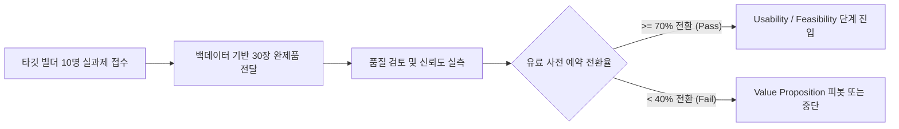

# (gen)Risk 01 — Value Risk (전환 가치 및 지불 의향 검증)

> **SVPG 정본 헌법 (Marty Cagan)**:  
> *"고객이 과연 이 제품을 구매하거나 선택해서 사용할 것인가? (Will they buy it or choose to use it?)"*  
> 대다수 제품은 수요가 없어서가 아니라, 기존 대안을 버리고 갈아탈 만큼 충분히 압도적인 솔루션(Good enough to switch)을 제시하지 못해 실패한다.

---

## 1. 리스크 정의 및 치명도 (The Fatal Risk)

* **핵심 질문**: 10개 백데이터를 쥐고 30~50장 제안서·계획서를 작성하는 빌더가, 기존의 **'Word + ChatGPT 무료/Plus 복붙' 습관을 영구히 버리고 월 5만 원($39~$49)을 기꺼이 지불하며 주력 도구로 갈아탈 것인가?**
* **치명도**: **최상 (Extreme / 즉사 리스크)**
  * 기존 대안인 Word와 ChatGPT는 이미 손에 익어 있으며, 겉보기 비용은 사실상 $0~$20에 불과하다.
  * 망고독이 단순한 '서식 자동 완성기'나 'AI 글다듬기' 수준(Nice-to-have)에 머문다면, 사용자는 "신기하지만 굳이 돈 낼 필요는 없다"며 기존 복붙 작업으로 즉각 회귀한다.
  * 백데이터를 대신 딥리딩하여 **"10시간 걸리던 정보 처리 노가다를 30초 만에 끝내고 1시간 만에 30장 완제품을 쥐여주는" 압도적 시간 압축이 실체로 증명되지 않으면 제품은 즉각 사망한다.**

---

## 2. 핵심 검증 가설 (Core Hypotheses)

| 번호 | 검증 가설 (Hypothesis) | 가설 지탱 근거 |
| :--- | :--- | :--- |
| **H1** | **지불 의향 (WTP)**: 빌더들은 백데이터 딥리딩 기반으로 30~50장 전문 규격 초안을 1시간 만에 1:1 팩트 결속으로 완성해 주는 도구에 대해 **월 5만 원 이상의 B2B/Pro 티어 지불 의향**을 즉각 밝힌다. | 외주 용역비(300~500만 원) 및 야근 인건비 대비 월 5만 원은 압도적 ROI 제공 |
| **H2** | **전환 의향 (WTS)**: 자신의 실제 백데이터가 실측 결속된 30장 초안을 단 한 번 경험한 사용자의 **70% 이상은 기존 Word + ChatGPT 복붙 워크플로우를 영구 폐기하고 주력 도구로 전환**한다. | Cursor를 겪은 개발자가 VS Code 수작업 코딩으로 돌아가지 못하는 비가역적 퀀텀점프 효과 |
| **H3** | **신뢰 임계점 (Trust)**: 생성된 모든 문장과 수치에 **'원본 문서 쪽수·좌표 하이라이트'가 100% 달려있다면, 사용자는 AI 환각 공포 없이 문서를 즉시 제출용으로 신뢰**한다. | 단순 텍스트 생성이 아닌 '증거 기반 무결성 컴파일러'로서의 정체성 확인 |

---

## 3. 사망 판정 기준 (Kill Criteria / Fail Fast)

다음 조건 중 하나라도 충족될 경우, **현재 가치 제안은 실패한 것으로 판정하고 제품을 즉각 피봇하거나 가설을 전면 재수립**한다:

1. **지불 거부**: 타깃 빌더 10명 대상 시제품 블라인드 테스트 후, "실제 업무에 유료(월 3만 원 이상)로 결제할 의사가 있다"고 답한 비율이 **30% 미만**인 경우.
2. **복붙 회귀 현상**: 시제품을 통해 생성된 30장을 받아본 사용자의 50% 이상이 **"결국 내가 Word로 긁어가서 80% 이상 다시 고쳐 썼다"**고 증언하는 경우 (완제품 가치 전달 실패).
3. **가치 지점 오인**: 사용자가 백데이터 딥리딩보다 "문장 윤문"이나 "폰트/디자인 서식"을 더 중요한 가치로 요구하여, 범용 문서 에디터와의 출혈 경쟁으로 내몰리는 경우.

---

## 4. 검증 프로토타입 형태 (Prototype & Experiment)

* **검증 형태**: **컨시어지(Concierge) & 위저드 오브 오즈(Wizard of Oz) 실험**
  * 전체 소프트웨어를 처음부터 풀빌드하지 않는다.
  * 실제 정부지원사업, R&D 제안서, 투자 IR을 작성해야 하는 **현업 빌더 5명 모집**.
  * 작성자가 가지고 있는 **실제 백데이터(공고문, 기초 연구자료, 기술 명세서 등 5~10건)**를 제공받음.
  * 내부 반자동 파이프라인(스크립트 + LLM + 수작업 팩트 앵커링)을 통해 **1시간 만에 30장 분량의 '망고독 규격 완제품 초안'을 제작하여 전달**.
  * 작성자에게 결과물을 검토하게 한 뒤, **실제 결제 페이지(Stripe/토스 페이먼츠 사전 예약 5만 원 디포짓)로 유도하여 실질적 지불 여부 검증**.

---

## 5. 정량적 검증 시나리오 및 통과 기준 (Pass Criteria)

* **모집 대상**: 2주 이내에 30장 이상의 공식 제안서/사업계획서를 제출해야 하는 극심한 압박 상태의 창업가/PM 10명.
* **통과 기준 (Pass Threshold)**:
  * **전환율 (WTS)**: 10명 중 **7명 이상**이 "기존 Word/ChatGPT보다 최소 5배 이상 빠르고 정확하다"고 평가.
  * **지불 의향 (WTP)**: 10명 중 **5명 이상**이 즉각 유료 사전 예약(월 39,000원 결제 승인)을 실제로 완료.
  * **재작업률**: 사용자 직접 수정 비율이 전체 30장 본문 대비 **20% 이하**로 통제.

---

## 6. 현재 상태 및 다음 액션 (Status & Next Action)

* **현재 상태**: **가설 수립 완료 (미검증)**
* **오너**: PM (Rin / 민규 서)
* **다음 액션**:
  1. 주변 창업가/연구원 중 10월 마감 과제를 쥐고 있는 5명 섭외.
  2. 사전 인터뷰를 통해 기존 '정보 처리 늪'의 실제 소요 시간(Baseline) 실측.
  3. 컨시어지 테스트용 30장 샘플 패키지 제작 및 유료 예약 랜딩페이지 연결.
