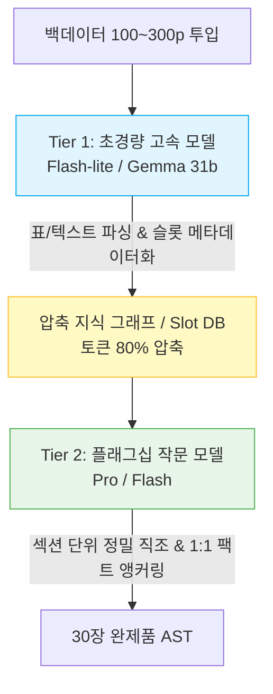

# (gen)Risk 04 — Business Viability Risk (추론 토큰 마진 및 경제성)

> **SVPG 정본 헌법 (Marty Cagan)**:  
> *"이 솔루션이 우리 비즈니스의 다양한 측면(재무, 비즈니스 모델, 법률, 윤리, 파트너십)에서 지속 가능한가? (Does this solution work for our business?)"*  
> 아무리 고객이 열광하고 기술이 뛰어나도, 제품을 팔수록 적자가 누적되는 역마진 구조라면 사업은 성립할 수 없다.

---

## 1. 리스크 정의 및 치명도 (The Fatal Risk)

* **핵심 질문**: 30~50장 대형 문서를 완성하기 위해 수백 페이지 백데이터를 읽고 수십 차례 Composer 수정을 거칠 때, **발생하는 LLM API 추론 비용을 문서 1건당 $2 이내로 통제하여 월 $39~$49(약 5만 원) 구독 요금제에서 최소 75% 이상의 총이익률(Gross Margin)을 방어할 수 있는가?**
* **치명도**: **최상 (Extreme / 재무 파산 리스크)**
  * 백데이터를 매 프롬프트마다 전체 컨텍스트에 밀어 넣는 나이브한 구조를 채택할 경우, 30장 문서 1건 생성 시 API 토큰 비용만 $15~$25가 소요되어 구독료를 단숨에 갉아먹는다.
  * 헤비 유저가 월 20건 이상의 문서를 생성하고 수백 번의 재직조를 요청할 경우 유닛 이코노믹스가 완전히 붕괴된다.
  * 고객의 지불 의향 상한선(약 5만 원)과 모델 API 원가 사이의 마진 버퍼를 확보하지 못하면 SaaS로서 생존 불가능하다.

---

## 2. 핵심 유닛 이코노믹스 가설 (Unit Economics Hypotheses)

| 번호 | 검증 가설 (Hypothesis) | 수치 목표 및 전제 |
| :--- | :--- | :--- |
| **H1** | **문서 1건당 토큰 원가 (COGS)**: Two-Tier LLM 하네스(경량 모델로 딥리딩/슬롯 추출 + 플래그십 모델로 섹션별 고밀도 직조)를 통해 **30장 완제품 1건당 API 원가를 $1.80 미만으로 방어**할 수 있다. | 문서 1건당 평균 토큰 소비: Input 80만 토큰, Output 6만 토큰 내외로 통제 |
| **H2** | **월평균 문서 생산량 (Usage Cap)**: Pro 티어($39/월) 가입 고객의 **월평균 완제품 문서 생성 건수는 4~6건 수준으로 수렴**한다. | 대부분의 빌더는 분기별 2~3회 집중 작성 기간을 가지며 연중 내내 폭증하지 않음 |
| **H3** | **총이익률 (Gross Margin)**: 고객 1인당 월평균 서버 및 토큰 원가를 $9.00 내외로 묶어둠으로써, **플랫폼 총이익률 75% 이상을 달성**한다. | $39 매출 - $9 원가 = $30 공헌이익 (Margin 76.9%) |

---

## 3. 사망 판정 기준 (Kill Criteria / Fail Fast)

다음 조건 중 하나라도 충족될 경우, **현재 비즈니스 모델은 지속 불가능한 것으로 판정하고 과금 체계나 모델 파이프라인을 전면 수정**한다:

1. **원가 폭발 (Negative Margin)**: 30장 완제품 1건을 직조하는 데 들어가는 실제 LLM 토큰 원가가 **$4.00를 초과**할 때 (월 10건 작성 시 역마진 발생).
2. **헤비 유저 덤핑 (Tragedy of the Commons)**: 상위 10%의 파워 유저가 월 30건 이상의 문서를 양산하여 전체 플랫폼 마진을 50% 미만으로 잠식할 때 (Fair Usage Policy 또는 크레딧제 미도입 시).
3. **지불 회피 (Churn Risk)**: 월 구독을 유지하지 않고 "필요한 달(1달)만 결제하고 즉시 해지"하는 체리피커 비율이 70%를 넘어 LTV(고객 생애 가치)가 CAC(고객 획득 비용)를 밑돌 때.

---

## 4. 모델 티어링 및 원가 절감 아키텍처 (Cost Architecture)

1. **Phase 1 (자료 독해)**: 컨텍스트 비용이 극도로 저렴한 초경량 고속 모델을 사용하여 백데이터 전수를 1회성으로 슬롯 DB에 인덱싱.
2. **Phase 2 (문서 직조)**: 30장 전체를 통째로 생성하지 않고, 아웃라인 기반의 **섹션별 분할 직조(Section-by-Section Orchestration)**를 통해 컨텍스트 윈도우 팽창 차단.
3. **Phase 3 (Prompt Caching)**: 공고문 템플릿과 고정 가이드라인은 LLM 캐싱(Prompt Caching)을 100% 적용하여 입력 토큰 비용 50~80% 절감.

---

## 5. 경제성 시뮬레이션 및 검증 시나리오 (Simulation Matrix)

* **Pro 요금제**: 월 $39 (약 52,000원) / 기본 10건 완제품 직조 크레딧 제공
* **1건당 원가 시뮬레이션**:

| 작업 단계 | 사용 모델군 | 입력 토큰 (Clipped) | 출력 토큰 | 예상 원가 (USD) |
| :--- | :--- | :--- | :--- | :--- |
| **1. 백데이터 딥리딩** | 경량 인덱서 (Flash-lite 급) | 500,000 | 20,000 | $0.20 |
| **2. 아웃라인/스캐폴딩** | 플래그십 (Pro/Flash 급) | 50,000 | 10,000 | $0.25 |
| **3. 30장 본문 정밀 직조** | 플래그십 (Pro/Flash 급) | 200,000 (Cached) | 35,000 | $0.95 |
| **4. Composer 부분 수정(10회)**| 플래그십 (Flash 급) | 100,000 | 15,000 | $0.20 |
| **합계 (문서 1건 기준)** | - | **850,000** | **80,000** | **약 $1.60 (목표 $1.80 달성)** |

* **검증 방법**:
  * 실제 30장 완제품 작성 과제를 모의 실행하며 API Call별 `TokenUsage`와 실제 청구 금액을 전수 로깅.
  * 1건당 실측 원가가 $1.80 이하로 유지되는지 확인.

---

## 6. 현재 상태 및 다음 액션 (Status & Next Action)

* **현재 상태**: **가설 수립 완료 (미검증)**
* **오너**: PM / Finance
* **다음 액션**:
  1. 프롬프트 캐싱 및 Two-Tier 파이프라인 적용 시의 실제 토큰 소비 계측 스크립트 실행.
  2. B2B / 개인 Pro 요금제의 크레딧 정책(기본 8건 + 추가 건당 5,000원) 과금 모델 시뮬레이션 확정.
  3. 경쟁 대안(Word/ChatGPT Plus) 대비 고객 지불 마지노선 설문 조사.
