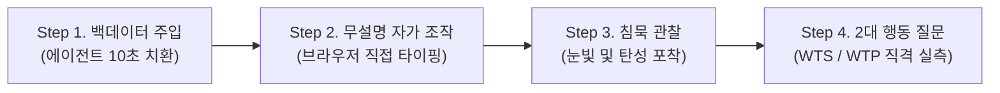

# (gen)프로토타입 01 — 바이브 코딩(Vibe Coding) 인터랙티브 프로토타입 (정성적 WTS·WTP 실측 프로토콜)

> **SVPG 정본 헌법 (Marty Cagan & Build to Learn)**:  
> *"The best prototype is the fastest disposable simulation that feels 100% real to the customer."*  
> *(가장 훌륭한 프로토타입이란, 고객에게는 100% 진짜 제품처럼 느껴지면서도 팀 입장에서는 가장 빠르고 저렴하게 버릴 수 있는 일회용 시뮬레이션이다.)*

---

## 1. 개요: 왜 Figma가 아니라 "바이브 코딩(Vibe Coding)"인가?

본 카드는 `(gen)Risk 01: Value Risk`를 해소하기 위해, **Figma 인터랙티브 목업의 물리적 한계를 돌파하고 AI 바이브 코딩(Vibe Coding)으로 2~3시간 만에 실제 브라우저 기반 시뮬레이터를 직조하여 지불 의향(WTP)과 전환 의향(WTS)을 실측하는 정성 검증 프로토콜**이다.

### 1.1 Figma vs 바이브 코딩(Vibe Coding) 실측 비교

| 비교 항목 | 기존 Figma 목업 방식 | **AI 바이브 코딩(Vibe Coding) 방식** |
| :--- | :--- | :--- |
| **제작 소요 시간** | 1~2일 (컴포넌트, 오토레이아웃, 와이어링 노가다) | **2~3시간 (Cursor / Claude / Antigravity 프롬프트 직조)** |
| **체감 리얼리티** | 핫스팟(지정 영역)만 클릭 가능 ➔ *"목업이네"* 인지 | **실제 브라우저 DOM 렌더링 + 타이핑 스트리밍 ➔ 100% 진짜 체감** |
| **백데이터 교체** | 테스터 백데이터마다 텍스트 박스 일일이 수동 수정 | **`mockData.json`에 프롬프트로 10초 만에 주입 교체** |
| **인터랙션 유연성** | 키보드 입력, 스크롤, 실제 복사/붙여넣기 불가 | **실제 입력창, 가짜 로딩 프로그레스, 실시간 타이핑 직조 연출** |
| **코드 수명주기** | 디자인 툴에 고립 | **검증 후 즉각 폐기하는 완벽한 1회용 버리는 코드 (Build to Learn)** |

> 💡 **핵심 인사이트**:  
> 피그마에서 화면을 그리고 애니메이션을 연결하는 것보다, **에이전트에게 "React 3단 레이아웃에 가짜 스트리밍 타이핑 시뮬레이터 만들어줘"라고 바이브 코딩으로 확 뽑아내는 것이 압도적으로 빠르고 실제 소프트웨어처럼 느껴진다.**

---

## 2. 바이브 코딩 프로토타입 구현 스펙 (1회용 브라우저 시뮬레이터)

백엔드 서버, 데이터베이스, 상용 API 연동은 **단 1줄도 작성하지 않는다 (Zero Backend).**  
오직 브라우저 위에서 "마치 초대형 AI 엔진이 딥리딩하여 제안서를 직조하는 것처럼" 정밀하게 눈속임(Smoke & Mirrors)하는 프론트엔드 단독 시뮬레이터이다.

### 2.1 3단 레이아웃 핵심 조작 화면
```text
┌─────────────────────────┬───────────────────────────────────────────┬─────────────────────────┐
│     좌측: @Reference     │               중앙: Document               │      우측: Composer      │
├─────────────────────────┼───────────────────────────────────────────┼─────────────────────────┤
│ • 100쪽 PDF 뷰어 흉내    │ • 30장 완제품 제안서 에디터 뷰            │ • 실제 텍스트 인풋창     │
│ • 원문 팩트 하이라이트  │ • 문장마다 [쪽수·좌표 앵커] 칩 클릭 가능   │ • [제안서 직조] 버튼     │
│ • 목차 및 인덱스 트리   │ • '타이핑 스트리밍 효과'로 실시간 직조     │ • 실시간 토큰/프로그레스 │
└─────────────────────────┴───────────────────────────────────────────┴─────────────────────────┘
```

### 2.2 바이브 코딩 연출 기능 (Mocking Scope)
1. **입력 인터랙션**: 테스터가 우측 Composer에 "스마트 팩토리 지원사업 1장 사업목표 직조해줘"라고 타이핑하고 엔터를 칠 수 있음.
2. **가짜 스트리밍 직조**: 엔터 입력 시 2초간 "Reference 100쪽 딥리딩 중..." 로딩 바가 돌고, 중앙 에디터에 실제 LLM 스트리밍처럼 글자가 촤라락 타이핑되며 완성됨.
3. **1:1 팩트 앵커링 조작**: 생성된 문장 옆 `[P.12 원문 보기]` 칩을 누르면 좌측 Reference 창이 해당 페이지로 스크롤되며 노란색 하이라이트가 켜짐.
4. **실제 클립보드 복사**: 상단 [Word로 내보내기] 버튼을 누르면 "클립보드에 복사되었습니다" 토스트와 함께 실제 텍스트가 복사됨.

---

## 3. 테스팅 대상자 선정 요건 (빌더 3인)

* **필수 조건 (3명)**:
  * 향후 2주 이내에 정부 지원사업, 투자 제안서, 연구 계획서 등 **실제 제출 마감 과제를 쥐고 야근 중인 창업가·연구원 3명**.
* **엄격한 배제 조건**:
  * 마감 과제가 없거나, 호기심에 "구경해보겠다"는 관전자.
  * 구두 칭찬만 남기고 사라질 지인/동료.

---

## 4. 4단계 실측 실행 시나리오



### Step 1: 타깃 백데이터 즉석 주입 (테스트 10분 전)
* 테스터가 작성 중인 실제 사업계획서/원천 통계 텍스트를 전달받아, 바이브 코딩 프로젝트의 `mockData.ts`에 에이전트를 통해 즉시 반영.

### Step 2: 무설명 자가 조작 유도
* 노트북을 테스터에게 넘기고 설명 없이 한마디만 전달:
  * *"이 브라우저에서 우측 창에 지시어를 넣고 제안서를 한 번 직조해 보세요."*

### Step 3: 침묵 관찰 (The Aha-Moment)
* 테스터가 Composer에 엔터를 치고, 중앙 에디터에서 팩트 앵커와 함께 30장 제안서가 촤라락 직조될 때의 **동공 확장과 반응**을 관찰.

### Step 4: 2대 행동 강제 질문 투여 (The Decisive Questions)
* 조작 직후 주관적 소감("어떠세요?")을 일체 묻지 않고, 즉각 아래 2가지 행동 질문을 직격으로 던짐:

```text
[질문 1: WTS 전환 의향 실측]
"이 제품이 다음 주 화요일에 오픈합니다.
 지금 쓰시던 Word 창을 끄고, 다음 주 마감 과제를 진짜로 이걸로 작성하시겠습니까?"

[질문 2: WTP 지불 의향 실측]
"오늘 사전 예약하시는 분들께만 첫 6개월을 50% 할인(월 19,000원)해 드립니다.
 지금 카드 번호를 등록하시겠습니까?"
```

---

## 5. 승패 판정 기준 (Kill Criteria)

| 판정 결과 | 고객 행동 양식 | 후속 조치 |
| :--- | :--- | :--- |
| **합격 (Pass)** | 망설임 없이 지갑에서 신용카드를 꺼내 번호를 등록하고, *"화요일 오전 9시에 바로 열어달라"*고 요구할 때 | **가치 검증 1차 통과 ➔ 양산 소프트웨어 코딩(Build to Earn) 승인** |
| **보류 (Warning)** | "Word로 쓰긴 할 텐데, 결제는 첫 달 써보고 결정할게요"라며 결제를 미룰 때 | 가치 제안 및 가격 정책 재설계 후 재실험 |
| **사망 (Fail)** | "신기하긴 한데, 다음 과제는 손에 익은 Word로 쓸게요", "출시되면 알려주세요" | **가치 검증 실패 ➔ 제품 콘셉트 즉각 피봇 (매몰비용 0원)** |

---

## 6. 바이브 코딩 거버넌스 원칙 (Build to Learn)

1. **상용 저장소 분리**: 본 시뮬레이터 코드는 양산 프로덕션 저장소에 병합하지 않고, `scratch/` 또는 독립 브랜치/임시 폴더에서 빌드 후 검증이 끝나면 폐기한다.
2. **코드 퀄리티 집착 금지**: 아키텍처, 린트, 테스트 코드에 신경 쓰지 않는다. 오직 "브라우저 화면이 100% 진짜 제품처럼 움직이는가"에만 집중한다.
3. **제작 3시간 타임박스**: 바이브 코딩에 3시간 이상을 쓰지 않는다. 에이전트 프롬프트 몇 번으로 신속하게 뽑아내는 것이 핵심이다.
