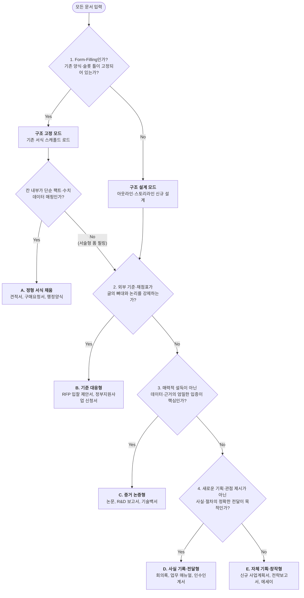

## 뭘 해야 하나

## 다음 행동

- [ ]

```mermaid
flowchart TD
    Start([모든 문서 입력]) --> Q1{1. Form-Filling인가?<br/>기존 양식·슬롯 틀이 고정되어 있는가?}
    
    %% 틀이 고정된 경우
    Q1 -- Yes --> S1[<b>구조 고정 모드</b><br/>기존 서식 스캐폴드 로드]
    S1 --> Q1_Sub{칸 내부가 단순 팩트·수치<br/>데이터 매핑인가?}
    Q1_Sub -- Yes --> T1[<b>A. 정형 서식 채움</b><br/>견적서, 구매요청서, 행정양식]
    Q1_Sub -- No<br/>(서술형 폼 필링) --> Q2

    %% 틀이 없는 자유 구조인 경우
    Q1 -- No --> S2[<b>구조 설계 모드</b><br/>아웃라인·스토리라인 신규 설계]
    S2 --> Q2

    %% 내용의 성격을 가르는 공통 분기 (서술형 폼 필링 & 자유 구조 공통)
    Q2{2. 외부 기준·채점표가<br/>글의 뼈대와 논리를 강제하는가?}
    Q2 -- Yes --> T2[<b>B. 기준 대응형</b><br/>RFP 입찰 제안서, 정부지원사업 신청서]
    Q2 -- No --> Q3{3. 매력적 설득이 아닌<br/>데이터·근거의 엄밀한 입증이 핵심인가?}
    
    Q3 -- Yes --> T3[<b>C. 증거 논증형</b><br/>논문, R&D 보고서, 기술백서]
    Q3 -- No --> Q4{4. 새로운 기획·관점 제시가 아닌<br/>사실·절차의 정확한 전달이 목적인가?}
    
    Q4 -- Yes --> T4[<b>D. 사실 기록·전달형</b><br/>회의록, 업무 매뉴얼, 인수인계서]
    Q4 -- No --> T5[<b>E. 자체 기획·창작형</b><br/>신규 사업계획서, 전략보고서, 에세이]
```

