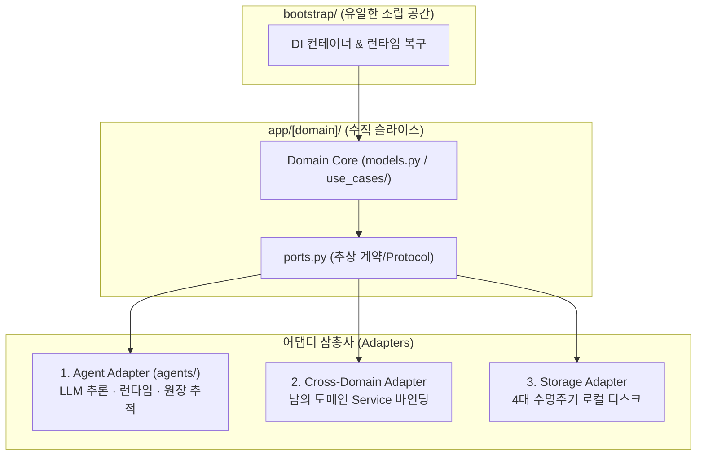
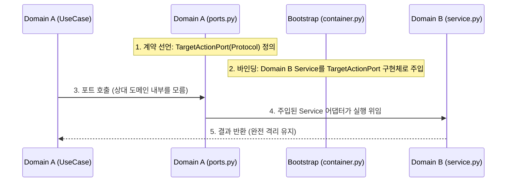

# [패턴] 01. Agent 어댑터 패턴 (Agent Adapter Pattern)

> 🖼️ 상위 개념 도면 → [[도메인 헥사고날 작동 이해.canvas]] | [[도메인 헥사고날 작동 이해]]

**Agent 어댑터 패턴 (Agent Adapter Pattern)**은 도메인의 순수성을 영구히 보존하기 위해, **AI Agent의 확률적 추론**, **타 도메인과의 협업**, **물리적 스토리지**를 모두 도메인 밖의 독립된 **'어댑터(Adapter)'**로 취급하여 포트(Port) 계약을 통해 조립하는 모던 소프트웨어 아키텍처 패턴입니다.

전통적인 헥사고날(Ports and Adapters)의 단일 도메인 계층 한계를 극복하고, 기능 중심의 **수직 슬라이스(Vertical Slice)**와 **AI Agent 런타임 이원화(Dual-Core)**를 결합하여 개발 복잡도를 최소화합니다.

---

## 1. 핵심 설계 철학 (Core Axioms)



### 1.1 단방향 계층 의존성 (Unidirectional Dependency)
* **의존성 흐름**: `Bootstrap(조립)` ──▶ `[Domain Slices(업무)]` ──▶ `Core(인프라)` ──▶ `Packages(독립엔진)`
* 상위 계층만 하위 계층을 바라보며, 하위 계층이 상위 계층을 import하는 역방향 의존성은 절대 금지합니다.

### 1.2 도메인 간 완전 격리 (Zero Direct Cross-Import)
* 도메인 A는 도메인 B의 내부 코드, 모델, 서비스를 직접 import할 수 없습니다.
* 특정 도메인 폴더 전체를 삭제하거나 교체해도 다른 도메인 및 전체 애플리케이션의 빌드가 깨지지 않아야 합니다.

### 1.3 황금 공식: "남의 도메인 Service = 내 도메인의 Adapter"
* 다른 도메인의 동작이 필요할 경우, 내 도메인의 `ports.py`에 요구사항(Protocol)을 선언합니다.
* 상대방 도메인의 Service는 내 도메인의 포트를 충족하는 **하나의 외부 어댑터(Adapter)**로 취급되어 DI 컨테이너에서 주입됩니다.

### 1.4 데이터 수명주기 4등급 격리 (Data Lifecycle Tiering)
* 디스크에 영속화되는 모든 데이터는 4개 수명주기 등급(`config`, `data`, `cache`, `state`) 중 하나에만 귀속됩니다.
* 실제 물리 디스크 경로의 결정 권한은 도메인 로직이 아닌 `core/storage`와 `Bootstrap`에만 위임합니다.

---

## 2. 최상위 시스템 계층 표준 (System Layer Protocol)

| 계층 | 위치 | 성격 및 주요 역할 |
| :--- | :--- | :--- |
| **Bootstrap** | `app/bootstrap/` | **객체 그래프 조립 (Wiring)**: DI 컨테이너 구성, 스토리지 등급 경로 주입, 비정상 종료 Run 재개 핸들러 등록 |
| **Domain Slices** | `app/[domain]/` | **자립적 비즈니스 슬라이스**: 단일 비즈니스 관심사를 수직 응집 (HTTP ──▶ UseCase ──▶ Port ──▶ Adapter) |
| **Core** | `app/core/` | **도메인 비의존 순수 인프라**: 환경설정, 다중 타깃 구조화 로깅, 저장 게이트, LLM 공급자 연동 및 관측 하네스 |
| **Packages** | `packages/*` | **호스트 비의존 독립 엔진**: 서버/CLI/웹 등 어떤 실행 환경에도 구애받지 않는 순수 계산/변환 엔진 |

---

## 3. 도메인 슬라이스 내부 표준 구조 (Slice Template)

각 도메인 슬라이스는 아래의 고정된 파일 템플릿을 준수하며, 임의로 최상위 세그먼트를 늘리지 않습니다.

```text
app/[domain]/
├── __init__.py      # 외부 공개 인터페이스 (Public API) 정의
├── router.py        # Inbound HTTP 진입점 (DTO 검증 위임, 비즈니스 로직 미포함)
├── schemas.py       # Pydantic 기반 입출력 요청/응답 검증 DTO
├── models.py        # 프레임워크/DB 비의존 순수 도메인 엔티티 및 값 객체
├── service.py       # 유스케이스 디스패처 / 파사드 (비즈니스 조율 얇은 계층)
├── use_cases/       # 일반 비즈니스 로직 (1유스케이스 1파일, 결정적 워크플로우)
├── agents/          # 지능형 Agent 로직 (비결정적 LLM 개입, AgentRuntime 경유, data/ 영속화)
├── ports.py         # Outbound 계약 Protocol (외부 의존성 요구 규격 추상화)
└── adapters/        # Port 구체 구현체 (로컬 디스크, 클라우드 API, 타 도메인 연결기)
```

### 💡 `use_cases/` vs `agents/` 실행 이원화 기준
* **일반 유스케이스 (`use_cases/`)**: LLM이 개입하지 않는 순수 결정적 계산 로직입니다. 결과 데이터가 파생 성격일 경우 `cache/` 등급에 저장 가능합니다.
* **에이전트 유스케이스 (`agents/`)**: LLM 추론이 개입하는 확률적 로직입니다. 반드시 `AgentRuntime`을 거쳐야 하며, 출처 메타데이터(Provenance)를 동반한 아티팩트로 `data/` 등급에 영구 보존됩니다.

---

## 4. 도메인 간 협업 표준 프로토콜 (Cross-Domain Protocol)



1. **[1단계] 계약 선언 (Consumer)**:
   * 도메인 A의 `ports.py`에 필요한 외부 동작 규격을 `typing.Protocol`로 선언합니다.
2. **[2단계] 어댑터 준비 (Bridge)**:
   * 도메인 A의 `adapters/`에 도메인 B의 Service를 감싸는 어댑터를 작성하거나, DI 컨테이너에서 직접 바인딩합니다.
3. **[3단계] 의존성 주입 (Bootstrap)**:
   * `bootstrap/container.py`에서 도메인 B의 Service 인스턴스를 도메인 A의 Port 파라미터로 주입합니다.
4. **[4단계] 무손실 격리 보장 (Isolation)**:
   * 도메인 A 내부 코드는 도메인 B의 존재를 전혀 모른 채, 오직 자기 `ports.py`의 인터페이스만 바라보고 안전하게 동작합니다.

---

## 5. 스토리지 수명주기 4등급 프로토콜 (Storage Tier Protocol)

도메인이 다루는 모든 데이터는 아래 4대 등급에 따라 엄격히 물리 격리됩니다:

* ⚙️ **`config/` (사용자 설정)**:
  * 지우면 사용자의 맞춤 설정이 초기화됩니다. 백업 및 버전 관리 대상입니다.
* 📦 **`data/` (원본 및 영구 산출물)**:
  * 지우면 복구가 불가능한 원본 소스와 Agent 산출물(Provenance 포함)입니다. 최우선 백업 대상입니다.
* ⚡ **`cache/` (결정적 파생 데이터)**:
  * 지워져도 원본(`data/`)과 로직을 통해 100% 동일하게 재계산 복구할 수 있는 파생 캐시입니다.
* 📝 **`state/` (런타임 임시 상태 및 실행 로그)**:
  * 프로세스 비정상 종료 시 언제든 지워져도 전체 시스템 가동에 무해한 임시 세션과 회전 로그입니다.

---

## 6. 향후 아키텍처/디자인 패턴 확장 네이밍 룰 (Extensibility Rules)

본 디렉토리(`Discovery_Architecture/`) 하위에 새로운 아키텍처 패턴이나 시스템 설계 규격을 추가할 때는 다음 표준 네이밍 규칙을 엄격히 준수하여 유지보수성을 극대화합니다.

```text
[패턴] {일련번호 2자리}. {한글 패턴명} ({영문 공식 명칭}).md
```

* **일련번호 (Sorting)**: `01`, `02`, `03`... 순차 부여하여 파일 탐색기 및 옵시디언 목록에서 자연 정렬 보장.
* **접두사 태그**: `[패턴]` 접두사를 고정하여 일반 문서/도면과 즉시 식별.
* **이중 표기**: 한글 명칭과 영문 공식 명칭을 병기하여 다국어 및 검색(Searchability) 편의성 제공.
* **예시 목록**:
  * `[패턴] 01. Agent 어댑터 패턴 (Agent Adapter Pattern).md` (본 문서)
  * `[패턴] 02. 수명주기 티어드 스토리지 패턴 (Lifecycle Tiered Storage Pattern).md` (예정)
  * `[패턴] 03. 프랙탈 바운디드 슬라이스 패턴 (Fractal Bounded Slice Pattern).md` (예정)
