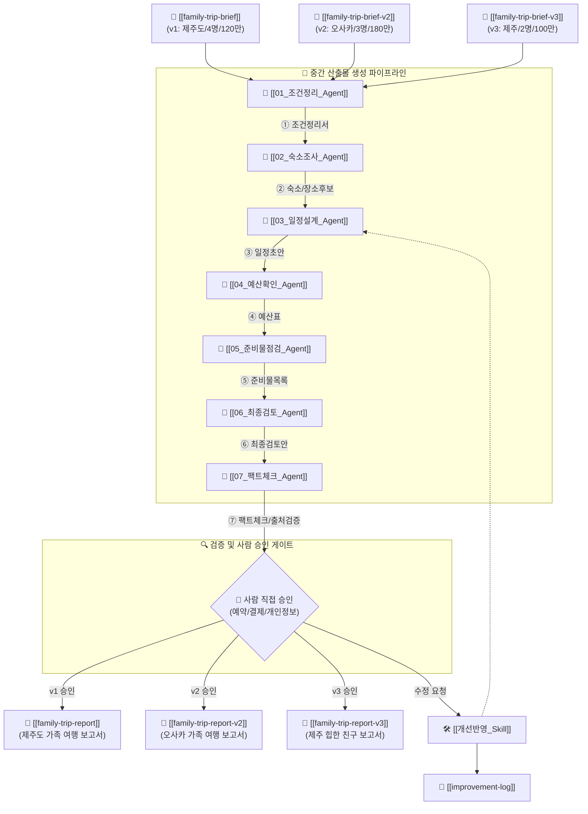

# 🧭 가족 여행 준비 멀티에이전트 하네스 대시보드

> **하네스 목표**: 여행지, 기간, 동행자, 예산, 취향, 참고 링크 등 수집된 컨텍스트를 바탕으로 **[조건정리 ➔ 숙소조사 ➔ 일정설계 ➔ 예산확인 ➔ 준비물점검 ➔ 최종검토 ➔ 팩트체크 및 승인]**을 거쳐 최적의 **가족/친구 여행 준비 보고서**를 생성하는 하네스 대시보드입니다.

---

## 🏗️ 하네스 7대 구성 요소 (Core Matrix)

| 하네스 요소        | 가족 여행 준비 하네스 정의                                                            | 관련 파일 / 링크                                                                                                                                                          |
| :------------ | :------------------------------------------------------------------------- | :------------------------------------------------------------------------------------------------------------------------------------------------------------------ |
| **🎯 목표**     | **v1**: 제주도 2박3일 / **v2**: 오사카 2박3일 / **v3**: 제주 3박4일 힙한 친구 여행             | [[family-trip-report]] [[family-trip-report-v2]] [[family-trip-report-v3]]                                                                                  |
| **📌 컨텍스트**   | **v1**: 제주도 4명 120만 / **v2**: 오사카 3명 180만 / **v3**: 제주 2명 100만 (트렌디&수영&노을) | [[family-trip-brief]] [[family-trip-brief-v2]] [[family-trip-brief-v3]]                                                                                     |
| **🛠️ 도구**    | 동선 탐색, 숙소 매칭, 예산 계산표, 체크리스트 generator, 팩트체크 링커, HTML 리포트                   | [[보고서작성_Skill]]  [📊 HTML 시각 리포트 열기](<file:///C:/Users/user/Desktop/개똥이 머릿속/📗(Library) 망고네 도서관/(E-Book) 하네스 엔지니어링 백과사전/여행_준비_하네스/03_Artifacts/trip-plan.html>) |
| **📂 중간 산출물** | ① 조건정리서 ➔ ② 숙소/장소후보 ➔ ③ 일정초안 ➔ ④ 예산표 ➔ ⑤ 준비물목록 ➔ ⑥ 검토안 ➔ ⑦ 팩트체크서           | [[family-trip-brief]] [[family-trip-brief-v2]] [[family-trip-brief-v3]]                                                                                     |
| **🔍 검증 기준**  | 일정 과밀도, 장소 간 이동시간, 예산 초과 여부, 실영업/출처 팩트체크                                   | [[06_최종검토_Agent]] [[07_팩트체크_Agent]]                                                                                                                             |
| **👤 권한과 승인** | **Human-in-the-Loop**: 항공/숙소/라피트/렌트카 예약 승인 진행                              | 대시보드 승인 게이트                                                                                                                                                         |
| **📑 기록과 개선** | 여행 후 피드백 및 다음 여행에 반영할 개선 노하우 축적                                            | [[improvement-log]]                                                                                                                                                 |

---

## 📌 파이프라인 및 아키텍처 (Workflow)
// 이게 랭스미스로 관리가 된다. 그럼 훨씬 복잡한 구조도 짤 수 있고, 디버깅도 가능하다.

---

## 🤖 01. Agents (담당 에이전트 목록)

| 순서 | 담당 에이전트 | 주요 역할 및 검증 기준 |
| :---: | :--- | :--- |
| **01** | [[01_조건정리_Agent]] | 여행 컨텍스트 수집/정제 (v1: 제주 / v2: 오사카 / v3: 제주 힙한 친구 2명 100만) |
| **02** | [[02_숙소조사_Agent]] | 난바역 인근 호텔 (v2) & 애월/협재 감성 스테이 (v3) 조사 완료 |
| **03** | [[03_일정설계_Agent]] | 짧은 이동 동선, 에메랄드 바다수영 & 신창/금능 노을 드라이브 설계 완료 |
| **04** | [[04_예산확인_Agent]] | 1,000,000원 2인 예산 분배표 (숙소 42만, 렌트 18만, 식비/카페 32만 등) 완료 |
| **05** | [[05_준비물점검_Agent]] | 방수팩, 스노클링 장비, 선크림, 삼각대, 블루투스 스피커 등 점검 완료 |
| **06** | [[06_최종검토_Agent]] | 폭염 피크(12~15시) 회피 & 우천 시 실내(아르떼뮤지엄/LP바) 대체 검증 완료 |
| **07** | [[07_팩트체크_Agent]] | 장소별 실제 영업시간/가격/휴무일 팩트체크 & 출처/공식링크 검증 완료 |

---

## 🛠️ 02. Skills (지원 매뉴얼)

| 구분 | 스킬명 | 역할 및 매뉴얼 |
| :---: | :--- | :--- |
| **Skill A** | [[보고서작성_Skill]] | v1 [[family-trip-report]], v2 [[family-trip-report-v2]], v3 [[family-trip-report-v3]] 작성 규격 |
| **Skill B** | [[개선반영_Skill]] | 피드백 반영 지침 |

---

## 📂 03. Artifacts (컨텍스트 및 산출물)

- 📝 **[입력 v1] 국내 제주도 컨텍스트**: [[family-trip-brief]]
- 📝 **[입력 v2] 해외 오사카 컨텍스트**: [[family-trip-brief-v2]]
- 📝 **[입력 v3] 국내 제주 힙한 친구 컨텍스트**: [[family-trip-brief-v3]]
- 🎯 **[최종 v1] 제주도 가족 여행 종합 보고서**: [[family-trip-report]]
- 🎯 **[최종 v2] 오사카 가족 여행 종합 보고서**: [[family-trip-report-v2]]
- 🎯 **[최종 v3] 제주 힙한 친구 여행 종합 보고서**: [[family-trip-report-v3]]
- 📑 **[기록] 개선 및 수정 기록 로그**: [[improvement-log]]

---

## 📋 하네스 실행 체크리스트

### [v1] 제주도 여행
- [x] v1 제주도 여행 준비 하네스 실행 및 [[family-trip-report]] 생성 완료

---

### [v2] 일본 오사카 해외 여행
- [x] 1. [[family-trip-brief-v2]]에 오사카 컨텍스트 입력 완료
- [x] 2. [[01_조건정리_Agent]] 실행 ➔ v2 해외 여행 조건 정제 완료
- [x] 3. [[02_숙소조사_Agent]] 실행 ➔ 난바역 인근 호텔 추천 완료
- [x] 4. [[03_일정설계_Agent]] 실행 ➔ 환승 최소화 & 이동 짧은 코스 완성
- [x] 5. [[04_예산확인_Agent]] 실행 ➔ 180만 원 예산 분배 완료
- [x] 6. [[05_준비물점검_Agent]] 실행 ➔ 돼지코 어댑터/여권/비상약 점검 완료
- [x] 7. [[06_최종검토_Agent]] 실행 ➔ 우천 실내 대체안 & 걷기 최소화 검증 완료
- [ ] 8. 👤 **사람 직접 승인 게이트** (항공권, 숙소, 라피트 결제 진행 중)
- [x] 9. [[보고서작성_Skill]]을 통해 [[family-trip-report-v2]] 최종 생성 완료
- [ ] 10. 피드백 발생 시 [[개선반영_Skill]]로 [[improvement-log]]에 노하우 기록

---

### [v3] 제주도 힙한 친구 여행 (3박 4일 100만 원)
- [x] 1. [[family-trip-brief-v3]]에 제주 친구 여행 컨텍스트 입력 완료
- [x] 2. [[01_조건정리_Agent]] 실행 ➔ v3 MZ/젊은 감성 트렌디 조건 정제 완료
- [x] 3. [[02_숙소조사_Agent]] 실행 ➔ 애월/협재 뷰 감성 스테이 조사 완료
- [x] 4. [[03_일정설계_Agent]] 실행 ➔ 바다수영 & 신창풍차/금능 노을 바다 드라이브 설계 완료
- [x] 5. [[04_예산확인_Agent]] 실행 ➔ 100만 원 2인 최적 분배 완료 (숙소42만/렌트18만/식비32만)
- [x] 6. [[05_준비물점검_Agent]] 실행 ➔ 방수팩/튜브/선크림/삼각대/스피커 점검 완료
- [x] 7. [[06_최종검토_Agent]] 실행 ➔ 12~15시 폭염 회피 & 비 올 때 아르떼뮤지엄/LP바 대안 완료
- [x] 8. [[07_팩트체크_Agent]] 실행 ➔ 추천 장소별 실 영업시간/휴무일/가격 및 출처 링크 검증 완료
- [ ] 9. 👤 **사람 직접 승인 게이트** (렌트카 차종 선택 및 숙소 예약 결제 진행)
- [x] 10. [[보고서작성_Skill]]을 통해 [[family-trip-report-v3]] 및 시각 대시보드 v3 생성 완료
- [ ] 11. 피드백 발생 시 [[개선반영_Skill]]로 [[improvement-log]]에 노하우 기록

