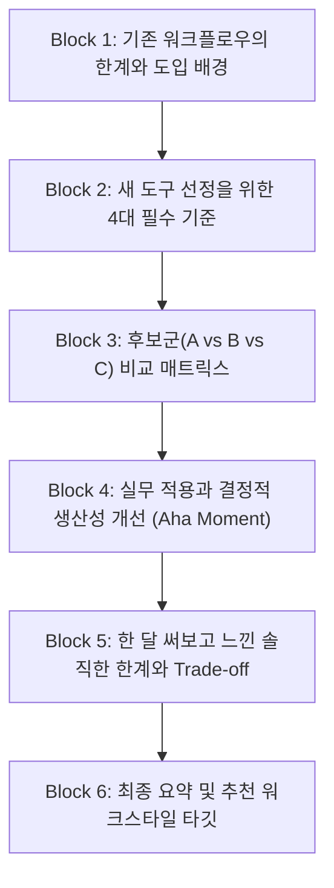

# 01. 요즘IT 실무 도구 도입 평가 및 비교 분석 레퍼런스 소스

IT 기획자, PM, 디자이너 실무자들이 가장 즐겨 읽는 플랫폼인 **'요즘IT(Yozm IT)'**의 전형적인 **[실무 도구 도입 평가 및 비교 분석형]** 아티클을 역공학하여 추출한 척추(Spine) 레퍼런스 카드입니다.

---

## 1. 레퍼런스 채널 개요 & 특징

* **출처 플랫폼**: 요즘IT (`yozm.wishket.com`)
* **대표 아키타입**: *"실무자 관점에서 깐깐하게 따져본 [도구명] 도입 평가 및 도구 비교"*
* **주요 탐색 키워드**:
  * `생산성 도구 도입`, `노션 대체 도구`, `협업 툴 비교`, `옵시디언 도입기`
* **이 채널이 최고의 레퍼런스인 이유**:
  * 감정적 후기나 단순 기능 나열을 배제하고, **[도입 배경 ➔ 4대 선정 기준 ➔ 후보 비교표 ➔ 실무 적용 팁 ➔ 한계]**의 와꾸(Layout)가 가장 깔끔하게 정돈되어 있어 비즈니스 독자의 신뢰도가 매우 높습니다.

---

## 2. 훔쳐올 핵심 척추 (Spine / 필수 의무 정보 블록)

독자가 이 장르의 글에서 무의식적으로 기대하는 6단계 필수 척추 구조입니다:

### [Block 1] 도입 배경 — 기존 방식에서 마주한 병목
* *"왜 기존 도구(노션, 슬랙, 메모장)로는 더 이상 버틸 수 없었는가?"*
* 팀 혹은 개인 작업에서 체감된 반복 피로, 로딩 지연, 서식 세팅의 인지 부하를 구체적 업무 상황으로 묘사.

### [Block 2] 선정 기준 — 도구를 고를 때 세운 나만의 원칙
* 기능이 많은 도구가 아니라, **우리 문제에 딱 맞는 도구**를 가려내기 위한 4대 평가 기준 제시:
  1. **입력 마찰도 (Friction)**: 생각의 속도를 방해하지 않는 키보드 중심 워크플로우인가?
  2. **위계 유연성 (Hierarchy)**: 깊은 들여쓰기와 구조 재배치가 자유로운가?
  3. **집중 메커니즘 (Focus)**: 주변 시야를 차단하고 현재 맥락에 몰입할 수 있는가?
  4. **확장성 & 연동성 (Extensibility)**: 외부 시스템/AI 에이전트와 데이터 통신이 가능한가?

### [Block 3] 후보군 비교 매트릭스 — 왜 최종 선택이 되었는가?
* 표(Table)를 활용하여 시각적으로 한눈에 보는 비교 제공:
  * 예: `Workflowy vs Notion vs Obsidian vs Dynalist`
  * 카테고리별 평점(O/X/△) 및 차별화 포인트 정리.

### [Block 4] 실무 적용 (Aha Moment) — 체감된 실질적 변화
* 도구를 실제 업무(글쓰기 뼈대 잡기, 회의록 정리, 기획안 분해)에 적용한 실전 스크린샷.
* 복잡한 설정 없이도 생각의 병목이 풀렸던 결정적 기능(예: 줌인, 미러링) 중심 서술.

### [Block 5] 솔직한 한계 (Trade-off) — 맹목적 찬양 배제
* *"하지만 모든 것이 완벽하진 않았습니다."*
* 표 서식 부족, 마크다운 호환의 아쉬움, 모바일 사용성 등 감점 요인을 명확히 짚어 글의 객관성 확보.

### [Block 6] 최종 추천 — "이런 분께 권합니다"
* 단순 총평이 아닌, **어떤 워크스타일의 사람에게 최적이고 어떤 사람에겐 비추천인지** 페르소나 정의.

---

## 3. 시각 장치 및 레이아웃 특징 (Visuals & Layout)

1. **소제목(H2~H3) 스타일**:
   * 단순 명사형(`기능 소개`) 대신 독자의 의문을 대변하는 문장형 소제목 채택:
     * 예: `“왜 수많은 메모앱을 두고 다시 흑백 화면으로 돌아왔을까?”`
2. **비교 매트릭스 표**:
   * 글 중반부에 스크롤을 멈추게 하는 3~4열 요약 표 배치.
3. **크롭 캡처 샷**:
   * 전체 화면을 줄여서 보여주지 않고, 눈여겨볼 UI 포인트(불릿 줌인 순간, 단축키 메뉴)만 1:1 비율로 크롭하여 캡션과 함께 배치.

---

## 4. 우리 프로젝트(Workflowy 도입기) 적용 가이드

* **Block 1 치환**: 노션의 무거운 DB와 서식 꾸미기로 인해 글쓰기 1단계 뼈대 잡기가 늦어지던 인지 부하 묘사.
* **Block 2 치환**: 4대 기준(키보드 무마찰, 단일 무한 트리, 즉시 줌인, 로컬 데스크톱 MCP 확장성)으로 설정.
* **Block 3 치환**: Workflowy vs Notion vs Obsidian vs Heptabase 비교 매트릭스.
* **Block 4 치환**: 블로그 포스팅 목차를 10분 만에 잡고 데스크톱 MCP로 에이전트와 협업한 실전 경험.
