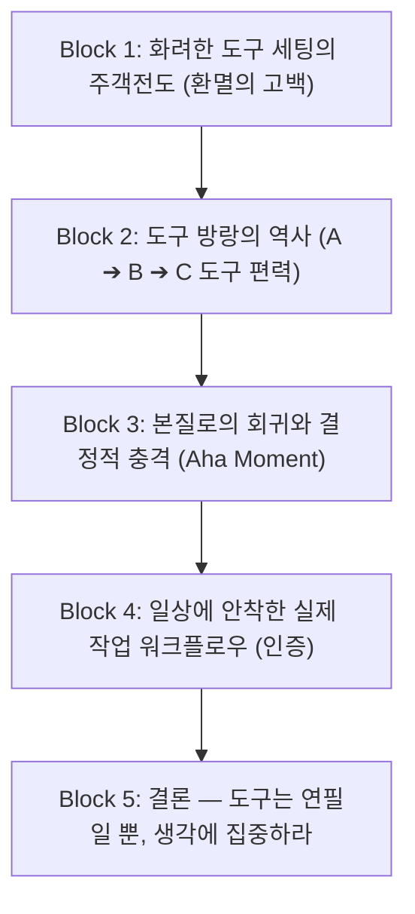

# 02. 벨로그·미디엄 도구 방랑기 및 이탈·전환 회고 레퍼런스 소스

개발자와 지식 생산자들이 날것의 목소리로 털어놓는 **'벨로그(Velog)'** 및 **'미디엄(Medium)'** 플랫폼의 대표 아키타입인 **[도구 방랑기 & 이탈/귀환형 솔직 회고]** 아티클을 역공학한 척추(Spine) 레퍼런스 카드입니다.

---

## 1. 레퍼런스 채널 개요 & 특징

* **출처 플랫폼**: 벨로그 (`velog.io`), 미디엄 (`medium.com`)
* **대표 아키타입**: *"내가 화려한 노션을 버리고 [도구명]으로 회귀한 솔직한 이유"*
* **주요 탐색 키워드**:
  * `노션을 버린 이유`, `워크플로위 3년 쓴 후기`, `세컨드 브레인 도구 방랑기`, `Why I left Notion`
* **이 채널이 최고의 레퍼런스인 이유**:
  * 완벽한 분석 보고서 형태가 아니라, **실제 사용자가 겪은 환멸과 고통(Pain Point)**을 1인칭으로 솔직하게 토로하여 독자의 깊은 감정적 공감대와 높은 체류 시간을 이끌어냅니다.

---

## 2. 훔쳐올 핵심 척추 (Spine / 필수 의무 정보 블록)

독자의 감정선을 자극하며 몰입을 유지하는 5단계 고백형 척추 구조입니다:

### [Block 1] 날것의 환멸 — 도구 꾸미기의 주객전도
* *"정작 중요한 글은 안 쓰고 템플릿과 속성 꾸미기에 3시간을 쏟고 있던 내 모습을 발견했습니다."*
* 도구가 제공하는 무한한 자유도가 오히려 행동을 마비시키는 현상(Productivity Procrastination)을 날것의 언어로 폭로.

### [Block 2] 도구 편력의 역사 — 방랑의 피로감
* 노션 ➔ 옵시디언 ➔ 롬 리서치 ➔ 에버노트 등을 거치며 겪었던 환상과 실망의 타임라인.
* *"기능이 많을수록 내 생각의 흐름은 더 뚝뚝 끊어졌습니다."*

### [Block 3] 본질로의 회귀 — 빈 화면의 충격 (Turning Point)
* 아무 서식도, 데이터베이스도 없는 새하얀 도화지와 하나의 불릿을 만났을 때 느낀 자유로움.
* 마우스 없이 키보드만으로 머릿속 생각이 그대로 모니터에 옮겨지는 무마찰 경험 묘사.

### [Block 4] 실제 안착한 워크플로우 — 현실적인 사용법 공개
* 화려한 대시보드가 아니라 실제 일상에서 사용하는 투박하지만 강력한 세 줄 구조:
  1. 오늘 날짜 불릿 만들기
  2. 생각나는 대로 `Enter`/`Tab`으로 쏟아내기
  3. 클릭해서 줌인하고 글 뼈대 완성하기
* 실제 사용 중인 날것의 캡처(개인정보 가림 처리) 포함.

### [Block 5] 결론 및 메시지 — 도구에 집착하지 말 것
* *"도구를 공부하는 데 인생을 낭비하지 마세요. 가장 좋은 도구는 내 생각의 속도를 따라오는 가장 단순한 도구입니다."*

---

## 3. 문체 및 스토리텔링 특징 (Tone & Storytelling)

1. **강렬한 첫 문장 (Hooking)**:
   * 의문형이나 반성형 문장으로 시작: *"나는 지난 3년간 글을 쓴 게 아니라 도구를 숭배하고 있었다."*
2. **극적인 대립쌍 (Contrast)**:
   * `화려한 기능(Notion)` vs `단순한 불릿(Workflowy)`
   * `세팅의 시간` vs `생각의 시간`
3. **가벼운 문체와 진솔한 독백**:
   * 전문 용어를 최소화하고, 커피 한잔 마시며 동료에게 털어놓는 듯한 편안한 어조.

---

## 4. 우리 프로젝트(Workflowy 도입기) 적용 가이드

* **Block 1 치환**: 완결된 글을 쓰기 전 뼈대를 잡아야 하는데, 서식 세팅에 지쳐 글쓰기가 막히던 경험.
* **Block 2 치환**: 다양한 리치 에디터와 마크다운 툴을 전전하던 회고.
* **Block 3 치환**: Workflowy의 들여쓰기와 줌인(Zoom-in)으로 생각의 병목이 한순간에 뚫린 경험.
* **Block 4 치환**: Workflowy에서 블로그 아웃라인을 10분 만에 잡고, 데스크톱 MCP로 에이전트와 빠르게 협업하는 현실 워크플로우 공개.
