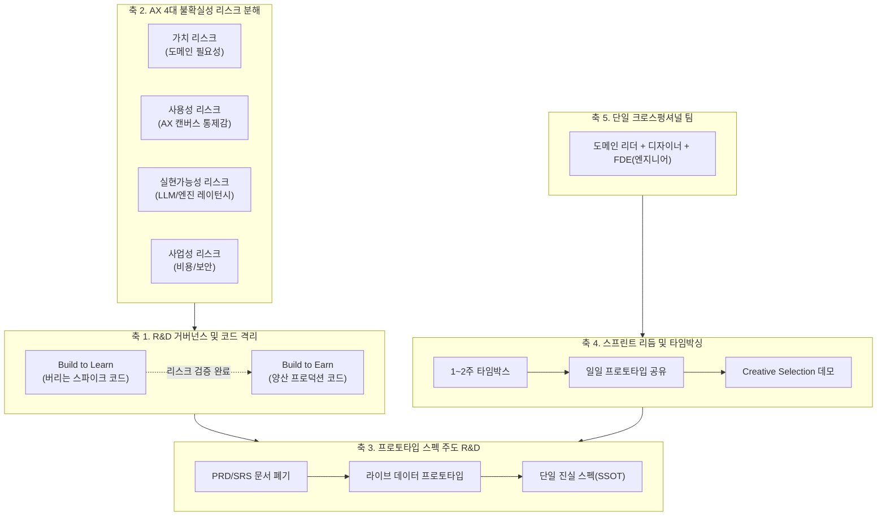

# SVPG Product Discovery 기반 AX R&D 소프트웨어 프로젝트 매니징 체계

## 1. 개요 및 배경

본 문서는 실리콘밸리 제품 연구소(SVPG, Silicon Valley Product Group)의 마티 케이건(Marty Cagan)이 정립한 **Product Discovery 지식 파이프라인(2007~2026, 총 40편)**을 전수 감사(Full Audit)하여, **AX(AI Experience) R&D 소프트웨어 프로젝트 매니징**을 체계화하기 위한 정본 기준서입니다.

### 당면 과제: 기존 R&D 매니징의 구조적 결함
1. **이종 프레임워크의 단순 짜깁기**: XP(Spike, Tracer Bullet), 린(Lean), Stage-Gate(Kill Criteria), Shape Up, Scrum 등이 단일 1열 선형 트리로 묶이면서 실행 단계에서 상호 충돌 발생.
2. **코드 거버넌스 부재**: 탐색적 연구(스파이크)용 코드가 양산 코드베이스에 그대로 침투하여 아키텍처 부채 폭증.
3. **관료적 문서화의 함정**: 비결정론적 AI/LLM 환경에서 무거운 사전 기획서(PRD/SRS)로 개발자를 통제하려다 분석 마비(Analysis Paralysis) 초래.
4. **팀 격리 안티패턴**: 기획/연구 부서와 양산 엔지니어링 부서의 분리로 인해 R&D 산출물이 양산 시점에 대량 폐기되거나 재작업되는 비효율.

---

## 2. SVPG 40편 전수 적합성 감사 매트릭스 (Full 40-Card Audit)

SVPG Product Discovery 파이프라인 40장 전체를 전수 점검하여, AX R&D 소프트웨어 프로젝트 매니징 체계와의 부합도를 3단계로 판정하였습니다.

* **[Core] 핵심 직결 (20장)**: R&D 거버넌스, 리스크 분해, 스파이크 실행, 스펙화, 코드 격리에 직결되는 필수 규칙.
* **[Supporting] 보조 및 환경 (13장)**: 팀 운영 리듬, 코칭, 데이터 사이언스 결합, 성과 지표 설정 등 지원 프랙티스.
* **[Context] 일반 배경/비대상 (7장)**: 역사적 회고, 도서 저작 등 본 소프트웨어 R&D 체계화에서는 후순위인 문서.

| 번호 | 카드 ID 및 제목 | 판정 | AX R&D 프로젝트 매니징 연계 사유 |
| :---: | :--- | :---: | :--- |
| **01** | `C-2007-09-24` Product Discovery 정의와 3대 리스크 | **Core** | R&D를 사양서 작성이 아닌 리스크 검증 루프로 정의하는 출발점 |
| **02** | `C-2008-05-12` 시장 발견 vs 제품 발견 | **Supporting** | 거시적 시장 기회 조사와 실제 작동하는 솔루션 발견의 경계 설정 |
| **03** | `C-2009-09-08` 발견 vs 국소 최적화 | **Supporting** | 단순 A/B 테스트 최적화에 갇히지 않고 기술/가치 도약 R&D를 추진하는 근거 |
| **04** | `C-2009-10-12` Product Discovery 계획 4단계 | **Core** | R&D 착수 전 명확한 가설과 프로토타입 전략을 수립하는 프레임워크 |
| **05** | `C-2009-11-12` 1주일 실행 일지와 일일 리듬 | **Supporting** | 1주일 단위 R&D 스파이크의 요일별 운영 프로토콜 참조 모델 |
| **06** | `C-2010-03-05` 비기술/물리적 환경의 발견 | **Context** | 하드웨어/오프라인 위주 내용으로 소프트웨어 R&D 직접 체계화에서 제외 |
| **07** | `C-2011-02-20` 라이브 데이터 프로토타입 | **Core** | AI/LLM 파이프라인에서 실제 데이터 흐름을 검증하는 최소 스파이크 기법 |
| **08** | `C-2012-08-20` 타임박싱과 분석 마비 방지 | **Core** | R&D가 끝없는 학술 연구로 늘어지는 것을 차단하는 1~2주 강제 타임박스 |
| **09** | `C-2012-10-24` 지속적 제품 발견 | **Supporting** | 일회성 R&D 과제가 아닌 상시 가설 검증 파이프라인 정착 |
| **10** | `C-2013-11-22` 성숙 기업의 2대 보호 장치 | **Supporting** | 기존 안정적 아키텍처를 훼손하지 않고 격리된 R&D를 수행하는 보호망 |
| **11** | `C-2015-10-22` 디스커버리 vs 딜리버리 듀얼 트랙 | **Core** | R&D(학습 트랙)와 양산 개발(배포 트랙)의 병렬 운영 아키텍처 |
| **12** | `C-2016-02-29` Discovery 스프린트의 제약 | **Core** | 일반 디자인 스프린트의 엔지니어링 실현가능성 검증 결함을 보완하는 규칙 |
| **13** | `C-2016-11-28` 성과(Outcome) 중심 정렬 | **Supporting** | 단순 기능(Feature) 목록이 아닌 성과 지표(Outcome) 기반 목표 정렬 |
| **14** | `C-2017-04-04` 10대 함정과 안티패턴 | **Core** | R&D 매니징 시 범하는 10대 치명적 오류(기능 공장화, 엔지니어 소외 등) 방지책 |
| **15** | `C-2017-09-05` 데이터 사이언스 통합 | **Core** | AI/데이터 전문가를 사후 분석가가 아닌 R&D 초기 가설 파트너로 결합 |
| **16** | `C-2017-12-04` 4대 핵심 리스크와 R&R | **Core** | 가치/사용성/실현가능성/사업성의 4대 리스크 정의 및 오너십 분배 |
| **17** | `C-2018-01-29` 규제/보안 환경에서의 발견 | **Supporting** | 데이터 보안, 개인정보, API 규제 이슈를 선제 해결하는 프로토콜 |
| **18** | `C-2018-05-31` MVP 은유의 오해와 진실 | **Core** | 조악한 제품 배포가 아닌 핵심 불확실성 학습 도구로서의 프로토타입 재정의 |
| **19** | `C-2018-09-28` 애플의 데모 중심 창조적 선택 | **Core** | 문서 기반 설득 대신 작동하는 엔지니어링 데모로 의사결정하는 R&D 문화 |
| **20** | `C-2019-01-16` PM 4대 취약 영역 코칭 | **Supporting** | 엔지니어 신뢰 결여, 데이터 편향 등 R&D 리더가 피해야 할 결함 |
| **21** | `C-2019-08-09` 진정한 협업(Collaboration) | **Core** | 엔지니어에게 솔루션을 지시하는 것이 아니라 문제와 리스크를 공동 해결하는 규범 |
| **22** | `C-2020-04-13` 원격 근무 환경에서의 지속 전략 | **Supporting** | 비동기 소통 환경에서 디스커버리가 기계적 티켓 처리로 전락하는 것 방지 |
| **23** | `C-2020-06-01` Product Discovery 기원 | **Context** | 90년대 워터폴 실패 회고 중심 역사적 문서 (배경 지식) |
| **24** | `C-2020-09-01` 단순 학습 vs 제품 통찰 | **Supporting** | R&D 스파이크 결과가 단순 사실 나열이 아닌 아키텍처적 통찰로 이어지는 기준 |
| **25** | `C-2020-09-04` 문제 공간 vs 솔루션 공간 | **Core** | 솔루션을 만져보면서 문제가 구체화되는 나선형 상호작용 (AX R&D 핵심) |
| **26** | `C-2020-09-10` 제품 판단력(Product Judgement) | **Supporting** | AI 비결정론적 환경에서 단순 벤치마크 지표를 넘어선 엔지니어링 판단력 |
| **27** | `C-2020-10-30` 팀 분리의 치명적 위험성 | **Core** | "기획/연구팀"과 "개발팀"을 분리하지 않고 단일 팀에서 두 트랙을 수행하는 원칙 |
| **28** | `C-2021-01-18` 심층 사고(Deep Thinking) 블록 | **Supporting** | 연속 회의에 치이지 않고 핵심 알고리즘/아키텍처 탐색 시간을 보호하는 가이드 |
| **29** | `C-2021-02-13` 일일 프로토타입(Daily Prototype) | **Core** | 매일 최소 단위의 동작 데모를 공유하여 피드백 루프를 극단으로 단축하는 의식 |
| **30** | `C-2021-03-27` 디스커버리 5대 변명 논파 | **Supporting** | 시간 부족, 리소스 부족 등 현장 회피 심리를 돌파하는 논리적 방패 |
| **31** | `C-2021-06-14` 도서 저작 프로세스 | **Context** | 출판 및 도서 저작 비유 문서로 R&D 프로젝트 매니징에서 제외 |
| **32** | `C-2021-08-25` 방대한 문서화 관료주의 폐기 | **Core** | 수십 장의 PRD 문서를 버리고 작동하는 인터랙티브 프로토타입을 단일 스펙으로 확립 |
| **33** | `C-2021-10-11` 비판적 피드백 수용과 자아 분리 | **Supporting** | 가설 검증 실패를 개인의 무능이 아닌 리스크 사전 차단의 성공으로 보는 문화 |
| **34** | `C-2023-01-01` 시리즈 총괄 인덱스 | **Context** | 15년 아티클 총괄 메타 인덱스 문서 |
| **35** | `C-2023-07-10` 리스크 분류학(Taxonomy) | **Core** | 사용성(Usability)을 가치와 분리하여 복잡한 AX 상호작용 문제를 격리 검증 |
| **36** | `C-2025-09-12` 프로토타입 4대 목적 | **Core** | 학습, 소통, 스펙, 정렬에 따른 프로토타입 해상도(Resolution) 통제 규칙 |
| **37** | `C-2025-09-17` 전방 배치 엔지니어(FDE) | **Core** | 엔지니어가 도메인 현장 최전선에서 기술적 타당성과 요구사항을 실시간 검증 |
| **38** | `C-2026-04-09` 상용 제품 vs 사내 도구 | **Supporting** | 내부 연구/개발 툴체인 구축 시 구성원들의 강제 채택 저항을 돌파하는 해법 |
| **39** | `C-2026-04-16` Build to Learn vs Build to Earn | **Core** | **[최상위 헌법]** 학습용 스파이크 코드와 수익 창출용 프로덕션 코드의 절대 격리 |
| **40** | `C-2026-04-27` Build to Learn 실무 FAQ | **Core** | AI 시대 버리는 코드의 경제학, 엔지니어의 심리적 저항 극복 가이드 |

---

## 3. AX R&D 프로젝트 매니징 체계 5대 핵심 실천 축

위 20장의 핵심 카드를 바탕으로, AX(AI Experience) 소프트웨어 R&D의 특수성을 반영한 5대 프로젝트 매니징 아키텍처를 정립합니다.

### 축 1: R&D 거버넌스 및 코드 수명주기 격리 (Code Lifecycle Governance)
* **최상위 헌법 (`C-2026-04-16`, `C-2026-04-27`)**:
  * 코드는 오직 두 종류로 엄격히 분리된다: **'불확실성을 해소하기 위해 버릴 각오로 짜는 코드(Build to Learn)'**와 **'안정성과 확장성을 담보하는 상용 코드(Build to Earn)'**.
  * R&D 스파이크의 산출물은 '코드'가 아니라 **'리스크 해소 결과 및 아키텍처 통찰 보고서'**이다. 스파이크 코드는 검증 직후 폐기(Throw-away)하는 것을 원칙으로 한다.
* **듀얼 트랙 병렬 운영 (`C-2015-10-22`)**:
  * 디스커버리(1~3일 스파이크)와 딜리버리(2주 개발 스프린트)는 별도의 단계가 아니라 상시 병렬로 순환한다.
  * 스파이크를 통해 4대 리스크가 제거된 아이템만 선별하여 양산 WBS 백로그로 등록한다.

### 축 2: AX 4대 불확실성 리스크 분해 (Risk Dissection)
* **4대 리스크 오너십 분배 (`C-2017-12-04`)**:
  * **가치(Value)**: 사용자가 실제로 이 AI 기능을 원하는가? (도메인 리더)
  * **사용성(Usability)**: 사용자가 복잡한 AI 피드백을 직관적으로 조작하고 통제할 수 있는가? (AX 디자이너)
  * **실현가능성(Feasibility)**: 현행 LLM/API의 레이턴시, 비결정론적 응답, 콘텍스트 윈도우 한계 내에서 구현 가능한가? (엔지니어)
  * **사업성(Viability)**: API 호출 비용, 보안 규정, 지적재산권 요건을 충족하는가? (프로덕트 매니저)
* **사용성(Usability)의 독립 분리 (`C-2023-07-10`)**:
  * AI 추론 로직(Feasibility)과 사용자 인터랙션 캔버스(Usability)의 검증 스파이크를 완전히 분리하여 각각 측정한다.
* **문제와 솔루션의 나선형 공진화 (`C-2020-09-04`)**:
  * 문제를 완벽히 정의한 뒤 솔루션을 개발하려 하지 않는다. 거친 AI 파이프라인 솔루션을 직접 조작해 보며 비로소 진짜 문제가 무엇인지 정의한다.

### 축 3: 프로토타입 스펙 주도 R&D (Prototype as Spec)
* **문서 관료주의 폐기 (`C-2021-08-25`)**:
  * 수십 페이지의 장문 PRD 문서를 작성하지 않는다. 문서는 오해와 왜곡을 낳을 뿐이다.
  * **'작동하는 인터랙티브 프로토타입'**을 개발 스펙의 단일 진실 공급원(SSOT)으로 삼는다.
* **프로토타입 4대 목적과 해상도 통제 (`C-2025-09-12`)**:
  * **학습용 (Learn)**: 리스크 검증만을 목적으로 초단기 제작하는 저해상도 코드.
  * **소통용 (Communicate)**: 팀원 간 감각을 맞추는 인터랙션 프로토타입.
  * **스펙용 (Spec)**: 양산 개발자가 엣지케이스와 인터페이스를 파악하는 고해상도 프로토타입.
  * **정렬용 (Align)**: 의사결정권자에게 기술적 가능성을 실증하는 데모.
* **라이브 데이터 프로토타입 (`C-2011-02-20`)**:
  * 정적 목업(Figma)을 넘어, 실제 LLM API와 데이터 스트림이 결합된 최소 실행 스파이크로 체감 반응 속도와 결과 품질을 실측한다.

### 축 4: R&D 스프린트 실행 리듬 및 타임박싱 (Cadence & Time-Boxing)
* **강제 타임박싱 (`C-2012-08-20`)**:
  * R&D 과제는 1~2주의 엄격한 타임박스를 부여한다. 기한 만료 시 추가 시간 투입 없이 현재 데이터로 [GO / PIVOT / KILL]을 결정한다.
* **디스커버리 스프린트의 엔지니어링 보완 (`C-2016-02-29`)**:
  * 기획/디자인 위주의 5일 스프린트 한계를 극복하기 위해, 첫날부터 엔지니어의 기술적 타당성 스파이크를 1:1로 결합한다.
* **일일 프로토타입 의식 (`C-2021-02-13`)**:
  * 매일 오후 팀원들이 최소 단위의 동작 데모를 공유하고 피드백을 교환하여 학습 루프를 24시간 단위로 압축한다.
* **데모 중심 창조적 선택 (`C-2018-09-28`)**:
  * 회의실에서 말로 논쟁하지 않는다. 복수의 기술 대안이 있다면 엔지니어가 나란히 데모를 구축하여 직접 사용해 보고 결정한다.

### 축 5: 단일 크로스펑셔널 팀 구조 및 안티패턴 방어 (Team & Governance)
* **연구/개발 팀 분리 금지 (`C-2020-10-30`)**:
  * "연구/기획팀(Discovery)"과 "양산/개발팀(Delivery)"을 물리적으로 분리하는 것은 최악의 안티패턴이다. 단일 스쿼드 내에서 두 트랙을 모두 수행한다.
* **전방 배치 엔지니어 FDE (`C-2025-09-17`)**:
  * 엔지니어가 도메인 실무 현장 최전선에서 사용자 워크플로우를 직접 관찰하고 아키텍처를 설계한다.
* **10대 안티패턴 상시 점검 (`C-2017-04-04`)**:
  * 스프린트 백로그가 단순 기능 요구사항 나열로 전락하는 현상(Feature Factory), 엔지니어가 단순 코딩 하청으로 전락하는 현상을 원천 방지한다.

---

## 4. 기존 볼트 R&D 관리 체계의 정본 개편 가이드

외부 볼트(`What-s-in-my-head`)에 기존 작성된 R&D 매니징 자료들의 구조적 혼란을 다음과 같이 단칼에 정리합니다.

| 기존 문서의 개념 혼란 | SVPG 기반 정본 해결책 |
| :--- | :--- |
| **스파이크와 일반 Task의 혼재** (WBS에 스파이크가 섞여 일정 예측 불가) | **축 1 적용**: WBS는 오직 '양산(Build to Earn)'만 관리. 스파이크는 'Build to Learn' 트랙으로 완전 격리하여 1~3일 타임박스로만 운영. |
| **Stage-Gate 식 Kill Criteria의 경직성** (사전 문서 기반 관문 통과 시도) | **축 3·4 적용**: 문서 심사가 아니라 **'일일 라이브 프로토타입 데모'**를 통해 실증 데이터로 통과 여부 즉시 결정. |
| **방대한 기술/기획 문서 작성 부담** (PRD/SRS 작성에 리소스 소진) | **축 3 적용**: PRD 관료주의 폐기. 작동하는 프로토타입 + 핵심 리스크 검증 결과서(1페이지)로 스펙 대체. |
| **AI 기능의 체감 품질 불확실성** (정적 와이어프레임으로 기획 후 구현 시 파탄) | **축 2·3 적용**: Usability와 Feasibility를 분리하여 실제 LLM API가 연결된 **라이브 데이터 프로토타입**으로 사전 체감 검증. |

---

## 5. 결론 및 R&D 태스크 정의 규약 (DoD)

앞으로 신규 생성되는 모든 AX R&D 태스크는 다음의 **완료 정의(Definition of Done)**를 충족해야 합니다:

1. **가설 및 리스크 명시**: 4대 리스크(가치, 사용성, 실현가능성, 사업성) 중 어떤 리스크를 해소하기 위한 스파이크인지 명시되었는가?
2. **타임박스 설정**: 3일 이내(최대 1주)의 엄격한 기한이 설정되었는가?
3. **학습 산출물 정의**: 동작하는 프로토타입 데모와 1페이지 검증 보고서가 도출되었는가?
4. **코드 거버넌스 준수**: 스파이크 코드가 프로덕션 코드베이스를 직접 오염시키지 않고 격리 브랜치/디렉터리에서 수행된 후 폐기/정규화 절차를 밟았는가?
