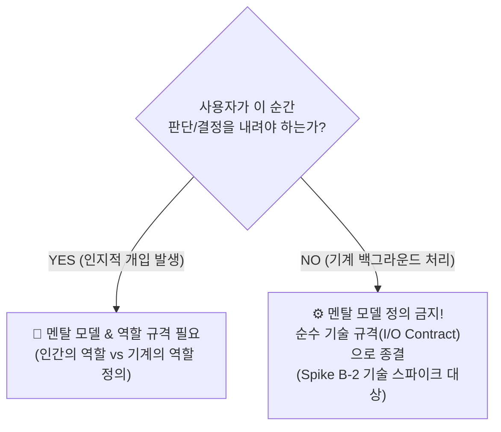
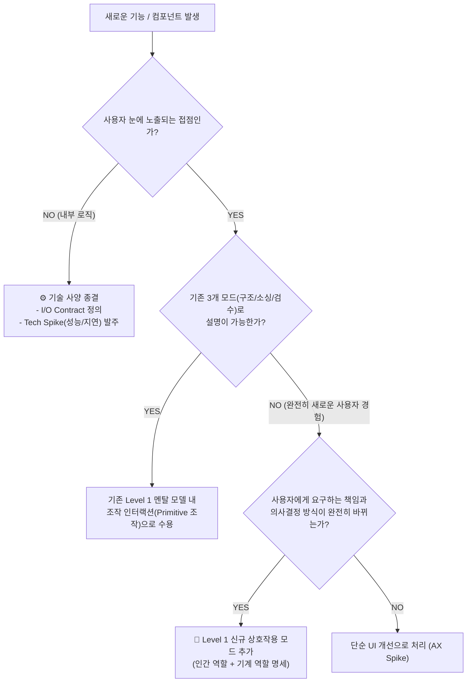

# 멘탈 모델과 역할 규격의 정의 경계 및 해상도 기준

> **핵심 요약**: 멘탈 모델은 시스템의 내부 구현(모듈, 에이전트, Primitive)마다 만드는 것이 아닙니다. **"인간이 개입하여 판단·결정·승인하는 인지적 인수인계선(Cognitive Hand-off)"**을 기준으로 자르며, **[Level 0: 서비스 헌법 → Level 1: 상호작용 모드(2~3개) → Level 2: 쐐기 접점]**의 3계층까지만 정의하고 그 이하는 철저히 기술 계약(I/O Contract)으로 격리해야 설계의 늪(Over-engineering)을 차단할 수 있습니다.

---

## 1. 문제의식: 왜 정의 경계(Stop Rule)가 필요한가?

프로덕트 및 아키텍처 설계 시 가장 흔하게 빠지는 두 가지 치명적 함정이 있습니다.

1. **설계 과적의 늪 (Over-engineering)**:
   - "모든 Primitive(Segment, Slot 등)마다 멘탈 모델이 있어야 하는가?"
   - "에이전트마다, 에이전트가 수행하는 내부 Action(파싱, 검색, 임베딩)마다 역할을 다 정의해야 하는가?"
   - ➔ 결과: 기획 문서만 수십 페이지가 되고, 정작 개발과 디자인은 어디서부터 손대야 할지 마비됨.
2. **거시적 슬로건의 함정 (Under-specification)**:
   - "사용자는 아키텍트이고 시스템은 코파일럿이다"라는 최상위 선언 하나만 던져둠.
   - ➔ 결과: 디자이너는 화면만 복잡하게 그리고, 개발자는 LLM 한 번 호출로 통짜 글을 뽑아내는 기존의 낡은 블랙박스 생성기(Form-Filler)로 회귀함.

따라서 **"어디까지 멘탈 모델로 다루고, 어디서부터 엔지니어링 기술 사양으로 넘길 것인가?"**에 대한 명확한 절단 기준이 필요합니다.

---

## 2. 제1 원칙: 인지적 개입선 (Cognitive Hand-off Rule)

멘탈 모델은 시스템 내부 구조(Code/DB/Agent)를 위한 것이 아니라, **인간의 뇌(사용자 인지)가 시스템을 이해하고 통제감을 느끼게 하기 위한 도구**입니다.

> 🛑 **절대 중단 규칙 (Stop Rule)**:  
> **"사용자가 화면을 보고 무언가를 '판단'하거나 '결정'하지 않는 구간에는 멘탈 모델을 두지 않는다."**

---

## 3. 멘탈 모델의 3계층 위계 (적정 해상도 기준)

멘탈 모델과 역할 규격은 서비스 전체에서 **오직 3계층까지만** 정의합니다. 그 이상 쪼개는 것은 엔지니어링 영역의 침범입니다.

| 계층 | 대상 | 정의 내용 | 구체적 예시 |
| :--- | :--- | :--- | :--- |
| **Level 0. 서비스 헌법** | **서비스 전체** (단 1개) | 인간과 기계의 근본적인 존재론적 관계 | *"인간은 결재권을 가진 아키텍트/리뷰어, 기계는 뼈대에 살을 붙이는 초안 빌더"* |
| **Level 1. 상호작용 모드** | **인간의 행동 맥락** (통상 2~3개) | 작업 단계(화면 상태)에 따른 역할 전환 규격 | **① 구조 설계 모드**: 인간=도시계획자, 기계=구조 가이드 **② 조달/소싱 모드**: 인간=큐레이터, 기계=분류·추출기 **③ 검수/조립 모드**: 인간=최종결재자, 기계=초안작성비서 |
| **Level 2. 결정적 접점 (Wedge)** | **최초 침투 액션** (단 1~2개) | 새로운 역할을 3초 만에 체감하는 손맛 | *"기계가 슬롯에 올린 Diff 제안을 인간이 `Tab` 키로 즉시 승인(Patch)한다"* |
| 🛑 **Level 3 이하** | **에이전트 Action / 내부 모듈** | **정의 엄격 금지** (설계 과적) | I/O Contract(입출력 JSON), 런타임 제약(ms), 단위 알고리즘 사양으로 격리 |

---

## 4. 자주 혼동하는 대상별 명확한 정리

### ① Primitive(Segment, Slot 등) vs 멘탈 모델
* **오해**: "Segment용 멘탈 모델, Slot용 멘탈 모델을 각각 따로 만들어야 하는가?"
* **진실**: **Primitive는 멘탈 모델 안에서 인간이 손에 쥐는 '레고 블록(명사/재료)'일 뿐입니다.**
  * 언어에 비유하자면 Primitive는 **'단어'**이고, 멘탈 모델은 **'문장 규칙'**입니다. 단어 하나마다 문법을 새로 만들지 않듯, Primitive마다 역할을 따로 정의하지 않습니다.

### ② 에이전트(Agent) vs 멘탈 모델
* **오해**: "에이전트 A, 에이전트 B마다 멘탈 모델을 개별 정의해야 하는가?"
* **진실**: 사용자는 에이전트가 뒤에서 몇 마리가 도는지 알 필요가 없습니다.
  * 시스템 뒤에 10마리의 서브 에이전트가 동작하더라도, 사용자가 '검수 모드'에 있다면 사용자에게 비치는 기계의 역할은 **'초안을 정중히 올리는 단 하나의 비서'**로 통일되어야 합니다.

### ③ 에이전트 Action(파싱, 검색, 임베딩) vs 멘탈 모델
* **오해**: "에이전트가 텍스트를 파싱할 때의 사용자 역할을 정의해야 하는가?"
* **진실**: 완전한 백그라운드 자동화 구간입니다.
  * 여긴 멘탈 모델이 아니라 **Spike B-2에서 정의한 [Input JSON ➔ Output JSON ➔ 런타임 5ms 지연]**이라는 기술 계약(Contract)으로만 다룹니다.

---

## 5. 실무 판정 흐름도 (Decision Flowchart)

새로운 기능이나 아키텍처를 구상할 때, 이것을 멘탈 모델로 정의할지 기술 스펙으로 넘길지 판단하는 트리입니다.

---

## 6. 결론: 프로덕트 아키텍트의 원칙

* **멘탈 모델은 '단순함'을 위해 존재합니다.** 시스템이 복잡해질수록 사용자가 인지하는 멘탈 모델은 오히려 단순하고 일관되어야 합니다.
* **사용자에게는 '통제감(결재권)'을 주고, 기계에게는 '명확한 제약(Diff 제안)'을 주는 것**이 멘탈 모델 & 역할 규격의 궁극적인 목표입니다.
* 이를 벗어난 세부 로직, 모듈 분해, 알고리즘 성능은 모두 **3일짜리 기술 스파이크(Spike B-2, Tech Feasibility)**의 주머니에 넣고 철저히 디커플링(Decoupling)해야 합니다.
