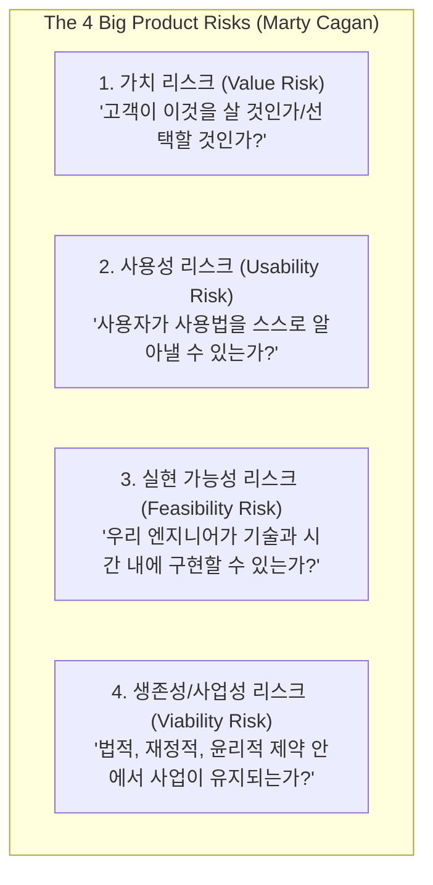

# [HDD] 마티 케이건의 4대 프로덕트 리스크 가설 체계 (Value·Usability·Feasibility·Viability)

> **원전 정보**:  
> * **저자**: 마티 케이건 (Marty Cagan - Silicon Valley Product Group 설립자, 전 이베이/넷스케이프 제품 총괄)  
> * **원서**: 《인스파이어드 (INSPIRED: How to Create Tech Products Customers Love)》  
> * **공식 아티클**: [The Four Big Risks (SVPG)](https://www.svpg.com/the-four-big-risks/)  
> * **성격**: 실리콘밸리 테크 기업들이 제품을 기획하고 R&D 가설을 세울 때 사용하는 **가장 보편적인 표준 가설 분류 프레임워크 (Industry Standard)**

---

## 1. 개요: 제품 실패의 4대 원인과 HDD

마티 케이건은 소프트웨어가 실패하는 이유는 수백 가지가 아니라, **정확히 4가지 치명적 리스크 중 하나를 사전에 가설로 검증하지 않았기 때문**이라고 정의합니다.

가설 주도 개발(HDD)에서는 "기능을 어떻게 구현할까?"를 묻기 전에, **"이 기능이 4대 리스크 중 어느 리스크를 해결하기 위한 가설인가?"**를 먼저 분류하고 검증에 착수합니다.

---

## 2. 4대 가설 유형별 상세 명세

### ① 가치 가설 (Value Hypothesis)
* **핵심 질문**: *"고객이 낡은 기존 방식(Status Quo)을 포기하고, 우리의 새로운 제안을 진짜로 선택하여 쓸 것인가?"*
* **실패 원인**: 기능은 완벽하게 돌아가지만, 아무도 그 기능을 필요로 하지 않음.
* **검증 도구**: 랜딩 페이지 사전 테스트, 가치 제안 인터뷰, Wedge Point 체감 반응 측정.
* **캔버스 매핑**: **[00. Product Thesis & 01. Paradigm Shift]** (타이핑 노동 ➔ 컴파일 엔지니어링 패러다임 수용 여부).

### ② 사용성 / AX 가설 (Usability / Cognitive Hypothesis)
* **핵심 질문**: *"사용자가 기능을 다 배우지 않아도, 화면을 보고 직관적으로 조작법을 파악할 수 있는가? 인지적 피로가 없는가?"*
* **실패 원인**: 기능은 유용한데, 사용자가 인터페이스를 이해하지 못해 포기하거나 시야가 가려 짜증을 느낌.
* **검증 도구**: Figma Low-Fi 프로토타입, 단일 HTML 샌드박스, 5분 관찰 사용성 테스트(Usability Testing).
* **캔버스 매핑**: **[Spike B-AX: AX Spike]** (슬롯 오버레이 조작 시 시선 이탈 여부 및 인라인 Tab 승인 손맛).

### ③ 실현 가능성 / 기술 가설 (Feasibility Hypothesis)
* **핵심 질문**: *"우리가 가진 엔지니어링 역량, 라이브러리, 아키텍처, 시간 제약(Timebox) 내에서 이것을 실제로 작동하게 만들 수 있는가?"*
* **실패 원인**: 아이디어는 훌륭하나, 런타임 지연, 메모리 누수, 알고리즘 복잡도로 인해 실제로 돌지 않음.
* **검증 도구**: 콘솔 더미 스크립트, 단위 알고리즘 벤치마크, I/O Contract 기반 스파이크.
* **캔버스 매핑**: **[Spike B-2: Tech / Feasibility Spike]** (Segment ➔ Slot 바인딩 지연 < 5ms 달성 여부).

### ④ 생존성 / 비즈니스 제약 가설 (Viability Hypothesis)
* **핵심 질문**: *"이 솔루션이 법적 규제, 오픈소스 라이선스, 비용 한계, 아키텍처 제약(Target Contract) 안에서 지속 가능한가?"*
* **실패 원인**: 기술은 작동하지만, 상용 라이선스 위반(GPL 충돌), API 호출 비용 폭탄, 번들 크기 초과로 서비스 불능.
* **검증 도구**: 1일 타임박스 라이브러리 조사(Make vs Buy), ADR 문서화, 제약 조건 체크리스트.
* **캔버스 매핑**: **[Spike 4: Library / Make vs Buy Spike & Target Contract]**.

---

## 3. 실무 가설 수립 매트릭스

실무에서 새로운 R&D 과업을 시작할 때 사용하는 표준 가설 분류 카드입니다:

| 리스크 유형 | 가설 기술서 포맷 (Template) | 판정 기준 (Gate Indicator) |
| :--- | :--- | :--- |
| **Value** | 우리는 [사용자]에게 [새로운 패러다임]을 주면, [기존 방식 대비 전환율 X%]를 보일 것이라 믿는다. | 사용자의 [Wedge Point] 자발적 반복 사용률 |
| **Usability** | 우리는 [인라인 인터랙션]을 도입하면, [문맥 전환 피로] 없이 [1회 클릭]으로 완료할 것이라 믿는다. | 5분 관찰 시 헤맴 0건, 클릭 수 < 2회 |
| **Feasibility** | 우리는 [특정 알고리즘]을 쓰면, [더미 데이터 1만 건] 처리 시 [지연 < 16ms]를 달성할 것이라 믿는다. | 콘솔 벤치마크 수치 측정 및 프로파일러 로그 |
| **Viability** | 우리는 [후보 라이브러리]를 채택하면, [라이선스 충돌] 없이 [번들 증가 < 50KB]를 지킬 것이라 믿는다. | Target Contract 제약 통과 여부 및 ADR 확정 |

---

## 💡 결론 및 시사점

마티 케이건의 4대 리스크는 **"모든 가설을 하나의 주머니에 뭉뚱그리지 말고, 내가 지금 기술을 테스트하는지(Feasibility), 손맛을 테스트하는지(Usability)를 칼같이 분리해서 실험하라"**는 것입니다.  
이는 대표님 캔버스에서 **B-2(기술)와 B-AX(경험)를 디커플링하여 분리 발주**한 아키텍처 원칙과 완벽하게 일치합니다.
