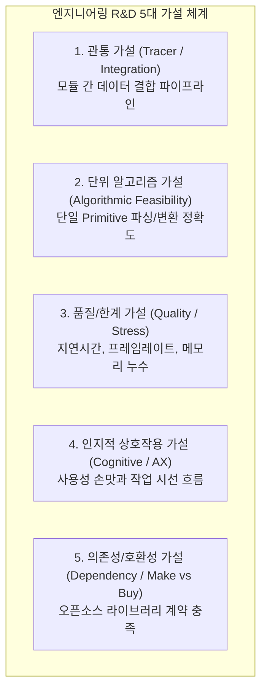

# [HDD] 소프트웨어 아키텍처 R&D 5대 가설 분류 체계 (Tracer·Algorithm·Quality·AX·Dependency)

> **원전 정보**:  
> * **학술 / 업계 출처**: 마틴 파울러(Martin Fowler), IEEE Software Architecture Guidelines, Extreme Programming (XP)  
> * **성격**: 비즈니스 기획 차원이 아니라, **소프트웨어 엔지니어와 아키텍트가 기술적 불확실성을 코드로 검증할 때 사용하는 공학적 R&D 가설 체계**

---

## 1. 개요: 엔지니어링 HDD의 본질

기획서 상의 아이디어가 아무리 좋아도, 소프트웨어는 메모리 누수, 런타임 지연, 모듈 결합 오류 등의 기술적 벽에 부딪힙니다.  
엔지니어링 R&D에서의 가설 주도 개발(HDD)은 **"불확실성이 높은 기술적 미지의 영역(Unknowns)을 5가지 성격의 공학적 가설로 분해하여 3일 타임박스 스파이크(Spike)로 검증하는 활동"**입니다.

---

## 2. 엔지니어링 R&D 5대 가설 상세 명세

### ① 관통 가설 (Tracer / Functional Integration Hypothesis)
* **공학적 정의**: 두 개 이상의 서로 다른 모듈(Primitive)이 만났을 때, 런타임 데이터 스키마 충돌 없이 처음부터 끝까지 신호가 관통할 수 있다는 가설.
* **핵심 질문**: *"Segment(데이터)가 Scaffold(슬롯)에 타입 에러 없이 인라인으로 주입되는가?"*
* **검증 기법**: **Integration Spike (최대 3일)** ➔ 최소 파이프라인 E2E 관통 데모.
* **DoD & Kill**:
  * ✅ DoD: 데이터 추출부터 슬롯 렌더링까지 한 줄 관통 성공 (Tracer Bullet).
  * 🛑 Kill/Pivot: 3일 내 데이터 스키마 불일치 해결 불가 시 ➔ 어댑터 패턴(IR)으로 Pivot.

### ② 단위 알고리즘 가설 (Algorithmic / Core Primitive Feasibility)
* **공학적 정의**: 시스템 전체와 상관없이, 단일 Primitive를 생성·파싱·변환하는 핵심 알고리즘이 기술적으로 동작 가능하다는 가설.
* **핵심 질문**: *"비정형 텍스트 1만 자를 파싱할 때 마크다운 서식을 보존하면서 50ms 내에 AST로 변환할 수 있는가?"*
* **검증 기법**: **Tech / Feasibility Spike (1~2일)** ➔ 콘솔 더미 스크립트 및 단위 벤치마크.
* **DoD & Kill**:
  * ✅ DoD: 파싱 지연 < 50ms, 원본 오프셋(Source Offset) 보존율 100%.
  * 🛑 Kill/Pivot: 파싱 지연 100ms 초과 시 ➔ AST 파서 폐기하고 토큰 기반 파서로 Pivot.

### ③ 품질/한계 가설 (Quality Attribute / Stress Hypothesis)
* **공학적 정의**: 시스템이 극한의 부하, 대규모 데이터, 동시 조작 환경에서도 비기능적 요구사항(성능, 메모리, 반응속도)을 방어할 수 있다는 가설.
* **핵심 질문**: *"슬롯 500개가 캔버스에 렌더링된 상태에서 조작해도 브라우저 프레임이 60fps로 방어되는가?"*
* **검증 기법**: **Stress / Non-Functional Spike (1~2일)** ➔ 부하 발생 스크립트 및 브라우저 프로파일러.
* **DoD & Kill**:
  * ✅ DoD: 슬롯 500개 조작 시 60fps 유지, 1시간 연속 조작 시 메모리 누수 0MB.
  * 🛑 Kill/Pivot: 슬롯 100개 미만에서 30fps(버벅임) 추락 시 ➔ 즉시 가상화(Virtualization) 엔진 도입으로 Pivot.

### ④ 인지적 상호작용 가설 (Cognitive Interaction / AX Hypothesis)
* **공학적 정의**: 인간-컴퓨터 상호작용(HCI) 관점에서, 특정 인터랙션이 작업자의 인지 부하(Cognitive Load)를 실제로 줄여준다는 가설.
* **핵심 질문**: *"슬롯 추천 시 인라인 Tab 방식이 팝업 클릭 방식보다 작업자의 문맥 전환 피로를 덜어주는가?"*
* **검증 기법**: **AX / Design Spike (1~2일)** ➔ Figma 프로토타입 또는 단일 HTML 하네스.
* **DoD & Kill**:
  * ✅ DoD: 본문 시선 이탈 0건, 단 1회의 키 입력(Tab)으로 완료.
  * 🛑 Kill/Pivot: 오버레이로 인한 시야 차폐 피로 호소 시 ➔ 즉시 우측 사이드바 핀(Pin) 방식으로 Pivot.

### ⑤ 의존성/호환성 가설 (Dependency / Make vs Buy Hypothesis)
* **공학적 정의**: 우리가 정의한 엄격한 제약(Target Contract)을 만족하는 외부 오픈소스 라이브러리가 세상에 존재하며, 이를 도입하는 것이 자체 구현보다 낫다는 가설.
* **핵심 질문**: *"렌더링 지연 < 16ms와 MIT 라이선스를 만족하는 캔버스 슬롯 라이브러리가 존재하는가?"*
* **검증 기법**: **Library Spike (딱 1일 / 8시간 엄격 제한)** ➔ 후보 2~3개 PoC 비교.
* **DoD & Kill**:
  * ✅ DoD: 후보 비교표 및 1페이지 아키텍처 결정 기록(ADR) 작성 완료.
  * 🛑 Kill/Pivot: 8시간 내 Contract 만족 라이브러리 0개 시 ➔ 외부 도입 즉시 중단(Kill) & **자체 구현(Make) 확정**.

---

## 3. 💡 캔버스 아키텍처와의 1:1 대응표

| 엔지니어링 HDD 5대 가설 | 캔버스 상의 Spike 분류 체계 | 위임 패키지 및 도구 |
| :--- | :--- | :--- |
| **관통 가설 (Tracer)** | **🔗 3. Integration Spike** | Spike B-2 (I/O Contract JSON 스키마) |
| **단위 알고리즘 가설** | **⚙️ 2. Tech Spike** | 콘솔 벤치마크 스크립트 |
| **품질/한계 가설** | **📈 5. Stress Spike** | 브라우저 프로파일러 / 메모리 측정 |
| **인지적 상호작용 가설** | **🎨 1. AX Spike** | Spike B-AX (Mock 킷 & Sandbox 하네스) |
| **의존성/호환성 가설** | **🔍 4. Make vs Buy Spike** | Target Contract ➔ 1일 탐색 ➔ ADR 자산화 |

이 분류 체계가 확립되어 있으면, 개발팀은 *"뭘 검증해야 할지 모르겠다"*고 우왕좌왕하지 않고 **5가지 가설 템플릿 중 하나를 골라 1~3일 안에 명확한 DoD와 Kill 기준으로 코드를 격파**할 수 있습니다.
