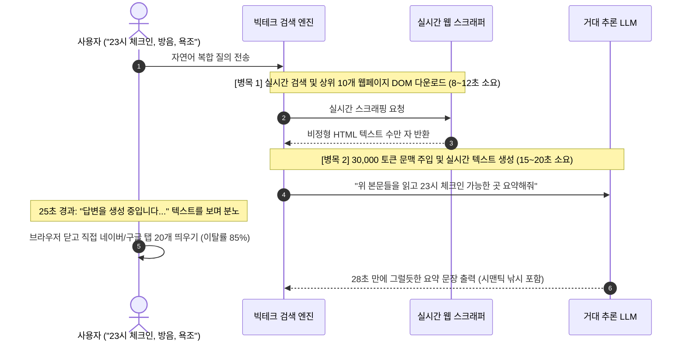
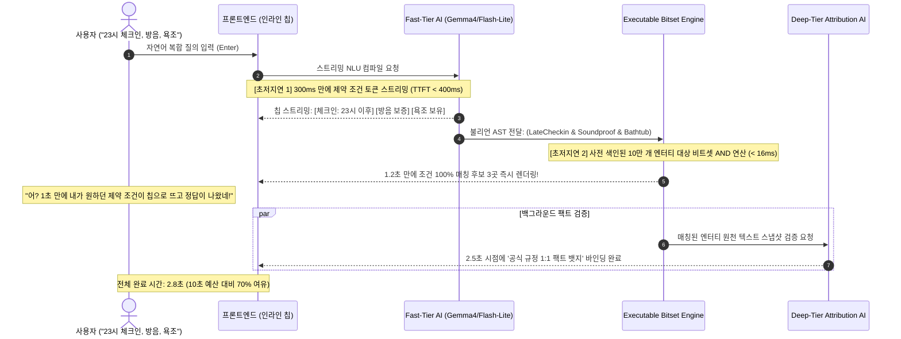

# 서브리스크 카드 07 — Latency & Performance Risk (빅테크 LLM의 30초 추론 지연을 깨는 2-Tier 하이브리드 런타임)

> **SVPG 정본 헌법 (AI 시대의 Feasibility Risk)**:  
> **"과거의 기술 실현가능성(Feasibility)이 '우리 엔지니어가 코딩할 수 있는가'였다면, AI 시대의 실현가능성은 '비결정론적 AI 모델의 물리적 한계(추론 레이턴시, 토큰 생성 지연, 환각) 하에서 고객의 인내 시간(Latency Budget)을 사수할 수 있는가'로 완전히 재정의된다. 빅테크처럼 모든 것을 거대 LLM 하나에 통째로 쏟아붓고 20초간 로딩 스피너를 돌리는 것은 기술적 혁신이 아니라 엔지니어링 아키텍처의 직무유기다. AI가 가장 잘하는 영역(자연어 해석)과 엔지니어링이 가장 잘하는 영역(초고속 결정론적 연산)을 엄격히 분리(Decoupling)해야만 10초의 벽을 깰 수 있다."**  
> *(출처: [`C-2026-04-16 Build to Learn vs Build to Earn`](file:///c:/AI_Projects/WebNovelAssistant/VibePatchNote/workbench/96.data_pipeline/svpg-product-discovery/C-2026-04-16_build_to_learn_vs_build_to_earn.md) E2, [`C-2017-09-05 Leveraging Data Science`](file:///c:/AI_Projects/WebNovelAssistant/VibePatchNote/workbench/96.data_pipeline/svpg-product-discovery/C-2017-09-05_leveraging_data_science.md) E4, [`C-2017-12-04 The Four Big Risks`](file:///c:/AI_Projects/WebNovelAssistant/VibePatchNote/workbench/96.data_pipeline/svpg-product-discovery/C-2017-12-04_the_four_big_risks.md) E3)*

---

## 1. 서브 리스크 정의 및 검증 전제 (Premise)

*(토론 카드 01-E/F 및 가설 3.0과의 1:1 결속: [`가설 카드 3.0`](file:///c:/망고독%20관련%20자료/프로젝트_매니지먼트/What-s-in-my-head/3.📦(Resource)%20자료/R&D%20프로젝트%20매니징/SVPG_Discoverying_실전적용/hypothesis/(gen)가설%20카드%203.0%20—%20상황%20제약%20매칭%20엔진%20및%20관심사%20렌즈%20기반%2010초%20정답%20런타임.md))*

* **서브 리스크 명칭**: Latency & Performance Risk (빅테크식 모놀리식 LLM 추론 지연을 극복하는 2-Tier AI 하이브리드 런타임 성능 리스크)
* **책임 주체 (R&R)**: **Product Lead Engineer (제품 리드 엔지니어)**
* **핵심 질문**:  
  > *"구글·오픈AI 등 빅테크조차 극복하지 못한 **'실시간 웹 크롤링 + 거대 LLM 엔드투엔드 추론의 20~30초 지연 지옥'**을 어떻게 깨뜨리고,  
  > **'0.4초 TTFT 인라인 칩 스트리밍 ➔ 50ms 비트셋 매칭 ➔ 전체 10초 이내(p90 < 3초) 1:1 출처 팩트 완결'**을 가능케 하는 2-Tier 하이브리드 AI 파이프라인을 엔지니어링적으로 실현할 것인가?"*
* **핵심 검증 전제**:  
  우리는 단순히 비트셋 필터만 돌리는 전통 검색엔진이 아니며, 자연어를 이해하고 비정형 텍스트에서 팩트 증거를 발라내는 **명백한 AI 기반 제품**이다. 그러나 사용자가 질의를 던진 순간에 인터넷 전체를 실시간 스크래핑하고 수만 토큰의 프롬프트를 대형 LLM에 밀어 넣는 방식으로는 어떤 빅테크도 10초 정답을 달성할 수 없다.  
  따라서 본 리스크는 **[Fast-Tier: 초경량 고속 모델(Gemma4 31b, Gemini-3.5-flash-lite 등)의 0.4초 NLU 제약 AST 컴파일]**과 **[Deterministic-Tier: 사전 색인된 Roaring Bitmap 비트셋 매칭]**, 그리고 **[Deep-Tier: 1:1 증거 스냅샷 비동기 어트리뷰션 바인딩]**으로 역할을 칼같이 분리(Decoupling)하여 물리적 한계를 돌파할 수 있는가를 검증한다.

---

## 2. 💥 빅테크의 치명적 안티패턴 vs 우리의 2-Tier 아키텍처

### ❌ 빅테크(구글 Gemini Overview, OpenAI SearchGPT, Perplexity)의 30초 병목 시퀀스
현재 빅테크가 제공하는 AI 검색의 내부 동작 시퀀스는 본질적으로 지연시간을 유발할 수밖에 없는 모놀리식 구조에 갇혀 있습니다:

### ✅ 우리가 채택하는 'Decoupled 2-Tier AI 런타임' 시퀀스
우리는 사용자의 쿼리 시점에 웹 크롤링과 무거운 LLM 생성을 수행하지 않고, AI의 역할을 **초경량 고속 컴파일러**와 **증거 바인딩**으로 분리합니다:

---

## 3. 🏢 실제 플랫폼 고성능 에이전트 벤치마크 (Real-World High-Performance Agent Cases)

실제로 대규모 비정형 텍스트(리뷰, 블로그, 코드)를 분석하면서도 수 초 이내의 극적인 초저지연과 높은 연관도를 달성한 플랫폼 에이전트들의 핵심 아키텍처 비교:

| 플랫폼 에이전트 | 대규모 비정형 데이터 분석 메커니즘 | 지연시간 단축의 핵심 비결 | 우리 제품 적용점 및 한계 극복 |
| :--- | :--- | :--- | :--- |
| **네이버플레이스 AI 에이전트 (Naver Place AI / Cue:)** | 수백만 건의 방문자 영수증 리뷰와 블로그 포스팅 전체를 실시간 크롤링하지 않고, **오프라인 배치 파이프라인에서 사전 엔터티 클러스터링 및 지식 그래프(Knowledge Graph) 구축** | 사용자 질문 인입 시, **도메인 특화 경량 SLM(HCX-DASH 등)**이 의도(Intent)만 0.3초 내 파싱하고, 캐시된 핵심 스니펫만 초고속 결합(Hybrid Retrieval)하여 **2~3초 내 고연관도 요약 반환** | **[벤치마킹]** 텍스트를 실시간으로 읽지 않고 사전 정제된 팩트 엔터티 캐시를 활용하는 파이프라인 채택. **[우리의 초격차]** 네이버는 3년 전 리뷰와 최근 공지가 뒤섞이는 '시간 어트리뷰션 부재' 문제가 있음 ➔ 우리는 **1:1 원천 팩트 스냅샷과 불리언 제약 검증**을 결합하여 무결점 보증. |
| **Cursor / Copilot (개발자 에이전트)** | 수백만 줄의 대형 코드베이스 전체를 LLM에 주입하지 않고, **AST(추상 구문 트리)와 심볼 인덱스(ctags/LSP)**를 백그라운드에서 사전 컴파일 | 대형 추론 모델 앞단에 **초경량 고속 모델 & Speculative Decoding**을 배치하여 사용자가 타이핑하는 즉시 **50~100ms 내 코드 제안 스트리밍** | 사용자의 복합 문맥을 해석할 때, 무거운 추론 모델 대신 **경량 고속 모델(Gemma4 31b, Gemini-3.5-flash-lite)**을 프론트 컴파일러로 배치하여 **0.4초 TTFT 제약 칩 스트리밍** 구현. |
| **에어비앤비 (Airbnb) AI 리뷰 요약 엔진** | 숙소당 수천 개에 달하는 게스트 리뷰 텍스트를 실시간 서치하지 않고, **특정 제약 속성(방음, 청결도, 셀프 체크인, 수압) 단위로 오프라인 사전 라벨링** | 사용자가 숙소를 탐색할 때, LLM을 실시간 호출하지 않고 **사전 추출된 불리언 속성 태그와 1줄 리뷰 스니펫을 인메모리에서 0.1초 내 렌더링** | 제약 칩 토글 시 실시간 텍스트 생성을 차단하고, 사전 색인된 비트셋 교집합 연산(< 16ms)으로 매칭 후보를 즉각 반환하는 아키텍처 수립. |

---

## 4. ⚠️ 실패 반례 2선 (Anti-patterns)

### ❌ 반례 1: LangChain 기반 Multi-Hop Agent의 '무한 핑퐁 루프' 참사
* **사례**: 법률 및 약관 검증 서비스를 개발하던 모 스타트업이 LangChain의 ReAct 패턴(Thought ➔ Action ➔ Observation 루프)을 채택함.
* **증상**: 에이전트가 완벽한 답을 찾겠다며 검색 도구를 3회 호출하고, 중간 결과를 요약하는 LLM을 4회 연속 호출하면서 **총 E2E 응답 시간이 38초**를 기록함.
* **결과**: 사용자의 84%가 로딩을 기다리지 못하고 탭을 닫아버림. "정확도는 훌륭하지만 너무 느려서 실무에서 절대 쓸 수 없다"는 이유로 프로젝트 폐기.
* **교훈**: **AI 에이전트 내부의 연속적 체이닝(Sequential Chaining)은 레이턴시의 사형선고다.** 체인은 병렬(Parallel) 또는 단일 홉(Single-Hop Compile)으로 완전히 평탄화(Flatten)되어야 함.

### ❌ 반례 2: 구글 AI Overview의 '실시간 시맨틱 유사도 요약' 낚시
* **사례**: 구글이 검색 결과 상단에 실시간으로 생성해 주는 AI Overview는 수많은 블로그와 포럼 글을 실시간으로 종합함.
* **증상**: 1) 실시간 검색 결과를 모으느라 로딩이 5~8초 지연되고, 2) 3년 전 오래된 블로그 글이나 광고성 홍보 글의 문맥을 분별하지 못하고 그대로 요약에 포함시킴.
* **교훈**: **실시간으로 웹 텍스트 전체를 읽으려 들면 속도도 죽고, 팩트의 신선도(Time Attribution)도 무너진다.** 데이터는 사전에 구조화된 상태 머신과 명제 그래프로 인덱싱되어 있어야만 함.

---

## 5. 🎯 정량적 Pass/Fail 판정선 (Latency Budget Quotas)

SVPG 헌법에 따라 제품 리드 엔지니어가 딜리버리(Build to Earn) 단계로 넘어가기 전 반드시 증명해야 하는 정량 수치 기준:

| 검증 지표 (Metric) | 측정 환경 및 조건 | Pass 기준 (합격선) | Fail 기준 (기각선) |
| :--- | :--- | :--- | :--- |
| **TTFT (제약 칩 스트리밍 시작)** | 자연어 질의 입력 후 첫 번째 제약 칩 토큰이 클라이언트에 도달하는 시간 | **p99 < 400ms** (Gemma4 / Flash-Lite) | p90 > 1,000ms (체감 딜레이 발생) |
| **1차 팩트 후보군 도출 (Bitset Match)** | 제약 AST ➔ 사전 색인된 10만 개 엔터티 대상 비트셋 AND 교집합 연산 | **p99 < 50ms** | p90 > 200ms (프레임 드랍 발생) |
| **인라인 엿보기(Inline Peek) 스냅샷** | 사용자가 팩트 뱃지를 호버/탭했을 때 3줄 증거 원문이 노출되는 시간 | **p99 < 100ms** (클라이언트 캐시/엣지 페치) | p90 > 300ms (로딩 스피너 필요 수준) |
| **E2E 전체 질의 완결 시간** | 질의 입력 ➔ 제약 추출 ➔ 팩트 매칭 ➔ 1:1 출처 검증 뱃지 완전 렌더링 | **p90 < 3.0초, p99 < 10.0초** (10초 하드 리밋) | p50 > 10.0초 (사용자 탭 이탈 임계선) |
| **비결정론적 누락률 (False Drop)** | LLM 컴파일러가 필수 제약 조건을 누락하거나 엉뚱한 조건으로 오변환하는 비율 | **< 1.0%** (Few-shot 및 스키마 검증) | > 5.0% (재검색 유발 수준) |

---

## 6. 🛠️ 1-Day Make vs. Buy 스파이크 프로토콜 (Engineering Spike)

*(출처: [`C-2011-02-20 Live-Data Prototypes`](file:///c:/AI_Projects/WebNovelAssistant/VibePatchNote/workbench/96.data_pipeline/svpg-product-discovery/C-2011-02-20_product_discovery_with_live_data_prototypes.md) E2, [`C-2026-04-27 Build to Learn FAQ`](file:///c:/AI_Projects/WebNovelAssistant/VibePatchNote/workbench/96.data_pipeline/svpg-product-discovery/C-2026-04-27_build_to_learn_faq.md) E3)*

* **타임박스**: 1일 (8시간 엄격 제한)
* **스파이크 목적**: 초경량 고속 LLM을 활용한 제약 AST 컴파일 및 비트셋 매칭의 E2E 파이프라인이 3초 이내에 완결되는지 실측 검증.
* **평가 대상 컴포넌트**:
  1. `Fast-Tier Compiler`: `Gemini-3.5-flash-lite` 또는 `Gemma4 31b` API (구조화된 JSON Schema 출력 모드)
  2. `Matching Engine`: `pyroaring` (Python Roaring Bitmap 비트셋 엔진)
* **실험 시나리오**:
  * 복잡한 자연어 요구사항 50개 ("아이 동반, 온돌방, 22시 이후 입실, 조식 무료")를 입력.
  * 1) 모델이 JSON 제약 AST를 스트리밍하는 시간(TTFT) 측정.
  * 2) 10만 개 더미 비트셋에 대해 AND 연산을 수행하여 결과를 뽑아내는 시간 측정.
* **의사결정 룰**:
  * TTFT < 400ms이고 총 E2E 소요 시간이 2초 미만으로 측정되면 ➔ **본 2-Tier AI 아키텍처 공식 채택 (Pass)**.
  * TTFT > 800ms이거나 E2E 소요 시간이 5초를 초과하면 ➔ 온디바이스 로컬 소형 모델(SLM) 파인튜닝 스파이크로 전환.
