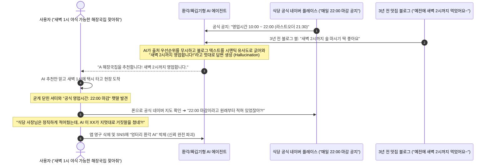
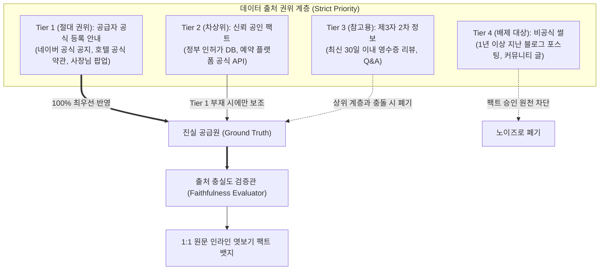

# 서브리스크 카드 09 — Reliability Risk (온라인 공식 안내의 무왜곡성 및 출처 충실도 100% 사수)

> **SVPG 정본 헌법 (Reliability & Groundedness in Feasibility)**:  
> **"제품의 신뢰성(Reliability)을 정의할 때 가장 치명적인 실수는 통제 불가능한 오프라인 현실 세계의 모든 돌발 변수까지 플랫폼이 보증하겠다고 나서는 과욕이다. 사용자는 네이버 지도에 '영업 중'이라 적힌 해장국집을 찾아갔다가 사장님 사정으로 문이 닫혀 있다고 해서 네이버를 탓하지 않는다. 그러나 '업체는 온라인에 일요일 휴무라고 정직하게 적어뒀는데, AI가 엉뚱한 블로그를 읽고 일요일도 영업한다고 왜곡했을 때' 사용자는 플랫폼을 영구히 버린다. 진정한 신뢰성은 온라인에 존재하는 공급자의 공식 안내(Ground Truth)를 단 1%의 날조와 왜곡 없이 1:1로 정직하게 보존하고 전달하는 '출처 충실도(Source Faithfulness 100%)'에서 완성된다."**  
> *(출처: [`C-2017-12-04 The Four Big Risks`](file:///c:/AI_Projects/WebNovelAssistant/VibePatchNote/workbench/96.data_pipeline/svpg-product-discovery/C-2017-12-04_the_four_big_risks.md) E3, [`C-2017-09-05 Leveraging Data Science`](file:///c:/AI_Projects/WebNovelAssistant/VibePatchNote/workbench/96.data_pipeline/svpg-product-discovery/C-2017-09-05_leveraging_data_science.md) E4, [`C-2026-04-16 Build to Learn vs Build to Earn`](file:///c:/AI_Projects/WebNovelAssistant/VibePatchNote/workbench/96.data_pipeline/svpg-product-discovery/C-2026-04-16_build_to_learn_vs_build_to_earn.md) E2)*

---

## 1. 서브 리스크 정의 및 올바른 신뢰성 경계선 (The True Boundary)

*(토론 카드 01-E/F 및 가설 3.0과의 1:1 결속: [`가설 카드 3.0`](file:///c:/망고독%20관련%20자료/프로젝트_매니지먼트/What-s-in-my-head/3.📦(Resource)%20자료/R&D%20프로젝트%20매니징/SVPG_Discoverying_실전적용/hypothesis/(gen)가설%20카드%203.0%20—%20상황%20제약%20매칭%20엔진%20및%20관심사%20렌즈%20기반%2010초%20정답%20런타임.md))*

* **서브 리스크 명칭**: Reliability Risk (온라인 공식 안내 무왜곡성 및 출처 충실도 100% 사수 리스크)
* **책임 주체 (R&R)**: **Product Lead Engineer (제품 리드 엔지니어)**
* **핵심 질문**:  
  > *"온라인 상에 엄연히 존재하는 공급자의 공식 규정·공지사항을 LLM이 비결정론적으로 자의적 해석하거나 블로그 썰과 뒤섞어 왜곡하는 오류를 원천 차단하고,  
  > **'온라인 원천 출처에 대한 충실도 100.0%, 가짜 팩트 날조(False Positive) 0.0%'**를 엔지니어링적으로 보증할 수 있는가?"*
* **핵심 검증 전제 (오판된 신뢰성 vs 진짜 신뢰성)**:
  * **❌ 잘못된 신뢰성 (오프라인 만능주의)**: 사장님이 갑자기 아파서 가게 문을 닫았는지, 호텔 엘리베이터가 고장 났는지 등 오프라인의 물리적 돌발 상황까지 AI가 알아맞혀야 한다는 것은 신뢰성의 과잉 정의이자 기술적 불가능의 영역이다.
  * **✅ 진짜 신뢰성 (출처 충실도 100%)**: 우리 시스템의 법적·도덕적·기술적 책임은 **"공급자가 온라인에 공식적으로 안내한 텍스트(영업시간, 체크인 마감, 주차 정책, 환불 규정)를 AI가 1mm도 지어내거나 왜곡하지 않고 그대로 전달했는가"**이다.  
  사용자가 1:1 원천 엿보기(Inline Peek)를 통해 "아, 사장님 공식 공지에 22시 마감이라 적혀 있었구나"를 눈으로 확인할 수 있다면, 플랫폼에 대한 신뢰는 결코 깨지지 않는다.

---

## 2. 💥 극단적 실패 시나리오: '해장국집의 비극'과 AI의 책임 전가

사용자가 플랫폼을 용서하는 상황과, 절대 용서하지 않고 이탈하는 상황의 결정적 차이:

### [시나리오 A] 사용자가 플랫폼을 탓하지 않는 정상 상황 (오프라인 돌발 상황)
* 사용자가 네이버 지도에 "영업 중"이라고 적힌 해장국집을 찾아감 ➔ 가게 문 앞에 "개인 사정으로 오늘 하루 쉽니다" 팻말이 붙어 있음.
* **사용자 심리**: *"아, 사장님이 오늘 급한 일이 생기셨나 보네."* ➔ **네이버 지도를 사기꾼이라 탓하지 않음.** (오프라인 통제 불능 영역임을 인지)

### [시나리오 B] 사용자가 극도로 분노하여 앱을 삭제하는 시스템 실패 상황 (AI의 원천 왜곡)

---

## 3. 🛡️ 출처 무왜곡성을 위한 3대 엔지니어링 헌법 (Hierarchy of Authority)

AI가 공급자의 공식 공지를 왜곡하지 못하도록, 데이터 원천의 신뢰 계층을 하드코딩된 규칙으로 강제합니다.

1. **상위 권위 절대 우선 원칙 (Authoritative Override)**:  
   블로그 글 100개가 "새벽까지 한다"고 떠들어도, 사장님 공식 공지(Tier 1)에 "22:00 마감"이라고 적혀 있다면, AI는 블로그 내용을 0.001%도 답변에 반영할 수 없으며 오직 Tier 1만 팩트로 승인함.
2. **생성 억제 및 문장 1:1 보존 (Verbatim Extraction)**:  
   AI에게 "규정을 너의 언어로 요약하라"고 지시하지 않음. 공식 공지의 **해당 문장 그대로(Verbatim Sentence)를 잘라내어 인라인 스냅샷으로 바인딩**함으로써 해석 왜곡 가능성을 0%로 차단함.
3. **증거 투명성 (The Inline Peek Shield)**:  
   모든 팩트 뱃지를 누르면 공급자가 직접 작성한 3줄 원문이 그대로 뜸. 설령 오프라인에서 사장님이 갑자기 문을 닫았더라도, 사용자는 인라인 엿보기를 통해 "아, 사장님이 22시까지라고 적어두셨던 건 맞네"를 확인하므로 플랫폼의 AI를 원망하지 않음.

---

## 4. 🏢 레퍼런스 기업 3선 (Reference Cases)

| 기업/엔진 | 해결한 출처 왜곡 및 신뢰성 문제 | 핵심 메커니즘 | 우리 제품 적용점 |
| :--- | :--- | :--- | :--- |
| **Brave Search (브레이브)** | AI 요약 시 광고성 블로그와 가짜 SEO 페이지의 오염 배제 | AI 생성 텍스트마다 정확한 원본 웹 텍스트 매칭 구절을 하이라이트하고, **공식 웹사이트 메타 태그에 가중치 10배 부여** | 팩트 추출 시 블로그/카페 글보다 **공급자의 공식 안내 채널(스토어 공지, 공식 홈)을 최우선 인덱싱** |
| **Wikipedia (위키피디아)** | 수억 명의 기여자가 편집하는 백과사전의 신뢰성 유지 | "출처 필요(Citation Needed)" 원칙: **출처가 명시되지 않은 진술은 즉시 삭제되며, 1차 사료(Primary Source)를 엄격히 우선** | 1:1 원천 URL과 3줄 증거 스냅샷이 결속되지 않은 팩트 클레임은 렌즈 및 검색 결과에서 강제 비활성화 |
| **Baseten / Guardrails AI** | 프로덕션 LLM의 비정형 출력 왜곡 및 환각 통제 | 출력된 텍스트와 프롬프트 원문 문서 간의 **'원문 충실도(Groundedness / Faithfulness Score)'를 검증하여 0.95 미만 시 응답 드랍** | Fast-Tier AI가 컴파일한 제약 AST가 원본 텍스트에 실재하는지 검증하는 결정론적 검증 레이어 배치 |

---

## 5. ⚠️ 실패 반례 2선 (Anti-patterns)

### ❌ 반례 1: 네이버 지식iN AI 요약의 '오래된 답변 왜곡' 참사
* **사례**: 네이버가 지식iN 답변들을 AI로 요약하여 상단에 띄우는 기능을 도입함.
* **증상**: 2018년도에 작성된 "청년 주거지원금 신청 자격" 답변을 최신 정부 공지보다 우선하여 요약에 포함시킴. 실제로 제도가 바뀌어 신청 자격이 안 되는 청년들이 AI 요약만 믿고 서류를 준비했다가 주민센터에서 거절당함.
* **결과**: "네이버 AI가 옛날 정보를 최신 정보인 양 사기 친다"는 비판이 쏟아지며 상단 요약 기능 신뢰도 급락.
* **교훈**: **최신 공식 규정이 과거의 2차 정보보다 우선하지 못하면 AI는 사회적 민폐가 된다.**

### ❌ 반례 2: 배달의민족 리뷰 요약 AI의 '사장님 공지 왜곡'
* **사례**: 배달앱에서 AI가 고객 리뷰를 바탕으로 "이 집은 배달팁이 무료예요!"라고 요약함.
* **증상**: 실제 식당 사장님은 최근 배달팁 정책을 유료(2,000원)로 변경하여 공지에 띄워뒀으나, AI가 과거 수백 개의 "배달팁 무료라 좋아요" 리뷰를 다수결로 신뢰하여 요약에 노출함.
* **결과**: 손님들이 결제창에서 배달팁 2,000원이 찍히자 식당에 항의 전화를 걸고 사장님들이 고객센터에 단체로 항의함.
* **교훈**: **고객 리뷰의 다수결이 사장님의 공식 공지 1줄을 이겨서는 안 된다.**

---

## 6. 🎯 정량적 Pass/Fail 판정선 (Faithfulness Thresholds)

SVPG 디스커버리 헌법에 따라 제품 리드 엔지니어가 반드시 증명해야 하는 출처 충실도 수치 기준:

| 검증 지표 (Metric) | 측정 방법 및 검증 시나리오 | Pass 기준 (합격선) | Fail 기준 (기각선) |
| :--- | :--- | :--- | :--- |
| **원문 충실도 (Source Faithfulness)** | 추출된 제약 AST가 온라인 원천 텍스트의 사실과 일치하는 비율 | **100.0% (Zero Distortion)** | < 99.9% (단 1건의 왜곡도 불허) |
| **출처 계층 역전율 (Hierarchy Inversion)** | 하위 출처(과거 리뷰)가 상위 출처(공식 공지)의 조건을 덮어쓴 비율 | **0.0% (완전 차단)** | > 0.0% (공식 안내 무력화 발생 시) |
| **1:1 원문 텍스트 매칭률** | 인라인 엿보기에 노출되는 3줄 텍스트가 실제 원본 웹페이지에 존재하는 비율 | **100.0%** (단어/어순 불일치 0건) | < 100.0% (AI가 문장을 윤문했을 시 Fail) |
| **환각 팩트 생성률 (Hallucinated Claims)** | 온라인 출처에 없는 조건(예: 발렛파킹 무료)을 AI가 지어낸 비율 | **0.0%** | > 0.01% (존재하지 않는 팩트 날조) |

---

## 7. 🛠️ 1-Day Make vs. Buy 스파이크 프로토콜 (Engineering Spike)

* **타임박스**: 1일 (8시간 엄격 제한)
* **스파이크 목적**: 식당/숙박 100개소에 대해 '공식 공지'와 '모순되는 과거 블로그 썰'을 동시에 주입했을 때, 시스템이 100% 공식 공지만을 팩트로 채택하는지 실측.
* **실험 설계**:
  1. 공식 공지: "2026년 9월부터 매주 월요일 정기 휴무로 변경되었습니다."
  2. 블로그 썰: "월요일에도 늦게까지 영업해서 너무 좋았어요!" (2024년 글)
  3. 두 문서를 동시에 파이프라인에 입력한 후 `open_monday` 제약 플래그 판정 확인.
* **의사결정 룰**:
  * 100개 케이스 전수에서 `open_monday = False`로 판정되고 원천 증거로 공식 공지가 1:1 바인딩되면 ➔ **출처 충실도 아키텍처 확정 (Pass)**.
  * 블로그 썰에 휘둘려 `True`로 오판하는 케이스가 1건이라도 발생하면 ➔ 프롬프트 및 휴리스틱 가중치 알고리즘 즉시 폐기 및 재설계.
