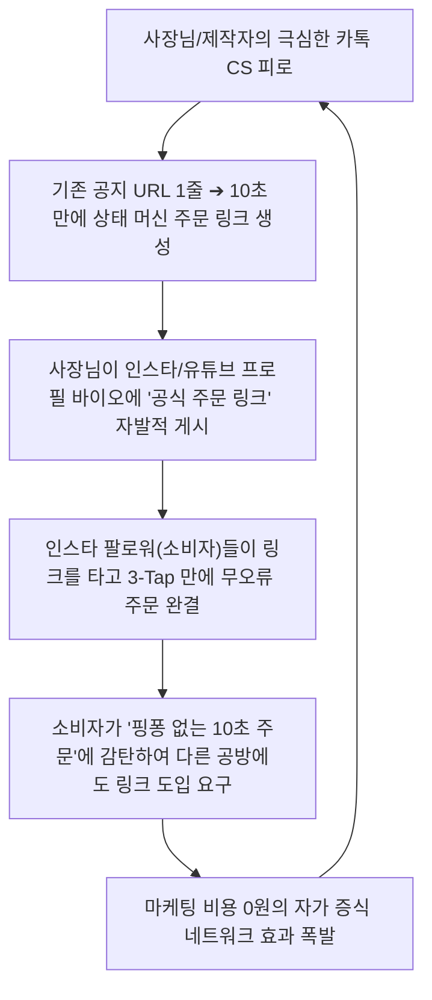

# Idea 카드 02 — 고마찰 주문 제작 및 실시간 스케줄 자율 동기화 팩트 플랫폼

> **SVPG 정본 헌법 (The Power of Extreme Focus)**:  
> **"모든 사람을 위한 제품은 아무도 원하지 않는 제품이다. 가장 절박한 고통(Extreme Pain Point)을 겪고 있는 명확한 거점 시장(Beachhead Market)을 찾아내어, 그들의 지옥 같은 마찰을 10배 이상 줄여줄 때 플랫폼의 자가 증식 플라이휠이 작동한다. 기성품 최저가 커머스가 해결하지 못하는 '조건부 주문 제작'과 '동적 스케줄 조율'이야말로 가장 강력한 거점 시장이다."**  
> *(출처: [`C-2017-12-04 The Four Big Risks`](file:///c:/AI_Projects/WebNovelAssistant/VibePatchNote/workbench/96.data_pipeline/svpg-product-discovery/C-2017-12-04_the_four_big_risks.md) E1, [`C-2018-02-09 The Role of Product Discovery`](file:///c:/AI_Projects/WebNovelAssistant/VibePatchNote/workbench/96.data_pipeline/svpg-product-discovery/C-2018-02-09_the_role_of_product_discovery.md) E2)*

---

## 1. 🌟 핵심 컨셉 (Core Concept)

**"텍스트 대화 핑퐁과 예약 혼선을 0으로 소멸시키는 동적 상태 머신(Dynamic State Machine) 기반 주문 제작 및 실시간 스케줄 자율 동기화 팩트 플랫폼"**

* **본질**:  
  소비자와 공급자가 인스타그램 DM, 카카오톡 오픈채팅, 이메일로 수십 번씩 *"이거 되나요?", "얼마예요?", "이 날짜 비었나요?"*를 주고받는 **비생산적 텍스트 핑퐁을 100% 소멸**시킨다.
* **핵심 메커니즘 (실시간 자율 동기화 루프)**:
  1. **원터치 제약 확정**: 소비자는 원터치 제약 칩으로 원하는 옵션(날짜·스펙·원재료 등)을 3초 만에 선언.
  2. **1초 승인(Claim)**: 공급자(사장님/창작자)는 알림톡을 통해 **`[1초 승인]`**만 클릭.
  3. **실시간 스케줄 자동 공유**: 승인 즉시 공급자의 작업 슬롯이 `점유(Occupied)`로 전환되며, 소비자에게 캘린더 일정이 실시간 자동 동기화.
  4. **취소 시 0ms 자율 복구**: 만약 고객 취소가 발생하면, 사장님이 수동으로 인스타 스토리를 올릴 필요 없이 **비트셋 슬롯이 0ms 만에 `가용(Available)` 상태로 즉각 복원**되어 대기자에게 자동 팩트 노출.

---

## 2. 👥 참여자 정의 (Participants)

| 참여 주체 | 정체성 및 역할 | 궁극적 목표 |
| :--- | :--- | :--- |
| **소비자 (Buyer / Client)** | • 인스타 마켓 수제 주문자, 영상 외주 의뢰 기업/크리에이터<br/>• 복잡한 다차원 상황 제약(특정 날짜, 맞춤 문구, 특수 스펙)을 쥔 의뢰자 | 6시간 대화 핑퐁 없이, **원하는 조건이 100% 충족되는 확실한 제작자에게 10초 만에 주문 완결** |
| **공급자 (Seller / Creator)** | • 수제 디저트·공방 사장님, 영상 편집자, 모션그래픽 프리랜서<br/>• 창작과 제작에 집중해야 하나 하루의 절반을 CS에 빼앗기는 1인 장인 | 카톡 복붙 안내 노동에서 탈출하고, **오배송·예약 사고·추가 수정 분쟁 없는 안전한 유휴 매출 확보** |
| **플랫폼 (Fact State Engine)** | • 공급자의 복잡한 제작 조건을 10초 만에 상태 머신으로 컴파일하는 엔진<br/>• 비트셋 기반 실시간 가용 슬롯 제어 및 1:1 증거 어트리뷰션 런타임 | 양면 참여자의 대화 마찰을 0으로 압축하는 **무결점 팩트 매칭 인프라 제공** |

---

## 3. 💥 각자의 페인포인트 심층 해체 (Pain Points)

```mermaid
flowchart LR
    subgraph BuyerPain [소비자의 지옥]
        B1["'가격은 DM 문의' 불투명성"]
        B2["카톡 양식 복붙 & 6시간 답변 대기"]
        B3["'그 날짜는 마감됐어요' 헛걸음 허탈감"]
        B4["외주 스펙 불명확성으로 결과물 분쟁"]
    end

    subgraph SellerPain [공급자의 뇌정지]
        S1["하루 100건 '이거 되나요?' 복붙 CS 피로"]
        S2["고객 오기재로 인한 오배송·환불 독박"]
        S3["예약 취소 시 인스타에 '급취소 1석' 구걸"]
        S4["'이것도 해주는 줄 알았다' 추가 수정 분쟁"]
    end

    BuyerPain --> Solution["💡 동적 상태 머신 팩트 엔진"] <-- SellerPain
```

### ① 소비자(구매자/의뢰자)의 페인포인트
1. **"가격은 DM 문의"의 극심한 피로**:  
   가격조차 명시되지 않아 인스타 프로필 링크를 타고 카카오톡 오픈채팅방에 일일이 입장해야 하는 폐쇄적 불투명성.
2. **반나절 대기 핑퐁**:  
   주문 양식을 길게 써서 보내도 사장님이 작업 중이면 4~6시간 뒤에나 답장이 오고, *"아, 그 날짜는 예약 찼습니다"*라는 말을 들으면 처음부터 다른 업체를 찾아 헤매야 함.
3. **실시간 가용성(Availability) 파악 불가**:  
   현재 이 공방이 이번 주 금요일에 주문을 받을 수 있는 상태인지, 영상 편집자가 이번 주 작업 슬롯이 비어 있는지 사전에 알 길이 없음.
4. **외주 스펙 불일치 불안**:  
   영상 외주 시 "1분짜리 숏폼"을 맡겼는데, 내가 생각한 퀄리티(자막, 효과음)와 제작자의 납품본이 달라 실랑이가 벌어짐.

### ② 공급자(사장님/창작자)의 페인포인트
1. **하루 100건 단순 CS로 본업 마비**:  
   케이크를 굽고 가죽을 꿰매야 하는 시간에 스마트폰을 붙잡고 *"고객님, 금요일 픽업은 마감이고요, 글자 수는 10자까지만 돼요"*라는 동일한 답변을 하루 종일 복붙 안내함.
2. **오배송·주문 사고의 전적인 독박**:  
   고객이 카톡으로 주문서를 엉뚱하게 적거나 계좌 입금 확인이 꼬여서 발생하는 컴플레인, 환불 손해를 사장님이 고스란히 감당.
3. **급취소 시 처절한 수동 영업**:  
   전날 예약 취소가 발생하면, 빈자리를 메우기 위해 인스타 스토리에 *"급취소 1자리 났습니다! 선착순 DM 주세요ㅠㅠ"*라고 구걸하듯 공지를 띄워야 하는 스트레스.
4. **영상 외주 시 '끝없는 수정(Scope Creep)' 지옥**:  
   스펙을 명확한 불리언 규칙으로 못 박지 못해, 클라이언트가 납품 후 *"어? 모션그래픽도 당연히 해주는 줄 알았는데요?"*라며 5차, 6차 수정을 요구하거나 잔금을 떼먹는 분쟁 빈발.
5. **기존 커머스(스마트스토어/쿠팡)의 무력화**:  
   스마트스토어는 공산품 중심이라 **"A옵션 선택 시 B옵션 불가", "일일 최대 3개 한정 제작"** 같은 동적 조건부 옵션을 다루지 못해 울며 겨자먹기로 카톡 수작업에 갇혀 있음.

---

## 4. 🎯 바운더리 및 적용 도메인 (Target Boundaries)

본 플랫폼은 공산품 쇼핑몰이 아니며, **"주문 제작 및 동적 스케줄 조율 과정이 많이 들어가는 고마찰(High-Friction) 도메인"**만을 선별 타깃으로 삼는다.

```text
[바운더리 선정 기준]
1. 정형화된 공산품이 아니라 '다차원 제약 조건(커스텀 옵션)'이 붙는가? (O)
2. 소비자와 공급자 간에 텍스트 핑퐁(상담/스케줄 조율)이 필수적인가? (O)
3. 공급자가 CS 지옥 탈출을 위해 링크를 프로필에 자발적으로 걸 이유가 있는가? (O)
```

### ✅ 3대 핵심 적용 도메인 (In-Scope)

#### 1. 인스타 마켓 & 핸드메이드 주문 제작 (Made-to-Order Crafts)
* **세부 영역**: 수제 레터링/비건 케이크, 수제 맞춤 디저트, 가죽/귀금속 각인 공방, 플라워 맞춤 꽃다발, 커스텀 답례품.
* **상태 머신 제약 예시**:  
  `[픽업 희망일시: 금요일 18시] ∩ [레터링 문구: 12자 이내] ∩ [원재료: 글루텐프리 쌀] ∩ [알레르기: 견과류 제외] ∩ [제작 슬롯: 가용]`

#### 2. 크리에이티브 및 전문 기술 외주 (Creative & Production Scope)
* **세부 영역**: 유튜브 컷편집, 숏폼/릴스 영상 제작, 모션그래픽, 1:1 맞춤 브랜드 로고/패키지 디자인, 웹/앱 프로토타입 외주.
* **상태 머신 제약 예시**:  
  `[러닝타임: 60초 미만] ∩ [자막: 예능 모션 자막] ∩ [오디오: 상업 라이선스 음원 포함] ∩ [납기: 3일 보증] ∩ [수정: 최대 2회 보증]`

#### 3. 슬롯 기반 실시간 예약 서비스 (Time-Slot Booking Services)
* **세부 영역**: 1인 헤어/바디케어 샵, 원데이 클래스 공방, 프라이빗 렌탈 스튜디오, 프라이빗 다이닝.
* **상태 머신 제약 예시**:  
  `[방문일시: 토요일 14시] ∩ [시술/클래스: 1:1 집중 코스] ∩ [소요시간: 120분] ∩ [동반인원: 2인] ∩ [잔여 슬롯: 즉시 확정 가능]`

---

### 🚫 바운더리 제외 대상 (Out-of-Scope)

* **대량 양산 공산품 최저가 쇼핑**: 쿠팡, 네이버 스마트스토어가 이미 압도적인 물류와 가격으로 독점한 영역.
* **정형화된 배달 프랜차이즈 음식**: 배달의민족, 쿠팡이츠가 라이더 네트워크로 장악한 영역 (동적 커스텀 제작 불필요).
* **단순 챗봇 FAQ 상담**: 카카오톡 챗봇이 수행하는 단순 텍스트 안내 영역.

---

## 5. 🚀 자가 증식형 바이럴 플라이휠 (Viral Flywheel)



1. **공급자의 자발적 영업 사원화**: 사장님과 제작자는 자신의 카톡 지옥에서 벗어나기 위해 **자신의 수만 팔로워가 보는 인스타 프로필에 우리 링크를 공짜로 홍보**해 준다.
2. **네트워크 바이럴 흡수**: 소비자는 핑퐁 없는 쾌적한 10초 주문을 경험한 뒤, 자신이 이용하는 다른 인스타 마켓 사장님에게도 *"여기 링크로 주문받아주시면 안 돼요?"*라며 플랫폼 확장을 유도한다.
3. **단위 경제성 극대화**: 실시간 크롤링 비용 없이, 공급자가 직접 승인하고 갱신하는 1차 팩트 레지스트리이므로 **인프라 원가 0원 수렴 & 마케팅 CAC 0원 달성**.
