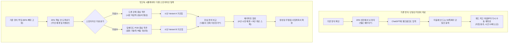

# (gen) 가치 카드 03 — [시뮬레이터] 와꾸 없는 20%를 뚫는 다중 스토리라인 탐색과 가조립의 본질 가치

> **핵심 명제**:  
> **"문서 작성의 본질은 '타이핑(입력)'이 아니라 '가설 시뮬레이션(Simulation)'이다."**  
> 80%의 기준 양식이 존재하더라도, 작성자를 멈춰 세우는 것은 **"어떻게 써야 할지 감이 안 잡히는 20%의 와꾸 없는 핵심 칸"**이다.  
> 기존 챗봇처럼 단일안을 뱉어내는 타이핑 대행을 넘어, **'드론 중심' vs 'PCB 중심'처럼 서로 다른 3~4개의 스토리라인(척추)을 갈아 끼우며 즉석에서 평행 시안을 가조립하고, '진심 펀치(실제 설득력)'를 눈으로 견주어 최적의 논리를 확정하는 행위**가 바로 '시뮬레이터'의 존재 이유다.

---

## 1. 왜 '생성기(Generator)'가 아니라 '시뮬레이터(Simulator)'인가?

* **기존 생성 AI(ChatGPT, Copilot)의 한계: "단일안 블랙박스"**:
  * "사업계획서 써줘"라고 하면 그럴듯한 줄글 1개를 일방적으로 출력함.
  * 결과물이 마음에 들지 않거나 논리가 어긋났을 때, 어디서부터 어떻게 손대야 할지 모르는 막막함 발생.
  * 사용자는 결국 결과를 복사해 워드에 붙여넣고 다시 백지 상태에서 고치는 노가다를 반복함.
* **실전 작업자의 진짜 고통: "80 / 20의 늪"**:
  * 회사 소개나 기본 항목 같은 **80%는 기준 문서(양식)가 있어 채울 수 있음**.
  * 그러나 **승부를 가르는 20%의 낯선 칸(예: 과제 추진 체계, 차별화 전략, 기술적 난제 해결안)** 앞에서 펜이 멈춤 ("이 칸을 도대체 무슨 논리로 메워야 하지?").
* **시뮬레이터의 정의**:
  * 기준 문서의 80% 뼈대를 단단하게 고정한 상태에서, **와꾸가 안 나오는 20%의 칸을 뚫기 위해 여러 갈래의 이야기 줄기(Storyline)를 꽂아보고 그 파급 효과를 실시간으로 가조립해보는 시각적 실험실**.

---

## 2. 시뮬레이터가 관장하는 4대 핵심 작업 행위 (The 4 Simulator Actions)

```text
[1. Spotting] ──▶ [2. Storylining] ──▶ [3. Assembling] ──▶ [4. Punch-Testing]
 20% 빈칸 도려내기   스토리라인 가설 투입    3~4개 평행 시안 가조립   진심 펀치 판정 & 합성
 (어디가 막혔나?)    (드론 vs PCB 척추)     (슬롯별 백데이터 결속)    (가장 강한 펀치 채택)
```

| 구분 | 작업 행위 | 작업자의 실제 행동 (Action) | 시뮬레이터가 관리하는 단위 |
| :--- | :--- | :--- | :--- |
| **01. Spotting** | 와꾸 없는 20% 식별 | 양식 전체를 헤매지 않고, 답을 못 내리고 있는 **핵심 승부처 칸(20%)을 특정**하여 도려냄 | **Focus Slot** (집중 공략 슬롯) |
| **02. Storylining** | 스토리라인 가설 분기 | "이번 제안은 '드론 관제'를 메인으로 밀까? 아니면 '초저전력 PCB'를 메인으로 밀까?" **문서 전체를 관통할 척추(가설)를 3~4개로 분기** | **Narrative Thread** (이야기 줄기/가설 축) |
| **03. Assembling** | 슬롯 단위 즉석 가조립 | 선택한 스토리라인에 맞춰 백데이터(리소스)를 슬롯에 꿰어 넣고, **3~4개의 평행 시안(Variant)을 캔버스 위에 나란히 렌더링** | **Multi-Variant Instances** (다중 평행 시안) |
| **04. Punch-Testing** | 진심 펀치 판정 및 합성 | 각 시안의 설득력(진심 펀치)을 비교하고, **"A안의 드론 서론 + B안의 PCB 기술 스펙"을 슬롯 단위로 체리피킹하여 최종본으로 융합** | **Cross-Variant Synthesis** (슬롯 교차 합성) |

---

## 3. 실전 작업 과정 대조: 단일 텍스트 작성 vs 시뮬레이터 가조립

### 시나리오: "R&D 연구 프로젝트 지원 사업 계획서 15개 돌리기"



---

## 4. 기존 대안 대비 '시뮬레이터'의 차별화 가치 매트릭스

| 비교 축 | 전통적 워드/노션 에디터 | 일반 생성형 챗봇 (ChatGPT, Copilot) | 망고독 문서 시뮬레이터 (Simulator) |
| :--- | :--- | :--- | :--- |
| **작업 출발점** | 빈 백지 (Zero-base) | 프롬프트 입력창 (Single Prompt) | **기준 문서의 80% 뼈대 + 20% 포커스 슬롯** |
| **가설 처리 방식** | 머릿속으로 암산하며 하나씩 작성 | 한 번에 1개 결과만 확인 (비교 불가) | **3~4개 스토리라인 평행 시뮬레이션** |
| **백데이터 결속** | 사람이 폴더 뒤져서 직접 복붙 | 프롬프트 창에 맥락 우겨넣기 (환각 발생) | **슬롯 ⇄ 리소스 1:1 바인딩 및 앵커링** |
| **결과 수정 행위** | 전체 줄글 재타이핑 | "다시 써줘" 다그침 반복 (회귀 버그) | **마음에 드는 슬롯만 골라 끼우는 체리피킹** |
| **검증 기준** | "글이 완성되었는가?" (형식 중심) | "문장이 매끄러운가?" (문체 중심) | **"내용이 진짜 맞고 설득력 있는가?" (진심 펀치 중심)** |

---

## 5. 북극성 Outcome 및 연계 로드맵

1. **작업 시간 10분의 1 단축 ([[Decision 05 — 북극성은 작업 시간 10분의 1로 둔다]])**:
   - 3~4개 버전을 손으로 쓰면 3~4일이 걸리지만, 시뮬레이터에서 스토리라인만 갈아 끼워 평행 가조립하면 **1시간 이내에 최적 시안 도출**.
2. **진심 펀치 실전 검증 ([[1.2_진심_펀치_테스트_내용이_맞게_나오는지_무엇으로_볼까]])**:
   - 도구의 UI 버튼이 예쁜가가 본질이 아님. 작업자가 실제로 제출할 10~15개의 실전 사업계획서에서 **"내용이 진짜 채택될 만큼 맞게 나오는가"**를 시뮬레이터로 입증.
3. **와꾸 안 잡힌 사람의 첫 교두보 ([[1.1_와꾸가_안_잡힌_사람_첫_타겟을_어디에_그을까]])**:
   - 완전히 백지인 사람보다, **"기준 문서는 있는데 특정 칸을 어떻게 채워야 할지 모르는 80/20 상태의 실무자"**에게 가장 압도적인 가치를 제공함.
