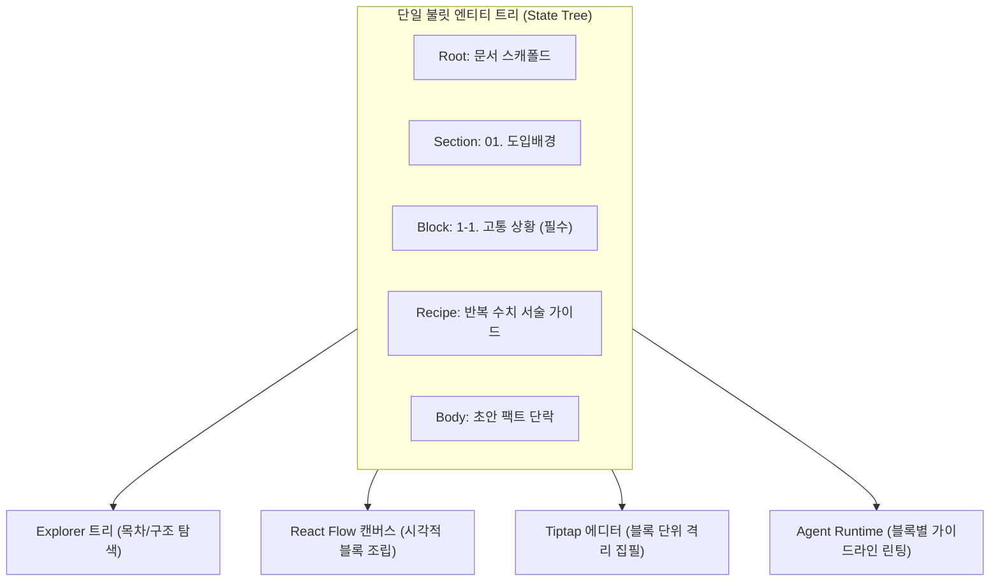

# Workflowy 아웃라이너 심층 분석 — 불릿 엔티티와 트리 조립 기반 스캐폴더 매니저 아키텍처

> **핵심 테제**:  
> 일반 마크다운이나 워드프로세서의 불릿(`•`, `<li>`)은 단순한 **'시각적 텍스트 서식(Formatting)'**에 불과하지만,  
> **Workflowy의 불릿은 그 자체로 하나의 완전한 독립 데이터 레코드이자 자가 참조 트리의 기본 단위(First-Class Node Entity)**입니다.  
> 스캐폴더 매니저는 문서를 문자열 텍스트가 아닌 '불릿 노드 객체들의 계층적 조립체'로 다룰 때 비로소 캔버스, 트리, 에디터, 에이전트 간의 무결점 동기화를 달성할 수 있습니다.

---

## 1. 멘탈 모델의 전환: '문자열 서식' vs '독립 노드 객체'

| 비교 항목 | 일반 문서 / Markdown 에디터 | Workflowy (아웃라이너 아키텍처) |
| :--- | :--- | :--- |
| **최소 단위** | 문자열(String), 단락(Paragraph) | **불릿 노드(Bullet Node Entity)** |
| **불릿의 성격** | 줄 앞에 붙는 점 스타일 (`- `, `*`, `<li>`) | **고유 UUID를 가진 독립 데이터베이스 레코드** |
| **문서의 실체** | 단일 텍스트 스트림 (`content.md`) | **자가 참조 트리 / 인접 리스트(Adjacency List)** |
| **페이지 이동** | 새 라우트로 이동, 새 파일 I/O 로드 | **뷰포트 포인터(Root ID)만 0ms로 이동 (Hoisting)** |
| **들여쓰기(Tab)** | 공백 2~4칸 삽입 또는 CSS 마진 변경 | **트리 상 부모 노드 포인터(`parentId`)의 실시간 재할당** |
| **복사 / 붙여넣기**| 문자열 복제 (원본과 동기화 단절) | **미러(Mirror): 동일 엔티티에 대한 다대다 참조(DAG)** |

---

## 2. Workflowy 핵심 구현 메커니즘 5대 요소

### ① 데이터 모델: 자가 참조 트리 (Self-Referencing Tree)
Workflowy에는 '폴더', '파일', '페이지'라는 개념적 구분이 존재하지 않습니다. 모든 것은 동일한 규격의 `Node` 엔티티입니다.

```typescript
interface BulletNode {
  id: string;              // 고유 식별자 (예: "node_sec_01")
  parentId: string | null; // 부모 불릿 ID (최상위 루트면 null)
  order: number;           // 형제 노드 간의 정렬 순서 (Fractional Index)
  content: string;         // 노드 타이틀 / 핵심 명제 (Header 역할)
  note?: string;           // Shift+Enter로 입력되는 상세 지침/본문 (Body 역할)
  isCompleted: boolean;    // 완료 체크 여부
  isCollapsed: boolean;    // 하위 트리 접힘/펼침 상태
  tags?: string[];         // 인라인 추출 태그 (#필수, #선택 등)
}
```
* 최상위 문서도 노드이고, 1단계 섹션도 노드이며, 단락과 세부 문장도 노드입니다.
* 데이터베이스 구조상 상하 위계가 대등하므로, 어떤 노드든 즉시 상위로 승격되거나 하위로 격하될 수 있습니다.

### ② 0ms 호이스팅 & 무한 줌인 (Hoisting & Infinite Zoom)
불릿 앞의 점(Dot)을 클릭했을 때 일어나는 동작은 페이지 전환이 아니라 **뷰포트 렌더링 필터의 전환**입니다.

1. 전역 상태의 `currentRootId`를 클릭한 불릿의 `node.id`로 변경합니다.
2. 뷰포트는 메모리 트리에서 `parentId === currentRootId`인 직계 자식 노드들만 필터링하여 그립니다.
3. 상단 Breadcrumb은 `node.parentId`를 루트까지 역추적하여 즉각 경로를 표시합니다.
4. **결과**: 수천 개의 블록이 존재해도 렌더링 오버헤드 없이 0ms 만에 특정 섹션으로 인지 맥락을 격리(Focus In)합니다.

### ③ 키보드 인터랙션과 실시간 그래프 변이 (Pointer Mutation)
Workflowy의 키 입력은 텍스트 편집기가 아닌 **그래프 조작 엔진**으로 작동합니다:

* `Enter`: 동일 레벨에 `order + 1`인 신규 노드 레코드 삽입.
* `Tab (들여쓰기)`: 현재 노드의 `parentId`를 바로 위 형제 노드의 `id`로 즉시 교체 (트리 깊이 +1).
* `Shift + Tab (내어쓰기)`: 현재 노드의 `parentId`를 부모 노드의 부모 `id`로 교체 (트리 깊이 -1).
* `Backspace (텍스트 비었을 때)`: 노드 엔티티 자체를 삭제하고 포커스를 인접 노드로 전환.

### ④ 미러 (Mirrors / Block Transclusion): 트리에서 DAG로의 확장
단순 트리는 하나의 노드가 단 하나의 부모만 가질 수 있지만, Workflowy의 미러는 **방향성 비순환 그래프(DAG)** 구조를 채택합니다.

* 단일 진실 공급원(SSOT) 엔티티가 존재하고, 서로 다른 부모들이 해당 엔티티를 포인터로 동시 참조합니다.
* A 섹션에서 미러 블록의 내용을 수정하면, B 섹션에 배치된 동일 미러 블록의 내용이 실시간으로 100% 동기화됩니다.

### ⑤ 무손실 뷰 프로젝션 (List ↔ Kanban Board)
트리 구조를 유지한 채 표시 방식만 즉석에서 바꿉니다:
* 부모 노드를 'Board View'로 지정하면:
  * `Depth 1` 자식 노드들 ➔ **칸반 컬럼 (예: To Do, In Progress, Done)**
  * `Depth 2` 손자 노드들 ➔ **칸반 카드**
  * `Depth 3` 하위 노드들 ➔ **카드 내부 체크리스트 및 본문**
* 별도의 데이터 마이그레이션 없이 순수 CSS / 렌더링 레이어 교체만으로 아웃라인과 칸반을 넘나듭니다.

---

## 3. 스캐폴더 매니저(Scaffold Manager)로의 전이 및 아키텍처 매핑

스캐폴더 매니저가 문자열 마크다운 기반 에디터를 버리고 **Workflowy식 불릿 엔티티 모델**을 채택해야 하는 이유는 명확합니다.



### 4단계 계층 매핑 규격

| 스캐폴더 매니저 구성요소 | Workflowy 대응 엔티티 | 역할 및 속성 |
| :--- | :--- | :--- |
| **문서 (Document)** | `Root Node` | 전체 글의 목표, 최상위 캔버스 컨테이너 |
| **섹션 (Section)** | `Depth 1 Node` | 아티클의 대단원 (예: `01. 도입배경`). 호이스팅 줌인의 기준 단위 |
| **블록 (Block)** | `Depth 2 Node` | 레고 블록 단위 조립체 (예: `1-1. 고통 상황`). `#필수`, `#선택` 제약 태그 보유 |
| **레시피 (Recipe Guide)** | `Node.note` (메모) | 작성자를 위한 지침, 체크리스트, 에이전트 린팅 규칙 |
| **팩트 초안 (Fact Draft)** | `Depth 3 Node` (본문) | 작성자가 실제로 채워 넣는 원재료 팩트 및 작성 문장 |

---

## 4. UI 개발 전 'Minimal 테스트베드' 검증 프로토콜

React Flow나 Tiptap 기반의 무거운 UI를 구현하기 전에, **Workflowy 웹/앱 환경에서 텍스트 블릿 모델링만으로 스캐폴더의 사용성과 인지 흐름을 검증**합니다.

### 3단계 검증 시나리오

1. **1단계: 스캐폴드 템플릿 모델링 (구조 검증)**
   * 기술 문서의 7대 섹션 및 31개 블록 사양을 Workflowy 불릿 트리로 구축.
   * `Title`에는 블록명과 태그(`#[필수]`, `#[선택]`)를 부여하고, `Note`에는 Recipe 가이드를 작성.
2. **2단계: 호이스팅 기반 격리 집필 체감 (UX 검증)**
   * 특정 섹션의 블릿을 눌러 Zoom-in 한 상태에서, 다른 섹션의 시각적 방해 없이 Recipe를 보며 초안을 작성할 때의 심리적 안정감과 몰입도를 측정.
3. **3단계: 보드 뷰 전환을 통한 공정 파이프라인 검증 (상태 관리)**
   * 블록들을 상태 노드(`대기`, `초안작성`, `검토완료`) 하위로 드래그하거나 칸반 보드로 전환하여, 작성 공정이 자연스럽게 가시화되는지 검증.

---

## 5. Workflowy의 한계와 스캐폴더 매니저의 독자적 가치

Workflowy는 구조화 관점에서 최상의 사용성을 제공하지만, **자유도가 무한하여 문서 엔지니어링의 규칙 강제(Rule Enforcement)가 불가능**합니다.

스캐폴더 매니저는 Workflowy의 불릿 메커니즘을 뼈대로 삼되, 다음 3가지 핵심 엔진을 상위에 결합하여 완성됩니다:

1. **규칙 엔진 (Rule Enforcement Engine)**:
   * 단순 텍스트 태그에 머무르지 않고, "섹션 내 필수 블록 2개가 채워져야 섹션 완료 뱃지가 점등"되는 조건 판정 로직.
2. **에이전트 협업 슬롯 (Agent Slot)**:
   * 각 블록의 Recipe 지침을 바탕으로 에이전트가 팩트 정합성을 검증하거나, 초안 문장을 추천하는 컨텍스트 주입 인터페이스.
3. **어셈블러 파이프라인 (Document Assembler)**:
   * 흩어져 있는 블록과 본문 노드들을 순서대로 직렬화(Serialization)하여 최종 완성본 마크다운/HTML로 일괄 렌더링하는 출력 엔진.
