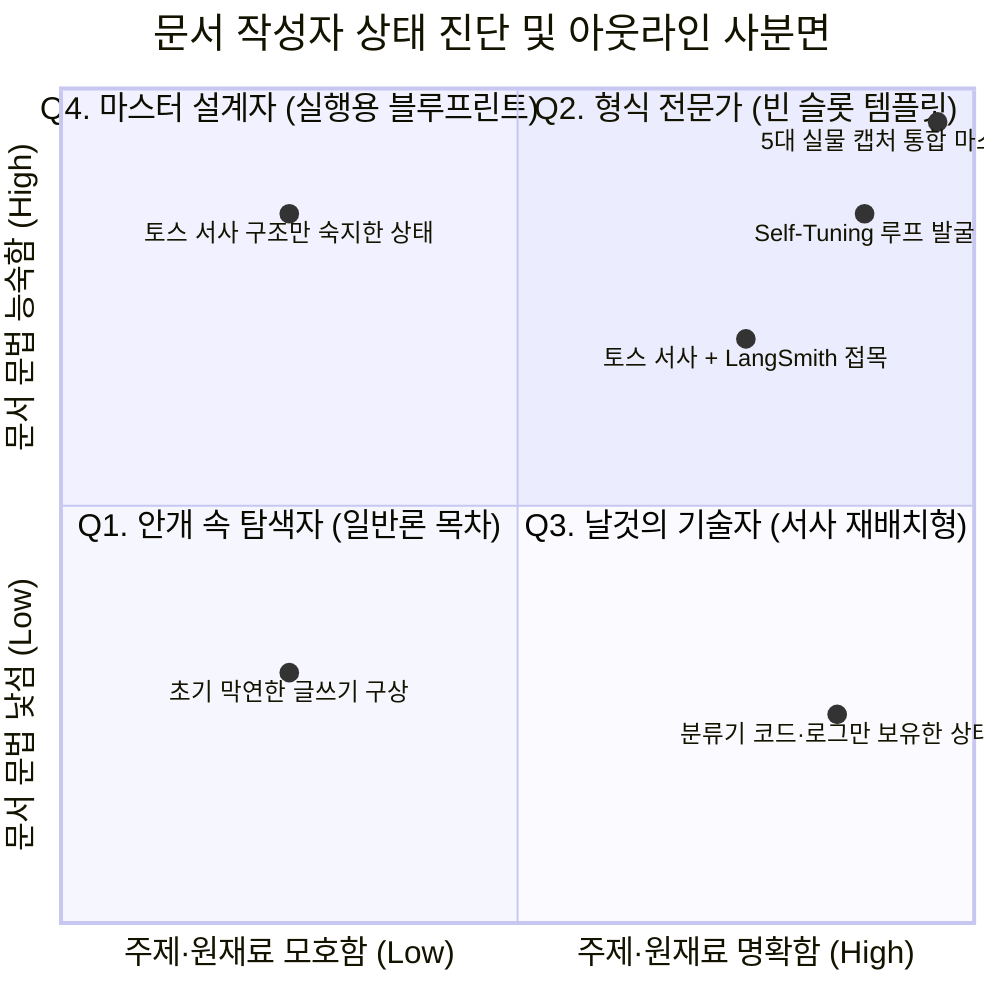
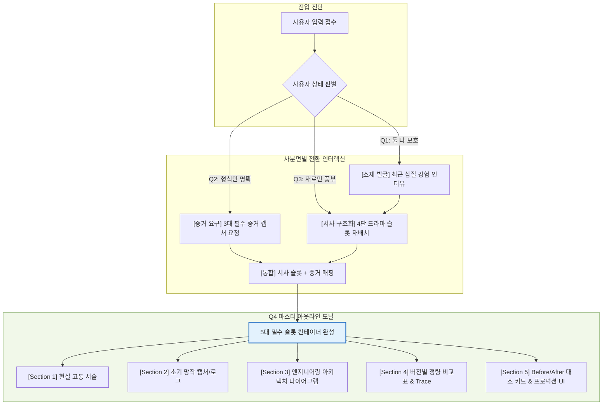

# 문서 스캐폴딩 사용자 진단 및 아웃라인 4사분면 매트릭스

> **핵심 테제**:  
> 문서 작성자가 가진 **[문서 형식·문법 친숙도]**와 **[주제·원재료 명확도]**에 따라 도출되는 아웃라인의 성격은 완전히 달라진다.  
> 이상적인 스캐폴딩 엔진(Scaffold Manager)은 사용자의 현재 사분면 위치를 진단하고, 질문과 가이드를 통해 **[Q4. 마스터 설계자]** 사분면으로 점진적으로 끌어올리는 동적 빌드업(Progressive Scaffolding) 엔진이어야 한다.

---

## 1. 2×2 사분면 진단 차트 (Mermaid Quadrant Chart)

아래 차트는 사용자의 준비 상태와 실제 지원사업 분류기 블로그 세션([지원사업_분류기_블로그_기획_대화_전개.canvas](file:///c:/망고독%20관련%20자료/프로젝트_매니지먼트/What-s-in-my-head/3.📦(Resource)%20자료/SM_Spec_Discoverying/2.ideation/sketches/블로그_스캐폴더_샘플1/지원사업_분류기_블로그_기획_대화_전개.canvas))에서의 진화 궤적을 나타냅니다.

---

## 2. 사분면별 특성과 스캐폴딩 엔진의 인터랙션 전략

| 사분면 | 사용자 심리 및 발화 | 도출되는 아웃라인 수준 | 스캐폴더의 핵심 역할 |
| :--- | :--- | :--- | :--- |
| **Q1. 안개 속 탐색자** *(Low 형식 × Low 주제)* | *"요즘 AI 유행하는데 테크 블로그나 하나 써볼까?"* | 뜬구름 잡는 일반론 목차 *(1. 서론 2. 적용 기술 3. 기대효과)* | **소재 발굴 인터뷰어** 최근 겪은 극단적인 고통이나 삽질 경험을 유도 질문으로 캐냄 |
| **Q2. 형식 전문가** *(High 형식 × Low 주제)* | *"토스 테크식 4단 서사로 쓸 건데, 뭘 쓸지는 고민 중이야."* | 구조화된 빈 슬롯 템플릿 *(Section 2에 망작 캡처, Section 4에 비교표)* | **증거 소싱 가이드** 슬롯을 채우기 위해 필요한 3대 필수 증거(로그, 스크린샷) 역요구 |
| **Q3. 날것의 기술자** *(Low 형식 × High 주제)* | *"LangSmith로 54%에서 94%로 올린 코드랑 로그 다 있는데 글을 못 쓰겠어."* | 사실 나열형 보고서 위험 ➔ 극적 드라마로 재배치된 아웃라인 | **서사 아키텍트** 날것의 데이터를 [문제-망작-과정-명작]의 문법으로 컨테이너화 |
| **Q4. 마스터 설계자** *(High 형식 × High 주제)* | *"토스 서사에 Self-Tuning 루프, 5대 캡처본까지 포함해서 최종 통합본 뽑아줘."* | **실행 가능한 마스터 블루프린트** (헤딩, Mermaid, 코드, 캡처 위치, 캡션 통합) | **정밀 디테일러 & 린터** 슬롯 누락 여부를 최종 검증하고 본문 집필 가이드 제공 |

---

## 3. Q4로 끌어올리는 동적 스캐폴딩 흐름 (Mermaid Pipeline)

스캐폴딩 엔진은 사용자가 어느 위치에 있든, 질문과 슬롯 가이드를 통해 최종적으로 **Q4(마스터 설계)** 상태로 도달하도록 유도합니다.

---

## 4. Q4 마스터 아웃라인 작업용 5대 필수 슬롯 컨테이너 규격

4사분면(Q4) 작업에서 아웃라인은 단순 텍스트 목차가 아닙니다.  
**"본문을 쓸 때 무엇을 채워 넣어야 하는가"**가 명시된 5개의 독립 컨테이너로 작동합니다:

1. **[슬롯 1: 문제 배경]**
   - 역할: 매일 쏟아지는 수백 개 공고와 제각각인 서식으로 인한 수작업 피로 폭로.
   - 필수 요소: 현실 고통 텍스트 + 파이프라인 개요.
2. **[슬롯 2: 초기 망작 (Before 박제)]**
   - 역할: 감으로 짠 프롬프트의 처참한 오분류 결과 공개 (독자 공감 유도).
   - 필수 요소: 실제 오답 공고문 + 초기 LLM 오답 출력 카드 + 당시 정확도(54.2%).
3. **[슬롯 3: 엔지니어링 관측 (기계 최적화)]**
   - 역할: 감을 버리고 관측(LangSmith SDK)으로 Self-Tuning 루프를 구축한 기술적 핵심.
   - 필수 요소: 루프 아키텍처 다이어그램(Mermaid) + 터미널 CLI 실행 로그 캡처.
4. **[슬롯 4: 점진적 성능 진화 (성적 증명)]**
   - 역할: 과적합 극복 과정과 인간 휴리스틱 결합(하이브리드) 성과 증명.
   - 필수 요소: LangSmith Trace 디버깅 캡처 + Experiments 3단 비교 대시보드 + 버전별 정량 비교표(v1 ➔ v2 ➔ v3).
5. **[슬롯 5: 최종 환골탈태 (After 카타르시스)]**
   - 역할: 망작이었던 공고가 명작으로 변모한 결과와 업무적 효용 완결.
   - 필수 요소: Before vs After Side-by-Side 대조 카드 + 프로덕션 UI 캡처 + 일일 검토 시간 95% 단축 지표.
