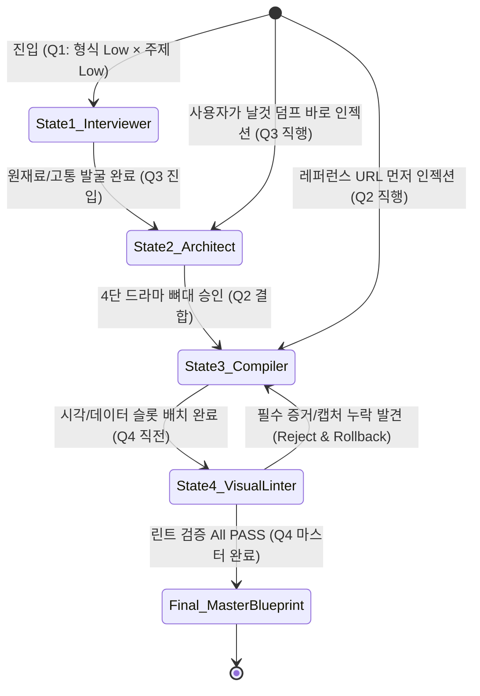

# 사분면 인식 기반 에이전트 상태 머신 — 공정형 스캐폴딩과 역할 전이 설계

> **핵심 테제**:  
> **"AI 도구는 모든 단계에서 똑같이 대답하는 '단일 챗봇(Monolithic Chat)'이어서는 안 된다."**  
> 사용자의 현재 준비 상태(Q1~Q4 사분면)를 감지하고, 스캐폴딩 공정 단계(Stage)에 따라 **[소재 인터뷰어 ➔ 서사 아키텍트 ➔ 슬롯 컴파일러 ➔ 비주얼 린터]**로 에이전트의 페르소나, 역할, 그리고 검증 가드레일이 자동 전환되는 **유한 상태 머신(Finite State Machine)**이어야 한다.

---

## 🏗️ 1. 왜 '공정형(State-Machine)' 접근인가?

### ① 자유 대화(Free Chat)의 한계: "숙련자 암묵지 의존"
* [[지원사업_분류기_블로그_기획_대화_전개.canvas]]에서 볼 수 있듯, 고품질 기술 아티클의 마스터 아웃라인을 뽑아내기까지 **15번의 치열한 핑퐁 대화**가 필요했습니다.
* 이는 작성자가 서사 구조(4단 드라마), 비주얼 앵커, 9대 레퍼런스 문법을 이미 꿰뚫고 있는 **초숙련자였기에 가능했던 결과**입니다.
* 비숙련자나 일반 사용자가 자유 대화창에 진입하면 질문 몇 번 만에 지쳐 평범한 텍스트 줄글 요약본을 받고 이탈합니다.

### ② 정적 폼/위저드(Static Form)의 한계: "인지 마비"
* 반대로 전통 UX처럼 빈칸 채우기 폼이나 4단계 위저드를 들이밀면, 와꾸(구조) 자체가 안 잡힌 작성자는 첫 입력창에서 멈춰 섭니다.

### 💡 해결책: '공정형 에이전트 상태 머신'
* 사용자의 입력 수준과 문서 빌드업 진척도를 추적하여, **현재 공정에 필요한 단 하나의 역할만 수행하는 상태 머신**을 가동합니다.
* 에이전트는 단계별 진입 조건(Guard)이 충족될 때만 다음 상태로 전이(Transition)하며, 각 단계마다 캔버스 노드를 직접 패치(Mutate)합니다.

---

## 🔄 2. 사분면 기반 4대 에이전트 상태(State) 및 역할 전이

[[문서_스캐폴딩_사용자_진단_및_아웃라인_4사분면_매트릭스]]의 2×2 진단 모델과 연동되는 4가지 런타임 상태입니다.



### 상세 상태 정의표

| 상태 (State) | 대상 사분면 | 에이전트 페르소나 | 주요 입력 및 행위 | 캔버스(UI) 조작 및 산출물 |
| :--- | :--- | :--- | :--- | :--- |
| **State 1.<br/>Interviewer** | **Q1**<br/>(안개 속 탐색자) | **소크라테스식 인터뷰어**<br/>(Socratic Prompter) | • *"최근 개발/업무 중 가장 빡쳤던 삽질이나 반복 피로는 무엇인가요?"*<br/>• 질문을 통해 사용자의 날것 경험을 밖으로 끄집어냄 | • 캔버스 중앙에 `[원재료 씨앗]` 임시 노드 생성 |
| **State 2.<br/>Architect** | **Q3**<br/>(날것의 기술자) | **서사 아키텍트**<br/>(Narrative Architect) | • 비정형 덤프(로그, 코드, 회고록) 접수<br/>• **4단 서사 드라마 [문제 ➔ 망작 ➔ 과정 ➔ 명작]** 구조로 재배열 | • 캔버스에 4개의 종적 컨테이너 자동 배치<br/>• 사건형 소제목 초안 매핑 |
| **State 3.<br/>Compiler** | **Q2**<br/>(형식 전문가) | **슬롯 컴파일러**<br/>(Slot-Carving Engine) | • 레퍼런스의 9대 문법 요소 분석<br/>• 텍스트 편향을 방지할 시각 블록(비교표, 루프 다이어그램) 슬롯 생성 | • 각 섹션 노드 내부에 `[Dropzone: 필수 다이어그램]`, `[Before/After 수치표]` 슬롯 삽입 |
| **State 4.<br/>Visual Linter** | **Q4 직전**<br/>(형식 완성 단계) | **비주얼 린터 & 게이트키퍼**<br/>(Visual Linter & Gatekeeper) | • **본문 작성 진입을 차단하고 뼈대의 시각 앵커 검증**<br/>• 3대 필수 가드레일 규칙 위반 여부 기계적 감사 | • 누락된 캡처본 자리에 `⚠️ 경고 배지` 표시<br/>• *"스크린샷 앵커가 누락되었습니다"* 교정 요구 |

---

## 🚨 3. State 4 '비주얼 린터(Visual Linter)'의 핵심 가드레일 규격

글의 완성도를 결정짓는 가장 중요한 상태는 **State 4(비주얼 린터)**입니다.  
사용자가 성급하게 본문 줄글 작성으로 넘어가지 못하도록 다음 규칙들을 엄격히 검사합니다:

```text
[ 비주얼 린터 3대 필수 린팅 룰셋 ]

Rule 1. [LINT-VIS-001] 실물 스크린샷 앵커 존재 여부
  - 조건: Section 1(현장 고통)과 Section 2(처참한 Before)에 '실제 화면 캡처' 슬롯이 1개 이상 바인딩되어 있는가?
  - 위반 시: ⛔ "텍스트만으로는 독자가 이탈합니다. 당시의 에러 화면이나 터미널 캡처 1장을 슬롯에 꽂아주세요."

Rule 2. [LINT-NUM-002] 정량적 극적 대조 수치 보유 여부
  - 조건: Section 2(Before)와 Section 4(After) 사이에 대비되는 숫자(시간/정확도/비용)가 명시되었는가?
  - 위반 시: ⚠️ "추상적인 '개선되었다' 대신 '54% ➔ 94%' 같은 전후 숫자를 대조 카드에 입력하세요."

Rule 3. [LINT-TXT-003] 텍스트 과밀도(Text Density) 경고
  - 조건: 시각 블록(표/도식/캡처) 없이 텍스트 줄글만 연속 300자 이상 나열된 섹션 발견 시
  - 위반 시: 💡 "이 섹션은 독자가 읽기 피로합니다. 3단계 흐름도(Mermaid)나 콜아웃 박스로 압축하세요."
```

---

## 🖥️ 4. AX(Agentic Experience) 상호작용 시나리오 예시

1. **[사용자 덤프]**:  
   - 사용자가 채팅창에 *"지원사업 분류기 LangSmith로 튜닝해서 정확도 올린 내용으로 블로그 쓸래"*라고 한 줄 입력.
2. **[상태 머신 판별]**:  
   - 시스템이 `주제=명확, 형식=모호`로 판별하여 즉시 **State 2(서사 아키텍트)** 모드 기동.
3. **[캔버스 조작 (Mutate)]**:  
   - 좌측 캔버스에 [문제 정의] - [초기 54% 망작] - [자가 튜닝 루프] - [최종 94% 명작] 4단 컨테이너가 1초 만에 렌더링됨.
4. **[슬롯 카빙 (State 3 전이)]**:  
   - 에이전트가 토스식 레퍼런스 문법을 결합하여 컨테이너 내부에 `[Before/After 비교 카드]` 슬롯을 깎아냄.
5. **[비주얼 린터 가동 (State 4 전이)]**:  
   - 사용자가 *"이대로 글 써줘"*라고 요청 시, 비주얼 린터가 인터럽트를 걸고 발화:  
     > **"잠깐만요! ✋ 현재 글에 독자의 시선을 꽂아줄 '실제 캡처 화면'이 누락되었습니다.**  
     > **Section 2의 `[📸 캡처 1: 공고문 원문]`과 Section 3의 `[📸 캡처 2: 터미널 실행 화면]` 슬롯을 먼저 채워주셔야 글의 생동감이 살아납니다."**
6. **[최종 컴파일]**:  
   - 사용자가 캡처 2장을 드래그 앤 드롭하자 린트 에러가 녹색(PASS)으로 바뀌고, **완전체 마스터 아웃라인 블루프린트**가 최종 확정됨.

---

## 🎯 5. 본 설계의 의의 및 도메인 정체성

* **대필 작가가 아닌 '공정 감독관'**: 사용자가 AI에게 문장을 대신 써달라고 의존하는 것이 아니라, 고품질 문서가 완성될 수밖에 없도록 **공정 단계별 규칙을 엄격히 집행하는 엔지니어링 파트너**가 됩니다.
* **표준화된 스캐폴딩 엔진의 토대**: 향후 본 프로젝트의 스캐폴딩 런타임 엔진(`scaffold-engine`)에서 모듈식 상태 머신 FSM(Finite State Machine)으로 직접 구현 가능한 구체적 아키텍처 스펙으로 활용됩니다.
