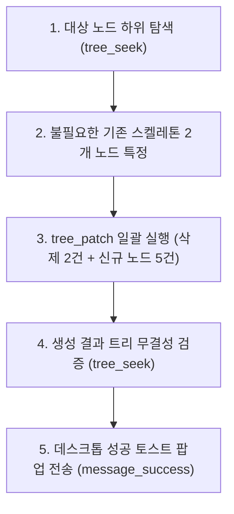

# 2026-10-07 #03 블로그 글감 후보 5종 노드 생성 및 스켈레톤 교체

Workflowy 데스크톱 내 `WorkFlowy 기반 블로그 작성` 노드 하위에 임시로 생성되어 있던 기존 스켈레톤(`블로그 글감 후보1`, `후보2`)을 정리하고, 사용자의 2-Track 지식 관리 철학과 AI 에이전트 협업 가치를 반영한 신규 글감 5종(상위 제목 + note 1줄)을 `tree_patch` 도구로 원자적 생성한 실행 기록입니다.

---

## 1. 작업 개요 (Why & Target)

* **실행 일시**: 2026-10-07 11:53 (KST)
* **사용자 핵심 피드백 및 설계 철학 (User's Raw Voice)**:
  > *"아니야 아니야 실제로는 나는 옵시디언을 버리지 않았어. 오히려 투트랙으로 활용을 하는거지. 그리고 나는 노션은 애초부터 메인으로 활용한 적도 없고. 처음부터 옵시디언이였고. 나의 메인 지식 저장소는 옵시디언이야. 그런데 나에게 workflowy 가 눈에 들어온 이유는 따로 있지.*
  > 
  > *1) 위계 관리를 전문적(시스템의 모든 구성 자체가)으로 할 수 있다 (top - down 방식의 틀 관리)*
  > *2) agent 와 mcp 연동이 유기적이다*
  > *3) agent 에게 사고를 '강제한다'*
  > *4) 사고의 '틀'을 잡는 공간과 그 부가적인 보관하는 자료들(옵시디언은 정말 종합 창고라고 볼 수 있어) 이 분리되어있다. 생각정리는 깔끔한게 좋거든"*
* **사용자 실행 지시 프롬프트**:
  > *"현재 workflowy 에 다음 5가지를 작성해줘. 내가 블로그 글감 후보 라고 그냥 skeleton 만 만들어둔 곳이 있는데 거기는 제거하고 노드 추가하면돼.*
  > *단! 가장 상위 제목 + 'note - 간단한 핵심 한 줄, 메인 컨셉 정도' 만 추가하고 나머지는 주저리주저리 쓰지마"*
* **작업 대상 경로**:
  * `Home` > `📆 Calendar` > `2026` > `Oct` > `Wed, Oct 7, 2026` > `✍️ WorkFlowy 기반 블로그 작성` (`09ec5a154974`)

---

## 2. 사용된 MCP 도구 (Tools)

* `tree_seek`: 기존 자식 노드(`f507efcd17b8`, `48dc7cd5e7d6`, `854546171f66`) 식별 및 트리 구조 확인
* `tree_patch`: 기존 스켈레톤 2개 노드 삭제(`delete`) 및 신규 글감 5개 노드 배치(`insert_after`)
* `message_success`: 사용자 데스크톱 화면 성공 토스트 알림 발송

---

## 3. 작업 수행 상세 (How)



1. **기존 노드 식별 및 정리 대상 확정**:
   * `48dc7cd5e7d6` (`블로그 글감 후보1`) ➔ 삭제 대상
   * `854546171f66` (`블로그 글감 후보2`) ➔ 삭제 대상
   * `f507efcd17b8` (메인 레퍼런스 링크 노드) ➔ 보존 대상
2. **신규 노드 생성 규칙 준수**:
   * 군더더기 목차 배제: H2/H3 세부 항목을 나열하지 않고 **[가장 상위 제목]**과 그 직속 하위의 **`note - 간단한 핵심 한 줄, 메인 컨셉`** 단 1개만 미니멀하게 부착.

---

## 4. 최종 Workflowy 트리 반영 결과 (Result / Snapshot)

```text
✍️ WorkFlowy 기반 블로그 작성 (ID: 09ec5a154974)
│
├── 🔗 메인 레퍼런스 - 내가 롬 리서치(Roam Research)를 좋아하는 이유와 실제 사용법(상) (ID: f507efcd17b8)
│
├── 1. 내가 옵시디언 유저이면서도 워크플로위(Workflowy)를 반드시 곁에 두는 이유 (ID: 0a9bce2eb274)
│   └── note - '종합 창고(옵시디언)'와 '사고의 틀(Workflowy)'을 분리했을 때 생긴 생각 정리의 쾌적함
│
├── 2. 화려한 기능 대신 '생각의 위계'를 택했다: 내가 워크플로위(Workflowy)를 도입한 4가지 결정적 이유 (ID: 7d7498bf30a5)
│   └── note - 시스템의 모든 구성이 오직 Top-down 틀 관리에만 맞춰진 아웃라이너의 구조적 힘
│
├── 3. AI 에이전트에게 '사고를 강제하는' 가장 완벽한 틀: 워크플로위(Workflowy)로 AI와 협업하기 (ID: d034d72ea899)
│   └── note - 횡설수설하는 LLM에게 마크다운 대신 '불릿 위계 트리'라는 가드레일을 쥐어주는 협업법
│
├── 4. AI 에이전트와 워크플로위(Workflowy)가 만났을 때: MCP 연동으로 체감한 실무 협업의 신세계 (ID: b847e070f957)
│   └── note - 단순 대화를 넘어 내 생각의 노드를 에이전트가 직접 탐색·조작하는 유기적 페어 씽킹
│
└── 5. 사고의 틀은 워크플로위로, 지식 자산은 옵시디언으로: AI와 함께하는 2-Track 기획 파이프라인 (ID: b2c84a2c4831)
    └── note - 발상과 위계 구축(Workflowy) ➔ AI 협업 ➔ 영구 아카이빙(옵시디언)으로 이어지는 3단계 파이프라인
```
