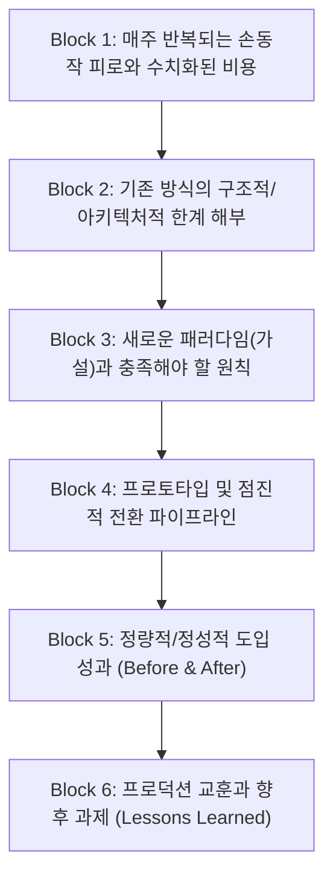

# 03. 토스테크 기업 기술블로그 도입배경과 문제정의 레퍼런스 소스

국내 최고 수준의 IT 기업 기술 블로그인 **'토스 테크(toss.tech)'** 및 테크 기업 블로그의 대표 아키타입인 **[도입 배경과 문제 정의의 정석 / 비용·피로 구조화형]** 아티클을 역공학한 척추(Spine) 레퍼런스 카드입니다.

---

## 1. 레퍼런스 채널 개요 & 특징

* **출처 플랫폼**: 토스 테크 (`toss.tech`), 우아한형제들 기술블로그, 당근 테크 블로그
* **대표 아키타입**: *"매주 반복되는 피로와 기존 방식의 한계 ➔ 새로운 패러다임 도입기"*
* **주요 탐색 키워드**:
  * `기술 도입 배경`, `생산성 개선`, `아키텍처 전환`, `개발자 경험(DX)`, `토스닥터`
* **이 채널이 최고의 레퍼런스인 이유**:
  * "써보니 좋더라" 수준의 주관적 감상이 아닌, **[구체적인 문제 현상 ➔ 구조적 원인 해부 ➔ 해결 가설 수립 ➔ 점진적 전환 ➔ 정량/정성적 성과]**의 논리적 척추가 가장 엄밀하여, 개발자와 엔지니어링 리더에게 압도적인 설득력을 제공합니다.

---

## 2. 훔쳐올 핵심 척추 (Spine / 필수 의무 정보 블록)

문제를 구조적으로 정의하고 해결을 입증하는 6단계 엔지니어링 척추 구조입니다:

### [Block 1] 문제 현상 — 수치화된 비용과 반복되는 피로
* 불편함을 추상적으로 말하지 않고, **구체적 반복 행동과 시간 비용**으로 제시:
  * 예: *"매주 반복되는 수동 조작 피로", "글 한 편을 쓸 때마다 발생하는 20번의 복사/붙여넣기 맥락 전환"*
* 작업자가 일상에서 겪는 병목 지점을 정밀하게 계측.

### [Block 2] 구조적 원인 해부 — 왜 기존 도구는 실패할 수밖에 없는가?
* 표면적 불편함 아래에 숨겨진 **아키텍처적 불일치(Impedance Mismatch)**를 규명:
  * 예: *"도큐먼트 중심 도구는 선형적 완성본을 강제하기 때문에, 비선형적으로 확장되는 뇌의 아이디어 분기와 구조적으로 충돌한다."*

### [Block 3] 해결 가설 및 설계 원칙 — 무엇이 필요한가?
* 새 시스템이 충족해야 하는 필수 조건 선언:
  1. 원자적 데이터 단위 (Atomic Unit)
  2. 양방향 동기화 및 단일 정본성
  3. 에이전트 자동화 연동 인터페이스

### [Block 4] 점진적 구현 및 전환 — 빅뱅이 아닌 점진적 검증
* 기존 데이터를 한 번에 버리지 않고, 프로토타입 ➔ 소규모 테스트 ➔ 전체 적용으로 전환해 나간 실전 과정.
* 에이전트 하네스, 스키마 연동, 파이프라인 구축 내용.

### [Block 5] 도입 결과 (Before & After) — 명확한 성과 제시
* **Before**: 복잡한 서식 세팅 30분, 글 구조 수정 시 수동 재배치 15분.
* **After**: 아웃라인 뼈대 완성 5분, 에이전트 자동 패치로 구조 정렬 즉시 완료.

### [Block 6] Lessons Learned — 진솔한 교훈
* 시스템을 도입하며 마주한 예상치 못한 엣지 케이스 및 배운 점 공유.

---

## 3. 시각 장치 및 논리 전개 특징 (Engineering Visuals)

1. **흐름 다이어그램 (Flowchart / Mermaid)**:
   * 텍스트 설명 전, 데이터의 흐름과 파이프라인을 시각적으로 한눈에 보여주는 도식 배치.
2. **비교 표와 Before & After Diff 블록**:
   * 전/후의 상태 차이를 명확한 Diff나 표로 대비.
3. **명확하고 건조한 전문적 어조**:
   * 감정적 형용사를 배제하고 '비용, 인지 부하, 아키텍처, 지연 시간' 등의 엔지니어링 어휘 사용.

---

## 4. 우리 프로젝트(Workflowy 도입기) 적용 가이드

* **Block 1 치환**: 문서 스캐폴딩과 블로그 기획 시 매번 반복되는 목차 재배치 피로와 텍스트 복사/붙여넣기 비용.
* **Block 2 치환**: 기존 마크다운/블록형 에디터가 가진 선형적 문서 모델의 한계 해부.
* **Block 3 치환**: '단일 무한 트리'와 '데스크톱 MCP 로컬 통신'이라는 아키텍처적 대안 제시.
* **Block 4 치환**: Workflowy 내장 MCP 서버와 Antigravity IDE 간의 연동 검증 및 `tree_seek` / `tree_patch` 자동화 구축 과정.
