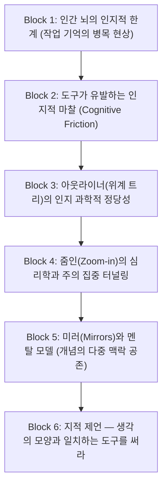

# 04. Ness Labs 인지과학 및 작업기억 관점 생산성도구 레퍼런스 소스

글로벌 지식 관리 및 신경과학 기반 생산성 연구 커뮤니티인 **'Ness Labs(nesslabs.com)'**의 대표 아키타입인 **[인지 과학 & 작업 기억(Working Memory) 관점의 도구 분석형]** 아티클을 역공학한 척추(Spine) 레퍼런스 카드입니다.

---

## 1. 레퍼런스 채널 개요 & 특징

* **출처 플랫폼**: Ness Labs (`nesslabs.com`), Tiago Forte / Ali Abdaal Substack
* **대표 아키타입**: *"도구를 기능이 아닌 '뇌의 외재화된 인지 보조 장치'로 바라보는 과학적 분석"*
* **주요 탐색 키워드**:
  * `Cognitive Load Theory`, `Working Memory`, `Outliner vs Document`, `Mindful Productivity`, `External Scaffolding`
* **이 채널이 최고의 레퍼런스인 이유**:
  * 도구를 단순한 'SW 기능 리스트'로 다루지 않고, **인간의 뇌가 정보를 처리하는 인지 구조(위계, 청킹, 시각적 주의 집중)와 어떻게 상호작용하는지**를 이론적으로 규명하여 글의 지적 권위와 설득력을 극대화합니다.

---

## 2. 훔쳐올 핵심 척추 (Spine / 필수 의무 정보 블록)

인간의 뇌 구조에서 출발하여 도구의 형태를 논증하는 6단계 인지과학적 척추 구조입니다:

### [Block 1] 인지적 한계 제시 — 작업 기억(Working Memory)의 병목
* 인간의 뇌는 한 번에 4~7개의 청크(Chunk)만을 작업 기억에 유지할 수 있다는 신경과학적 팩트 제시.
* 머릿속에서 아이디어를 굴리는 행위 자체가 극심한 에너지를 소모한다는 점을 지적.

### [Block 2] 도구가 유발하는 인지적 마찰 (Cognitive Friction)
* 일반적인 문서 도구들이 글쓰기 과정에서 뇌에 주는 3대 불필요한 부하:
  1. **어디에 둘지 결정하는 부하** (폴더 분류 피로)
  2. **어떤 모양으로 꾸밀지 결정하는 부하** (폰트/크기/서식 피로)
  3. **전체 글이 한눈에 보여서 생기는 부하** (주의 분산과 압박감)

### [Block 3] 아웃라이너의 과학적 정당성 — 생각의 본질은 트리(Tree)다
* 인간의 생각은 완성된 문장이 아니라, **'핵심 개념과 그에 딸린 하위 연상(Parent-Child)'**으로 구성됨을 논증.
* 불릿 들여쓰기(Indent)가 뇌의 자연스러운 청킹(Chunking) 프로세스를 가장 마찰 없이 외재화(Externalize)함을 설명.

### [Block 4] 줌인(Zoom-in)의 심리학 — 주의 집중 터널링(Attention Tunneling)
* 불릿을 클릭해 전체 화면을 그 노드로 가득 채우는 행위가 주변 시야의 잡음을 차단하고 **몰입(Flow State)**을 유도하는 심리학적 메커니즘.

### [Block 5] 미러(Mirrors)와 멘탈 모델 — 창의적 연결의 원리
* 실제 지식은 한 폴더에만 갇히지 않고 여러 맥락에 동시에 존재함.
* 동일한 불릿을 여러 위치에 실시간 동기화하여 배치하는 '미러'가 어떻게 서로 다른 생각 간의 창의적 결합(Bisociation)을 자극하는지 설명.

### [Block 6] 결론 — "내 생각의 자연스러운 구조를 거스르지 마라"
* 완성된 문장을 쓰기 전에 생각을 담는 그릇(Scaffolding)을 먼저 가볍게 만들어야 하는 이유 요약.

---

## 3. 시각 장치 및 지적 자산 특징 (Intellectual Visuals)

1. **인지 모델 다이어그램**:
   * 뇌의 입력 ➔ 작업 기억 ➔ 외재화 도구 ➔ 장기 기억으로 이어지는 인지 흐름 도식.
2. **신경과학 / 심리학 인용**:
   * Miller's Law (7±2의 법칙), Sweller의 인지 부하 이론 등 신뢰도 높은 연구 근거 인용.
3. **지적이고 차분한 에세이 톤**:
   * 유행을 좇는 툴 리뷰가 아닌, '인간의 사고 방식에 대한 통찰'을 담은 칼럼형 어조.

---

## 4. 우리 프로젝트(Workflowy 도입기) 적용 가이드

* **Block 1~2 치환**: 글을 쓰려고 할 때 백지 공포증(Blank Page Syndrome)이나 서식 고민으로 뇌 에너지가 고갈되던 현상 분석.
* **Block 3 치환**: 왜 Workflowy의 단일 무한 트리가 문서 스캐폴딩(Scaffolding)의 가장 이상적인 도화지인지 인지 과학적으로 정당화.
* **Block 4~5 치환**: Workflowy의 줌인(Zoom-in)과 미러(Mirrors) 기능이 주는 인지 부하 감소 효과 입증.
