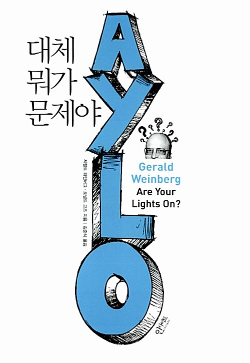

> **"책의 인상깊은 문구 삽입"**

> [!quote] 💭
> ### 나의 감상평
>
> ---
>

> [!warning] 🏷️
> ### 기억에 남는 글귀
>

## 💬 댓글

1) 무엇이 잘못인가를 어떻게 결정할 것인가?
2) 무엇이 잘못인가?
3) 그것에 대해 무엇을 해야한는가?
**-> 모카신 바꿔 신기로 생각해보기**

> [!tip]
> 문제란, 바라는 것과 인식하는 것 간의 차이다.

-> 허상의 문제들이 진짜 문제다. 
- 25도와 너무 춥다는 느낌에 대해 몸이 아프다고 결론을 내릴지도 모른다. 
- 보통 사람이라면 꽤 따듯하다고 느낄 수 있는 온도이지만 스스로 따뜻하다고 느끼지 않는다면 객관적 온도를 읽는 것은 아무 소용이 없다. 
-> 성급하게 결론에 도달하지 마라. 그러나 처음 느낌을 무시해서도 안 된다.
- 그럼 대체 뭐가 문제인가?  - 최종적인 해결안이라는 것은 존재하지 않는다 [[#^c-muc5s5dr|💬]].
- 그렇기에 정확히 정의 내렸다고 확신하지 말고, 그것을 얻기 위한 노력은 계속 되어야 한다.
-> 끝없는 사슬임. 각각의 해결안은 다음 문제의 근원이다.
- 문제를 해결한다는건 또 다른 덜 성가신 문제가 발생하길 바라는 것
- 어떤 문제들에 접근 할 때 가장 어려운 부분은 일단 문제의 존재를 인식하는 것부터

> 문제를 이해할 때, 꼬꼬무로 잘못될 수 있는 경우를 적어도 세 가지 이상 생각해 내지 못한다면 당신은 문제를 이해하지 못 한 것이다. [[#^c-muc5jhbe|💬]]

- 설계자들은 남들을 위해서 미리 문제를 해결하는 사람이기 때문에 계속해서 부적합 한 것을 생산해냄
	- 면도칼의 발명은 이로운 점에 비해 다치는 사람이 많아지고 이를 통해 안전 면도기가 또 발명되고, ..
	- 문제가 없다면 설계자도 더이상 필요하지 않을 것. 문제가 아예 해결되었는데 설계자가 왜 필요한가?
- 대부분의 부적합은 인식되기만 하면 쉽게 해결된다. [[#^c-muc5z1kd|💬]]
	- 왜냐면, 인간은 적응력이 강해 무언가가 그런식으로는 안된다고 의식하기 전까진 어떤 부적합도 참아냄.

> 여러분이 내린 정의에 대해 외국인이나 장님 혹은 어린이를 통해서 검증하라. 혹은 여러분 자신이 외국인, 장님 혹은 어린이가 되어보라.

-> 각각의 새로운 관점은 새로운 부적합을 야기한다.
- 해결안을 실행하기 전에 이런 관점들을 찾아보는 것이 나중에 그것이 문제가 된 후 깨닫으 것보다 낫지 않을까?
- [ ] 그래 이게 ai 페르소나로 피드백 받아보는거지. [[#^c-muc57dkd|💬]]

-> WHERE THE SKIES ARE NOT CLOUDY ALL DAY. [[#^c-muc67yl3|💬]]

## 💬 코멘트

> [!comment]- ✅ [ ] 그래 이게 ai 페르소나로 피드백 받아보는거지.
> **Rin** · 2026-09-22 12:56
> 페르소나의 중요성!@Rin
>
> **Rin** · 2026-09-22 13:00
> @Rin 슬랙 테스트

^c-muc57dkd

> [!comment]+ 💬 문제를 이해할 때, 꼬꼬무로 잘못될 수 있는 경우를 적어도 세 가지 이상 생각해 내지 못한다면 당신은 문제를…
> **Rin** · 2026-09-22 13:06
> 현재 볼트 문제점 세가지 이상 대보시오.@민규서 @Rin

^c-muc5jhbe

> [!comment]+ 💬 최종적인 해결안이라는 것은 존재하지 않는다
> **Rin** · 2026-09-22 13:13
> @민규서 이리오너라!!

^c-muc5s5dr

> [!comment]+ 💬 대부분의 부적합은 인식되기만 하면 쉽게 해결된다.
> **Rin** · 2026-09-22 13:18
> 사람은 적응의 동물이랫던가. 동의하나 자네@민규서

^c-muc5z1kd

> [!comment]- ✅ -> WHERE THE SKIES ARE NOT CLOUDY ALL DAY.
> **Rin** · 2026-09-22 13:25
> 하늘에 종일 구름이 끼지는 않는 곳. @Rin @민규서

^c-muc67yl3
