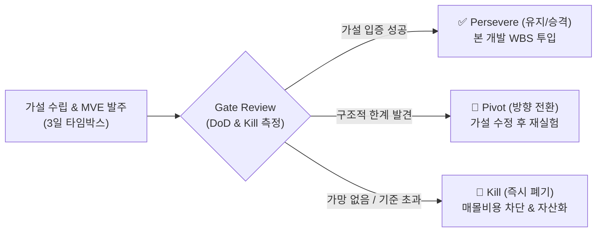

# Lean Enterprise (린 엔터프라이즈) — 가설 주도 개발(HDD)과 불확실성 관리

> **원전 정보**:  
> * **저자**: 제즈 험블(Jez Humble, 《지속적 배포》 저자), 조앤 몰레스키, 배리 오라일리 (Barry O'Reilly)  
> * **원서**: 《Lean Enterprise: How High Performance Organizations Innovate at Scale》 (O'Reilly Media)  
> * **국내 번역서**: 《린 엔터프라이즈: 혁신을 대규모로 실현하는 고성과 조직의 비밀》 (한빛미디어)  
> * **성격**: 엔터프라이즈 및 빅테크 조직에서 불확실성이 90%인 R&D 프로젝트를 **과학적 실험과 정량적 거버넌스로 통제하는 바이블 (Canon)**

---

## 1. 문제의식: '기능 공장(Feature Factory)'과 '연구실 프로젝트의 덫'

전통적인 IT 및 R&D 프로젝트는 두 가지 치명적 병폐를 앓습니다:

1. **기능 공장 (Feature Factory)**:
   * 고객이 진짜 원하는지, 아키텍처가 버티는지도 모르면서 기획서에 적혀 있다는 이유로 기능을 맹목적으로 찍어냄.
2. **연구실 프로젝트의 덫 (The Science Project Trap)**:
   * 불확실성이 큰 R&D 연구원들이 매몰 비용(Sunk Cost)에 빠져, 6개월~1년 동안 기약 없이 연구를 붙잡고 있으면서 아무런 제품 가치를 내지 못함.

《린 엔터프라이즈》는 이를 해결하기 위해 **"제품 개발은 공장식 납품이 아니라, 반증 가능한 과학적 실험(Scientific Experimentation)의 연속이어야 한다"**는 **가설 주도 개발(HDD)**을 정립했습니다.

---

## 2. 가설 주도 개발 (Hypothesis-Driven Development, HDD)

### ① 공식 가설 기술서 템플릿 (Hypothesis Statement)
요구사항을 "기능 A 개발"처럼 태스크로 적지 않고, 과학 실험실의 가설 형태로 기술합니다.

```text
우리는 [특정 대상/사용자]를 위해 [이 기능/아키텍처 접근법]을 도입하면,
[어떤 구체적인 비즈니스/기술적 결과]가 나타날 것이라 믿는다.

우리는 [측정 가능한 정량적 신호 / DoD 기준]을 관측했을 때,
이 가설이 참(Valid)임을 확신할 수 있다.
```

* **캔버스 적용 예시**:
  * *"우리는 문서 작업자를 위해 인라인 Diff 승인 방식을 도입하면 문맥 전환 피로가 줄어들 것이라 믿는다. 우리는 3명의 테스트 피험자가 시선 이탈 없이 1회 클릭(Tab)으로 슬롯을 채웠을 때 이 가설이 참임을 확신한다."*

### ② 최소 실행 가능 실험 (Minimal Viable Experiment, MVE)
* MVP(Minimum Viable Product)조차도 R&D 검증에는 너무 무겁습니다.
* **가설 하나를 검증하기 위해 1일~3일 안에 실행할 수 있는 가장 얇고 날카로운 실험 단위(MVE)**를 설계합니다. (캔버스의 3일 Spike와 정확히 일치)

### ③ 디리스킹 (De-risking: 위험 조기 제거)
* 프로젝트에서 성공 확률이 가장 낮거나, 실패했을 때 프로젝트 전체를 좌초시킬 **가장 위험한 기술적/사용성 가정(Riskiest Assumption)**을 식별하여 **스프린트의 1순위 과업으로 배치**합니다.

---

## 3. Stage-Gate 거버넌스와 3대 판정 (Pivot / Persevere / Kill)

《린 엔터프라이즈》는 연구 과제가 타임박스를 통과했을 때 감정이 아닌 **사전 정의된 객관적 지표**로 냉정하게 판정하는 게이트 시스템을 강제합니다.



### ① Definition of Done (DoD — 완료 판정)
* "코드가 에러 없이 돈다"는 완료가 아닙니다.
* **"사전에 약속된 성능 지표(예: 16ms 렌더링)를 달성하고, 1페이지 결과 리포트를 작성했다"**까지가 완료입니다.

### ② Kill Criteria (킬 기준 — 즉시 중단)
* 연구원이나 개발자가 스스로 연구를 포기하는 것은 심리적으로 불가능합니다.
* 따라서 시작 전에 미리 **"무엇을 넘으면 가차 없이 연구를 폭파하는가?"**를 합의합니다.
  * 예: *"파싱 지연이 100ms를 초과하거나, 1일 차에 메모리 누수가 발생하면 즉시 라이브러리를 버린다."*

### ③ Pivot Criteria (피벗 기준 — 방향 전환)
* 방향 자체는 유망하나 특정 전제가 틀렸을 때 가설을 수정하는 경로입니다. (예: 직접 매핑을 포기하고 IR 어댑터 패턴으로 전환)

---

## 4. 3단계 혁신 포트폴리오 (Three Horizons Model)

모든 개발 업무를 하나의 잣대로 관리하면 R&D는 100% 전멸합니다. 《린 엔터프라이즈》는 업무를 3개 영역으로 분리할 것을 요구합니다.

| 영역 | 성격 | 관리 방식 | 측정 지표 |
| :--- | :--- | :--- | :--- |
| **Horizon 1** | **핵심 사업 / 양산 본 개발** | WBS, 스크럼, 스프린트 | 일정 준수율, 기능 완성도 |
| **Horizon 2** | **기능 확장 및 신규 모듈** | 린 스타트업, MVP | 초기 사용자 유지율 |
| **Horizon 3** | **탐색적 R&D (불확실성 90%)** | **HDD, 3일 Spike, Stage-Gate** | **불확실성 감소율, 학습 속도** |

* 🛑 **치명적 오류**: Horizon 3(탐색적 R&D)에 있는 과업에 Horizon 1의 방식(WBS, 일정 마감, 기능 납품)을 들이대면 연구팀은 안전하고 뻔한 가짜 기능만 만들게 됩니다.

---

## 5. 💡 우리 R&D 체계와의 접점 및 시사점

1. 캔버스의 **[Level 1. 불확실성 파쇄기]**는 린 엔터프라이즈의 **[Horizon 3 전용 HDD(가설 주도 개발) 거버넌스]**의 완벽한 실체화입니다.
2. 캔버스의 **[DoD & Kill Criteria 분기]**는 제즈 험블과 배리 오라일리가 제시한 **[Stage-Gate의 Pivot / Persevere / Kill 3대 판정 엔진]**을 그대로 계승합니다.
3. 캔버스의 **[Tracer Bullet 통과 후 Level 2 WBS 승격]**은 과업의 성격이 **Horizon 3(탐색적 실험)에서 Horizon 1(양산 개발)으로 공식 승격**되는 경계선입니다.
