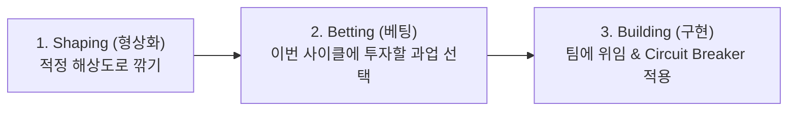

# Shape Up — Stop Running in Circles and Ship Work that Matters (Basecamp)

> **원전 정보**:  
> * **저자**: 라이언 싱어 (Ryan Singer, Basecamp 전 제품 전략 총괄)  
> * **공식 원문 (전체 무료 공개)**: [https://basecamp.com/shapeup](https://basecamp.com/shapeup)  
> * **성격**: 무한한 백로그와 추정의 늪에 빠진 전통적 스크럼을 대체하는 **실리콘밸리 프로덕트 R&D 및 불확실성 통제의 공식 플레이북 (Canon)**

---

## 1. 개요 및 핵심 철학

기존의 소프트웨어 개발은 "이 기능 만드는 데 얼마나 걸릴까?"를 추정(Estimation)하다가 기한이 늘어지고 끝없는 백로그에 갇힙니다.  
《Shape Up》은 이 접근을 완전히 뒤집어 **"우리가 이 문제에 투자할 시간 예산(Appetite)을 먼저 정해두고, 그 시간 안에 들어갈 수 있도록 해결책을 깎아내는(Shaping)"** 공학적 방법론입니다.

---

## 2. Part 1: Shaping (적정 해상도의 형상화)

업무를 기획할 때 너무 뭉뚱그리면 개발자가 길을 잃고, 너무 자세하게(Figma/Wireframe) 그리면 창의적 문제 해결이 막힙니다. Shape Up은 **"거칠지만(Rough), 해결책이 명확하고(Solved), 경계가 닫혀 있는(Bounded)"** 적정 해상도를 요구합니다.

### ① Appetite vs Estimates (시간 예산의 원전)
* **Estimates (전통 방식)**: 기능 명세를 먼저 다 적어놓고 "얼마나 걸릴까?"를 묻습니다. ➔ 100% 일정 지연 발생.
* **Appetite (Shape Up)**: "우리가 이 문제를 푸는 데 **최대 며칠(or 몇 주)을 태울 가치가 있는가?**"를 먼저 결정합니다.
  * 예: "이 슬롯 추천 기능은 우리에게 **딱 3일(Small Batch)**짜리 가치다. 3일 안에 풀 수 없는 구조라면 기능을 덜어내라."

### ② Breadboarding (와이어프레임 대신 회로 기판 그리기)
UI 픽셀이나 폰트를 신경 쓰지 않고, 전자 회로 기판(Breadboard)처럼 **최소 원자 단위(Primitives)**만 정의합니다.
* **Places (장소)**: 사용자가 머무는 화면/컨테이너
* **Affordances (조작점)**: 버튼, 입력창, 링크 등 인간이 조작할 수 있는 최소 인터랙션
* **Connection Lines**: 조작 시 데이터가 흘러가는 연결선

### ③ Fat Marker Sketches (두꺼운 마커 제약)
* 세부적인 레이아웃이나 여백을 파고드는 완벽주의를 강제로 차단하기 위해, **두꺼운 보드마커(Fat Marker)**로 그린 것처럼 거칠게 뼈대만 스케치하여 엔지니어에게 넘깁니다.

### ④ Rabbit Holes & Risks (토끼굴 사전 차단)
* 엔지니어가 구현 도중 빠져서 2주 동안 헤맬 만한 **기술적 미지의 영역(Rabbit Holes)**을 Shaping 단계에서 미리 찾아냅니다.
* 찾아낸 토끼굴은 사전에 패치하거나, *"이것은 이번 범위에서 절대 건드리지 않는다(No-Gos)"*고 선언하여 리스크를 제거합니다.

---

## 3. Part 2: The Pitch (팀원 실무 위임 제안서)

Shaping이 완료된 결과물은 **'피치(The Pitch)'**라는 5대 요소 문서로 작성되어 실무 팀에게 위임됩니다.

| 피치 5대 구성 요소 | 핵심 질문 및 내용 |
| :--- | :--- |
| **1. Problem** | 사용자가 겪는 진짜 마찰과 고통(Raw Friction)은 무엇인가? |
| **2. Appetite** | 이 과업에 허용된 최대 시간 예산(예: 3일, 2주, 6주)은 얼마인가? |
| **3. Solution** | Breadboard와 Fat-marker로 정의된 조작 구조와 핵심 Primitives |
| **4. Rabbit Holes** | 구현 중 마주칠 위험과 미리 차단해 둔 함정들 |
| **5. No-Gos** | 이번 타임박스에서 **절대 구현하지 말아야 할 제외 범위(가드레일)** |

---

## 4. Part 3: Betting & No Backlogs (베팅과 백로그 폐지)

* **백로그 폐지 (No Backlogs)**:
  * 끝나지 않는 거대한 백로그 리스트를 관리하느라 에너지를 낭비하지 않습니다.
  * 아이디어가 진짜 중요하면 다음 사이클에 다시 올라올 것이며, 중요하지 않은 아이디어는 조용히 잊히게 둡니다.
* **베팅 테이블 (Betting Table)**:
  * 매 사이클마다 올라온 피치(Pitch)들을 검토하고, 팀의 자원을 어디에 걸(Bet) 것인지 결정합니다.

---

## 5. Part 4: Building & Circuit Breaker (실행과 강제 차단)

### 🛑 Circuit Breaker (차단기 / Kill Rule의 원전)
* **절대 규칙**: 타임박스(Appetite)가 종료되었는데 작업이 미완성이라면, **절대 마감을 연장(Extension)해주지 않습니다.**
* **이유**: 마감을 연장해주는 순간 프로젝트는 늪에 빠지며, 팀은 실패 원인을 분석하지 못합니다.
* **조치**: 차단기가 내려가면 프로젝트는 **즉시 폐기(Kill)되거나, 원점에서 다시 깎여서(Re-shape)** 다음 사이클에 재발주됩니다.

### 📈 Hill Charts (불확실성 파쇄 시각화)
* 할 일 목록(Checklist) 대신 언덕 차트를 사용합니다.
  * **언덕을 올라가는 구간 (Uphill / Spike)**: *"어떻게 풀어야 할지 모르는 미지의 불확실성을 파쇄하는 단계"*
  * **언덕 꼭대기 (The Top)**: 모든 미지의 의문이 풀리고 해결책이 확정된 순간
  * **언덕을 내려가는 구간 (Downhill / Execution)**: 남은 것은 손으로 치는 단순 구현 단계

---

## 💡 우리 R&D 체계와의 접점 및 시사점

1. 캔버스의 **[3-Day Timebox]**는 Shape Up의 **[Small Batch Appetite]**와 정확히 같습니다.
2. 캔버스의 **[Spike B-2 위임 사양서]**는 Shape Up의 **[The Pitch (Solution + Rabbit Holes + No-Gos)]** 규격과 1:1로 일치합니다.
3. 캔버스의 **[Timebox Expired ➔ 마감 연장 금지 강제 판정]**은 Shape Up의 **[Circuit Breaker]** 철학의 완벽한 실천입니다.
