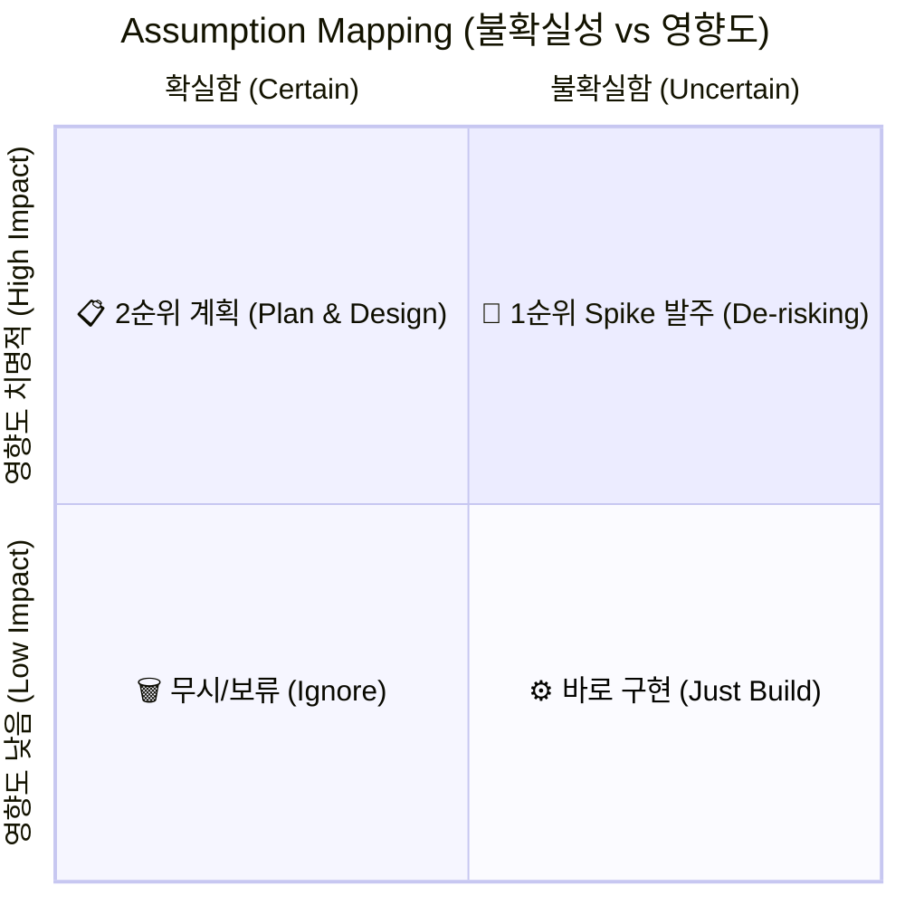

# [HDD] 도약 가설(LOFA)과 가설 위험도 3단계 위계 체계 (Leap-of-Faith Assumptions)

> **원전 정보**:  
> * **학술 / 업계 출처**: 에릭 리스 (Eric Ries, 《린 스타트업》), 제즈 험블 & 배리 오라일리 (《린 엔터프라이즈》)  
> * **핵심 개념**: **도약 가설 (Leap-of-Faith Assumptions, LOFA)** 및 **가설 매핑 (Assumption Mapping)**  
> * **성격**: 모든 가설을 평평하게 다루지 않고, 프로젝트의 존폐를 가르는 가장 치명적인 가설부터 순서대로 파쇄(De-risking)하기 위한 **가설 우선순위 및 위계 거버넌스**

---

## 1. 개요: 왜 가설에 '위계(Hierarchy)'가 필요한가?

프로젝트를 진행하다 보면 검증해야 할 가설이 수십 개로 늘어납니다:
* *"버튼 색을 파란색으로 하면 클릭이 늘어날까?"* (하찮은 가설)
* *"문서 작업의 본질을 타이핑에서 컴파일로 바꾸면 사용자가 수용할까?"* (치명적인 가설)

이 둘을 같은 스프린트에서 같은 무게로 다루면, 팀은 안전하고 사소한 가설만 검증하다가 **정작 프로젝트의 존폐가 걸린 가장 위험한 가설을 외면하여 결국 침몰**하게 됩니다.  
이를 막기 위해 가설의 위험도와 추상도에 따라 3단계 위계를 세우고, 최상위 도약 가설부터 정조준하는 것이 HDD의 핵심입니다.

---

## 2. 가설 위험도 3단계 위계 (The 3-Tier Hierarchy)

```text
[Tier 1] 도약 가설 (Leap-of-Faith Assumptions, LOFA)
         "만약 이것이 틀리다면, 코드가 아무리 완벽해도 프로젝트 전체를 접어야 하는 가정"
         ➔ 캔버스의 [00. Product Thesis & 01. Paradigm Shift]
                 ▼ (구체화)
[Tier 2] 메커니즘 가설 (Mechanism Hypotheses)
         "Tier 1의 가치를 실현하기 위해 선택한 원자(Primitives)와 아키텍처가 유효하다는 가정"
         ➔ 캔버스의 [02. Mental Model & 03. Core Primitives]
                 ▼ (수치화)
[Tier 3] 파라미터 / 임계치 가설 (Parameter & Threshold Hypotheses)
         "우리가 사전에 약속한 정량적 수치 지표(DoD / Kill 기준)를 달성한다는 공학적 가정"
         ➔ 캔버스의 [Spike B-2(5ms) & Spike B-AX(시선이탈 0건)]
```

### ① Tier 1: 도약 가설 (LOFA — Leap-of-Faith)
* **정의**: 비즈니스와 제품의 존폐를 가르는 가장 근본적인 믿음.
* **특징**: 증명된 적 없는 미지의 영역으로 신념의 도약(Leap of Faith)을 해야 하는 가설.
* **캔버스 적용**:
  * *"사용자는 백지 위에서 자유롭게 서식을 만지는 것보다, 원본 데이터를 규격에 맞춰 조립하고 승인하는 컴파일 방식을 더 높은 가치로 여길 것이다."*

### ② Tier 2: 메커니즘 가설 (Mechanism)
* **정의**: 도약 가설을 현실 세계에서 동작시키기 위한 시스템적 구조와 역할의 유효성.
* **특징**: 멘탈 모델과 핵심 Primitives의 관계 규격.
* **캔버스 적용**:
  * *"인간을 아키텍트/리뷰어로 두고, 데이터를 Segment와 Slot으로 분리하여 인라인 Diff로 제안하면 인간의 인지 부하가 제거될 것이다."*

### ③ Tier 3: 파라미터 가설 (Parameter)
* **정의**: 메커니즘이 실제로 성립하기 위해 만족해야 하는 구체적인 공학적/인터랙션 수치 경계.
* **특징**: 3일 스파이크에서 측정하는 Definition of Done(DoD) 및 Kill Criteria 수치.
* **캔버스 적용**:
  * *"Segment ➔ Slot 런타임 바인딩 지연이 5ms 이하일 것이다."*
  * *"인라인 Tab 조작 시 피험자의 본문 읽기 흐름 간섭이 0건일 것이다."*

---

## 3. 가설 우선순위 판정: 어섬션 매핑 (Assumption Mapping)

수많은 가설 중 **"어느 스파이크를 이번 주에 가장 먼저 발주해야 하는가?"**를 결정하는 2축 매트릭스입니다.



1. **우상단 (치명적 영향도 + 높은 불확실성)** ➔ **【Spike 1순위 발주】**:
   * 실패 시 프로젝트가 망하지만, 지금 당장 답을 모르는 가설.
   * 모든 3일 스파이크(Spike B-2, Spike B-AX)는 오직 이 사분면에 있는 가설에만 자원을 투입합니다.
2. **좌상단 (치명적 영향도 + 확실함)** ➔ **【즉시 계획 및 구현】**:
   * 이미 기술적으로 검증되었고 당연히 해야 할 일 ➔ 스파이크 없이 바로 WBS로 투입.
3. **우하단 (낮은 영향도 + 높은 불확실성)** ➔ **【보류/무시】**:
   * 궁금하긴 하지만 틀려도 프로젝트에 큰 영향이 없는 기술적 호기심 ➔ 스파이크 발주 금지 (시간 낭비 차단).

---

## 4. 실패(Kill/Pivot) 시의 역방향 에스컬레이션 규칙

3일 스파이크의 게이트 리뷰에서 Kill 기준에 도달했을 때, 어느 계층으로 피벗해야 하는지를 판정하는 룰입니다:

1. **Tier 3 (수치 미달) 실패 시**:
   * ➔ *조치*: 단순 알고리즘 최적화 또는 파서 라이브러리 교체 (국소적 엔지니어링 패치).
2. **Tier 2 (메커니즘 오류) 실패 시**:
   * ➔ *조치*: 직접 매핑 포기 ➔ `중간 표현(IR: Intermediate Representation) 어댑터` 패턴 도입 등 **Core Primitives 재설계**.
3. **Tier 1 (도약 가설 붕괴) 실패 시**:
   * ➔ *조치*: 사용자 10명 전원이 타이핑 자유를 원하고 컴파일 패러다임을 거부함 ➔ **프로젝트 전면 Kill(공식 폐기) 및 차기 아이템으로의 전략적 피벗**.

---

## 💡 결론 및 시사점

가설 주도 개발(HDD)의 성패는 **"가장 위험한 도약 가설(LOFA)을 가장 먼저 검증 가능한 파라미터(Spike 수치)로 쪼개어 조기에 격파(De-risking)할 수 있는가"**에 달려 있습니다.

이 체계가 잡혀 있으면, 팀은 사소한 UI 디테일에 매몰되지 않고 **가장 치명적인 위험부터 순서대로 3일 안에 부수는 압도적인 R&D 속도**를 갖추게 됩니다.
