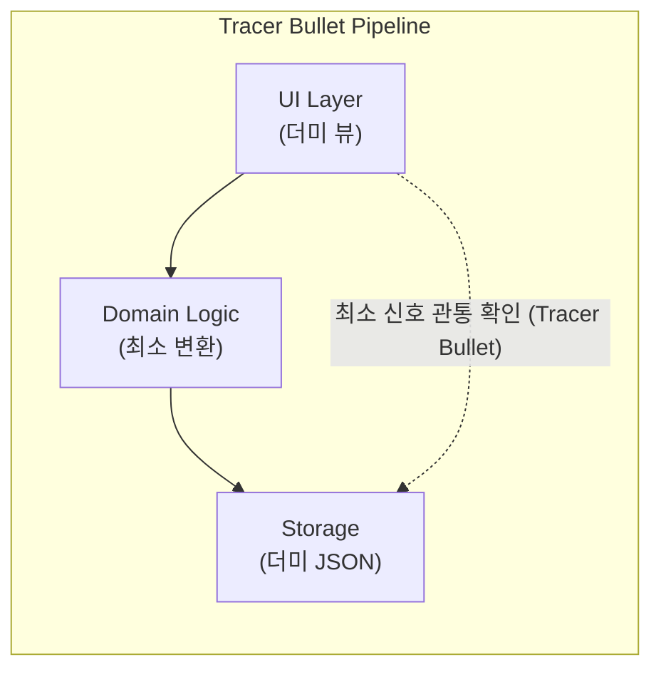

# 마틴 파울러의 엔지니어링 위키 (Martin Fowler Bliki) — Spike, Tracer Bullet, ADR

> **원전 정보**:  
> * **저자**: 마틴 파울러 (Martin Fowler, ThoughtWorks 수석 과학자, 애자일 선언문 공동 저자)  
> * **공식 백과사전 사이트**: [https://martinfowler.com](https://martinfowler.com)  
> * **성격**: 글로벌 소프트웨어 엔지니어링과 아키텍처 설계에서 사용하는 핵심 용어와 기법의 **원전(Original Definition) 집대성**

---

## 1. Spike (스파이크 원전)
* **공식 원문**: [https://martinfowler.com/wiki/Spike.html](https://martinfowler.com/wiki/Spike.html)
* **기원**: 켄트 벡(Kent Beck)과 와드 커닝햄(Ward Cunningham)의 **eXtreme Programming (XP)**

### ① Spike의 공식 정의
> *"스파이크(Spike)는 오직 하나의 기술적 질문에 답하거나, 불확실성을 제거하기 위해 고안된 초단기 타임박스(Time-boxed) 연구 과업이다."*

### ② Spike의 3대 절대 규칙
1. **타임박스 강제 (Time-boxed)**:
   * 스파이크는 "끝날 때까지" 하는 것이 아닙니다. 1일~3일의 엄격한 시간 상한선이 끝나면 결론의 유무와 상관없이 무조건 멈춥니다.
2. **산출물은 '기능'이 아니라 '지식' (Knowledge over Code)**:
   * 스파이크의 결과물은 고객에게 배포되는 완벽한 소프트웨어가 아닙니다. *"이 라이브러리가 16ms 안에 도는가?"*라는 질문에 대한 **'참/거짓 데이터와 위험 감소'**가 유일한 산출물입니다.
3. **버리는 코드 (Throwaway Code)**:
   * 스파이크 기간에 작성된 거친 더미 코드는 원칙적으로 메인 코드베이스에 머지하지 않고 **버립니다**. 지식을 얻었으면, 본 개발에서 깨끗하게 다시 작성합니다.

---

## 2. Tracer Bullet (예광탄 개발) vs Prototype
* **공식 원문**: [https://martinfowler.com/bliki/TracerBullet.html](https://martinfowler.com/bliki/TracerBullet.html)
* **기원**: 앤디 헌트, 데이브 토마스의 명저 《실용주의 프로그래머》 제2장

### ① Tracer Bullet의 공식 정의
> *"어둠 속에서 기관총의 탄도 궤적을 빛으로 보여주는 예광탄처럼, 전체 시스템의 모든 계층(UI ➔ 비즈니스 로직 ➔ DB/저장소)을 처음부터 끝까지 아주 얇게 관통(End-to-End)시키는 최소 코드."*



### ② Spike / Prototype vs Tracer Bullet 대조표

| 비교 항목 | Spike / Prototype (프로토타입) | Tracer Bullet (예광탄) |
| :--- | :--- | :--- |
| **목적** | 특정 알고리즘이나 UI 손맛의 단편적 탐색 | **전체 아키텍처의 배관(Plumbing) 연결 검증** |
| **코드의 운명** | 검증 후 즉시 **버림(Throwaway)** | 버리지 않고 **시스템의 영구적인 뼈대(Skeleton)**로 남음 |
| **완성도** | 가짜 데이터와 눈속임 인터랙션 | 기능은 극소수이지만 **실제 E2E 파이프라인으로 관통** |
| **적용 시점** | 불확실성이 90%인 극초기 탐색 | 3일 스파이크들을 통과한 직후 **본 개발 승격 관문** |

---

## 3. Architecture Decision Records (ADR — 아키텍처 결정 기록)
* **공식 원문**: [https://martinfowler.com/bliki/ArchitectureDecisionRecord.html](https://martinfowler.com/bliki/ArchitectureDecisionRecord.html)
* **기원**: 마이클 나이거드 (Michael Nygard, 2011)

### ① ADR의 필요성
불확실성을 해결하기 위해 라이브러리를 비교(Make vs Buy)하거나 아키텍처를 결정했을 때, 그 결정을 기록해 두지 않으면 3개월 뒤 새로운 팀원이 들어와 *"이거 왜 이렇게 짰어요? 딴 걸로 바꿉시다"*라며 똑같은 헛고생을 반복합니다.  
ADR은 **"왜 이 결정을 내렸고, 무엇을 포기했는가"를 1페이지 마크다운으로 영구 자산화**하는 표준 규격입니다.

### ② ADR의 표준 5대 포맷
```markdown
# [ADR-001] 캔버스 노드 렌더링 엔진 자체 구현(Make) 결정

* **Status (상태)**: Proposed / Accepted / Deprecated / Superseded
* **Context (맥락 및 문제)**:
  - 캔버스 슬롯 50개 렌더링 시 16ms 이하 성능 요구조건 존재.
  - 외부 오픈소스 라이브러리 A, B 검토 결과 번들 크기 2MB 초과 및 라이선스 충돌 확인.
* **Decision (결정 사항)**:
  - 외부 라이브러리 도입을 기각하고 React Flow 기반 경량 커스텀 노드로 자체 구현 확정.
* **Consequences (결과 및 트레이드오프)**:
  - [Positive]: 번들 크기 30KB 유지, 16ms 프레임 레이트 달성.
  - [Negative]: 줌/팬 커스텀 제어 코드를 내부에서 직접 유지보수해야 하는 부채 발생.
```

---

## 💡 우리 R&D 체계와의 접점 및 시사점

1. 캔버스의 **[Level 1. 불확실성 파쇄기]**는 마틴 파울러가 정의한 **[Spike의 타임박스 지식 획득]** 원칙의 구현체입니다.
2. 캔버스의 **[Tracer Bullet 관통 확인 ➔ Level 2 본 개발 승격]**은 파울러가 설명한 **[버리는 코드(Spike)에서 영구 뼈대(Tracer Bullet)로의 전환 관문]**과 완벽히 일치합니다.
3. 캔버스의 **[Make vs Buy Spike ➔ ADR 작성]**은 마이클 나이거드와 마틴 파울러의 **[ADR 표준 자산화]** 프로세스를 그대로 차용한 것입니다.
