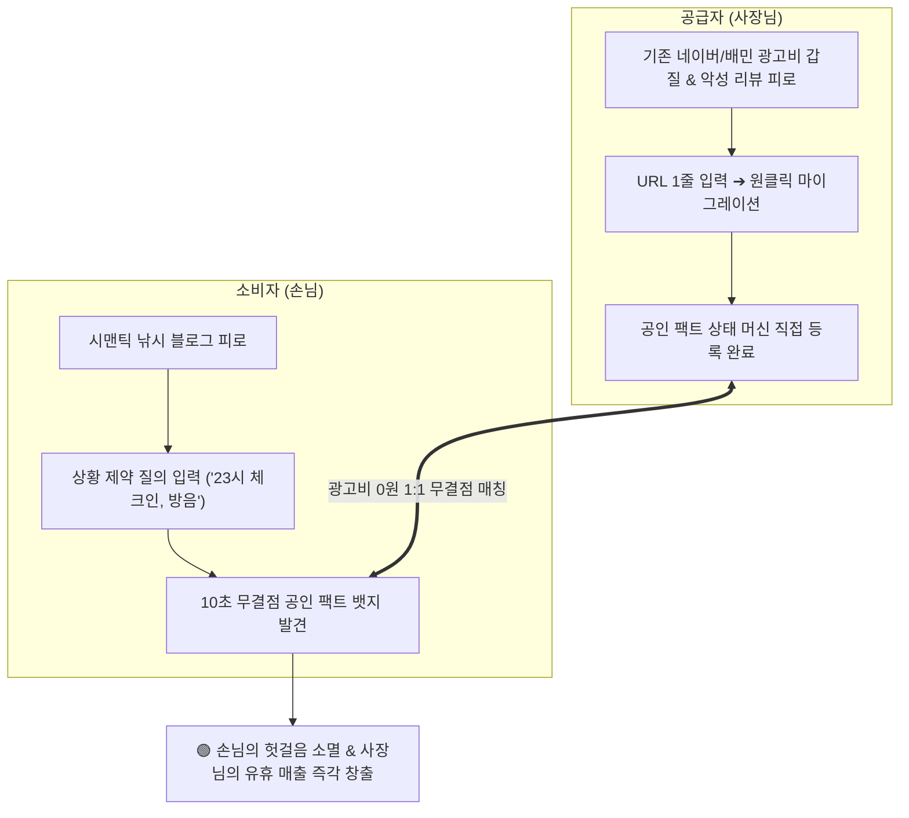

# 서브리스크 카드 01 — Demand Risk (양면 수요 절박성: 소비자의 팩트 갈망 & 공급자의 광고비 탈출과 유휴 매출 직결)

> **SVPG 정본 헌법 (Two-Sided Marketplace Value Risk)**:  
> **"양면 플랫폼(Two-Sided Platform)에서 가장 흔한 실패의 원인은 소비자가 없어서가 아니라, 공급자가 플랫폼에 머물러야 할 이유(Supplier Value)와 공급자의 절박한 고통을 해결하지 못했기 때문이다. 소비자는 단어 몇 개 겹친다고 엉뚱한 블로그를 들이미는 시맨틱 낚시에 지쳐 '진짜 확실한 출처'를 갈망하고, 공급자(의사, 변호사, 식당 사장님)는 네이버·배민의 매달 수백만 원 광고비 착취와 3년 전 악성 리뷰에 볼모로 잡혀 '내 진짜 상태를 정직하게 알리고 유휴 자산을 매출로 바꿀 창구'를 애타게 찾고 있다. 이 양면의 절박한 결핍이 만나는 순간 진정한 시장 수요가 폭발한다."**  
> *(출처: [`C-2017-12-04 The Four Big Risks`](file:///c:/AI_Projects/WebNovelAssistant/VibePatchNote/workbench/96.data_pipeline/svpg-product-discovery/C-2017-12-04_the_four_big_risks.md) E1, [`C-2008-05-12 Market Discovery vs Product Discovery`](file:///c:/AI_Projects/WebNovelAssistant/VibePatchNote/workbench/96.data_pipeline/svpg-product-discovery/C-2008-05-12_market_discovery_vs_product_discovery.md) E1, [`C-2020-09-04 Discovery – Problem vs. Solution`](file:///c:/AI_Projects/WebNovelAssistant/VibePatchNote/workbench/96.data_pipeline/svpg-product-discovery/C-2020-09-04_discovery_problem_vs_solution.md) E1)*

---

## 1. 서브 리스크 정의 및 양면 검증 전제 (Premise)

*(토론 카드 01-E 및 01-F와의 1:1 결속: [`토론 카드 01-E`](file:///c:/망고독%20관련%20자료/프로젝트_매니지먼트/What-s-in-my-head/3.📦(Resource)%20자료/R&D%20프로젝트%20매니징/SVPG_Discoverying_실전적용/debates/(gen)토론%20카드%2001-E%20—%20시맨틱%20서치(Vector%20RAG)의%20구조적%20결함과%20조건부%20제약%20검증%20한계.md), [`토론 카드 01-F`](file:///c:/망고독%20관련%20자료/프로젝트_매니지먼트/What-s-in-my-head/3.📦(Resource)%20자료/R&D%20프로젝트%20매니징/SVPG_Discoverying_실전적용/debates/(gen)토론%20카드%2001-F%20—%20에이전트%20시대의%20새로운%20데이터%20조건과%20기존%20독점%20데이터%20흡수%20메커니즘.md))*

* **서브 리스크 명칭**: Demand Risk (소비자의 팩트 갈망 및 공급자의 직접 등록·유휴 매출 전환 양면 수요 리스크)
* **책임 주체 (R&R)**: **Product Manager (PM)**
* **핵심 질문 (Dual-Axis Questions)**:  
  1. **[소비자 관점 (Demand-Side)]**:  
     > *"사용자는 기존 검색/AI가 던져주는 '단어만 겹치고 내 맥락과 무관한 엉뚱한 블로그 낚시'에 극심한 피로를 느끼고 있으며, 시스템이 내 복합 제약을 100% 충족하는 **'진짜 확실한 출처 팩트'**를 집어주는 것에 자신의 시간과 주의를 지불할 만큼 절박한가?"*
  2. **[공급자 관점 (Supply-Side)]**:  
     > *"의사, 변호사, 식당, 쇼핑몰 사장님은 매달 수백만 원씩 뜯기는 **'네이버·배민의 광고비 갑질'과 '오래된 악성 리뷰의 왜곡'에서 탈출**하여, **'내 진짜 최신 조건(야간 진료, 방음 룸, 당일 특가)을 우리 플랫폼에 직접 등록/마이그레이션하고 유휴 자산을 즉각 매출로 전환'**하려는 절박한 수요를 갖고 있는가?"*
* **핵심 검증 전제**:  
  소비자가 원하는 것은 '화려한 챗봇'이 아니라 **내 조건에 딱 맞는 진짜 매장/정보**이며, 사장님이 원하는 것은 '또 하나의 광고판'이 아니라 **광고비 없이 내 진짜 조건을 원하는 손님과 1:1로 꽂히는 매출**이다. 이 두 가지 절박한 수요가 맞물려, 사장님은 자신의 정보를 기꺼이 우리 서비스로 마이그레이션(직접 등록)하고 소비자는 의심 없이 그 팩트를 소비하는 상호 작용이 성립해야만 수요 리스크를 돌파할 수 있다.

---

## 2. 💥 극단적 실패 시나리오 (Dual Failure Scenarios)

### ❌ [소비자 실패 시나리오]: "또 하나의 엉뚱한 시맨틱 낚시극"
1. **상황**: 사용자가 "오늘 밤 23시 이후 늦은 체크인이 가능하고, 방음 잘되는 숙소"를 긴급히 검색함.
2. **실패 현상**: 엔진이 출처랍시고 5년 전 블로그 글을 띄웠으나, 실제로는 21시 체크인 마감이었음.
3. **결과**: 사용자는 분통을 터뜨림: *"이것도 결국 Perplexity나 구글이랑 똑같잖아! 단어만 대충 긁어와서 내 상황이랑 아무 상관없는 엉뚱한 블로그 던져놓고 출처라고 우기네."* ➔ 1회 사용 후 앱 즉시 삭제.

### ❌ [공급자 실패 시나리오]: "등록해 봐야 매출 안 나오는 또 하나의 유령 앱"
1. **상황**: 동네 치과 원장님과 식당 사장님이 네이버 광고비 부담에 지쳐, 우리 서비스에 본인 매장의 최신 조건("매주 화·목 21시 야간 진료, 임플란트 당일 식립", "8인 방음 룸 보유")을 직접 등록함.
2. **실패 현상**: 등록 후 2주일이 지나도 해당 조건을 찾는 손님의 예약이나 쿼리 매칭이 단 1건도 발생하지 않음.
3. **결과**: 사장님의 분노: *"네이버 플레이스에 링크 올리면 손님이라도 오지, 너희 서비스에 시간 들여 직접 등록해 봐야 손님 1명도 안 오잖아! 결국 너희도 나중에 광고비 내라는 거 아니야?"* ➔ 사장님들의 대규모 등록 이탈 및 데이터 공동화(Ghost Town).

---

## 3. 🏃 기존 생태계의 처절한 우회 행동 및 현실적 고역

### 1) 소비자의 처절한 고통
* **블로그 10개 탭 열고 분노의 스크롤**: "콘센트 많아요" 제목 보고 들어갔더니 음식 사진만 50장이고 정작 콘센트는 못 봤다는 무책임한 낚시 글.
* **수작업 크로스체크 전화 회귀**: AI와 인터넷 블로그를 믿지 못해 매장에 직접 전화를 걸어 "오늘 진짜 23시까지 하나요?"라고 몸으로 때움.

### 2) 공급자(사장님)의 피눈물 나는 고통
* **광고비 착취 (The Ad Tax)**: 네이버 파워링크 클릭당 수천 원, 배민 울트라콜 깃발 꽂기에 매달 200~500만 원씩 뜯기면서도 매출이 안 나와 적자 누적.
* **오래된 악성 리뷰의 볼모 (Review Hostage)**: 사장님이 시설을 전면 리모델링하고 서비스를 개선했음에도, 3년 전 악성 리뷰 하나가 상단에 노출되어 신규 손님 유입이 차단됨.
* **공식 공지의 묵살 (Ignored Announcements)**: 사장님이 네이버 플레이스 새소식에 "오늘 단체 예약 취소로 방음 룸 2개 비어 있습니다! 당일 할인!"이라고 정성껏 올려도, 플랫폼 알고리즘에 묻혀 아무 손님에게도 도달하지 않고 그대로 유휴 자산이 폐기됨.

---

## 4. 🏢 글로벌/국내 레퍼런스 기업 3종 심층 분석

| 기업/플랫폼 | 해결한 양면 수요(Two-Sided Demand) | 성공 메커니즘 | 우리 제품 적용점 |
| :--- | :--- | :--- | :--- |
| **Airbnb (에어비앤비)** | 호텔 체인의 천편일률적인 방에 지친 여행자 & 남는 빈방(유휴 자산)을 돈으로 바꾸고 싶은 호스트 | 호스트가 자신의 숙소 조건(와이파이 속도, 주방, 체크인 시간)을 **직접 등록**하게 만들고, 게스트의 세부 필터와 1:1 매칭 | 사장님이 직접 등록한 **'공인 팩트 상태 머신'**을 소비자의 '상황 제약'과 10초 만에 직결 |
| **쿠팡 로켓그로스 / 아마존 FBA** | 네이버 스마트스토어의 CS·배송 지옥에 지친 셀러 & 내일 당장 물건을 받고 싶은 구매자 | 셀러가 상품만 물류센터에 입고(등록)하면 노출과 배송을 자동 해결해 줌으로써 **공급자의 극심한 전환 수요 흡수** | 사장님이 기존 네이버 링크 1줄만 넣으면 AI가 규정을 자동 등록해 주는 **'초간편 마이그레이션'으로 공급자 유치** |
| **CatchTable (캐치테이블)** | 전화 예약 불통에 지친 손님 & 노쇼(No-show)와 빈 테이블(유휴 매출)에 피눈물 흘리던 파인다이닝 사장님 | 사장님이 빈 좌석 슬롯을 직접 등록하게 하고 예약 보증금을 묶어 **양면의 신뢰 결핍과 유휴 자산 동시 해결** | 사장님이 비어 있는 시간대/좌석/특수 혜택 조건을 직접 열어두고 실시간 결제/예약으로 꽂아주는 메커니즘 채택 |

---

## 5. ⚠️ 치명적 실패 반례 2종 (Counterexamples)

### ❌ 반례 1: 네이버 스마트플레이스의 광고 인질극과 신뢰 붕괴
* **실패 사건**: 초기에는 지역 소상공인을 돕겠다며 시작했으나, 점차 상단 영역을 유료 '플레이스 광고'와 '체험단 블로그'로 도배함.
* **치명적 결과**: 사장님들은 광고비를 내지 않으면 살아남을 수 없게 되었고, 손님들은 광고성 맛집에 속아 헛걸음하면서 네이버 플레이스 평점을 불신하게 됨.
* **교훈**: **광고비로 노출 순위를 왜곡하는 순간, 양면 모두의 신뢰가 무너진다. 오직 '조건 부합도와 공인 팩트'로만 매칭되어야 함.**

### ❌ 반례 2: 당근마켓 '동네가게' 초기 공급자 이탈 사태
* **실패 사건**: 당근마켓이 지역 소상공인을 모으겠다며 동네가게 탭을 만들었으나, 초기 사장님들에게 실질적인 손님 방문(매출)을 만들어주지 못함.
* **치명적 결과**: 사장님들이 "글 올려봐야 조회수만 나오고 손님은 안 온다"며 쿠폰 등록과 소식 발행을 중단하여 빈 껍데기 게시판으로 전락.
* **교훈**: **공급자는 '노출'이 아니라 '유휴 자산의 실제 매출 전환(Conversion)'이 증명되어야만 서비스에 머무른다.**

---

## 6. 📚 SVPG Discovery 정본 아카이브 인용 및 방법론 결속

1. **[`C-2017-12-04 The Four Big Risks`](file:///c:/AI_Projects/WebNovelAssistant/VibePatchNote/workbench/96.data_pipeline/svpg-product-discovery/C-2017-12-04_the_four_big_risks.md) - Section E1 (Value Risk)**:
   > *"양면 시장에서 가치 리스크는 두 배로 어렵다. 고객이 제품을 선택하는 이유와 공급자가 플랫폼에 재고(Inventory)를 올리는 이유는 완전히 다르다. 양쪽 모두에게 '기존 대안을 버릴 만큼 압도적인 이익'이 증명되지 않으면 마켓플레이스는 절대 시동이 걸리지 않는다."*
2. **[`C-2008-05-12 Market Discovery vs Product Discovery`](file:///c:/AI_Projects/WebNovelAssistant/VibePatchNote/workbench/96.data_pipeline/svpg-product-discovery/C-2008-05-12_market_discovery_vs_product_discovery.md) - Section E1**:
   > *"시장의 기회를 발견하는 것은 고통의 크기를 재는 것이다. 공급자가 불공정한 유통 독점자에게 매달 뜯기고 있는 비용이 크면 클수록, 그들을 해방시키는 새로운 데이터 포맷의 파괴력은 막강해진다."*

---

## 7. ⚖️ 기계적 🟢 Pass / 🔴 Fail 수치 판정선 (Two-Sided Thresholds)

본 카드는 소비자의 신뢰뿐만 아니라, **공급자의 실제 직접 등록(마이그레이션) 및 유휴 매출 전환율**을 기계적으로 동시 측정한다.

| 평가 영역 | 평가 지표 | 측정 단위 | 🟢 Pass (검증 성공) | 🔴 Fail (즉각 중단/피벗) |
| :--- | :--- | :--- | :--- | :--- |
| **소비자 측** | **출처 제약 일치 정밀도** | % (Fact Match) | **>= 95.0% (제시된 출처가 사용자의 상황 조건 A,B,C를 100% 충족)** | < 80.0% (단어만 같고 조건 다른 무관 출처 섞임) |
| **소비자 측** | **대안 검색창 재검색율** | % (Re-Search) | **< 15.0% (엔진의 공인 팩트를 보고 네이버/구글을 다시 켜지 않음)** | >= 40.0% (출처를 믿지 못해 여전히 포털 뒤짐) |
| **공급자 측** | **원클릭 마이그레이션 전환율** | % (URL ➔ Claim) | **>= 60.0% (네이버/홈피 링크 입력 후 팩트 카드를 보고 최종 승인 완료)** | < 25.0% ("이걸 왜 등록해야 하냐"며 중도 이탈) |
| **공급자 측** | **7일 내 첫 유휴 매출 매칭률** | % (First Match) | **>= 30.0% (직접 등록 후 7일 이내에 해당 조건을 찾는 손님과 1회 이상 매칭)** | < 5.0% (등록해 둬도 손님이 안 와서 유령 등록됨) |

