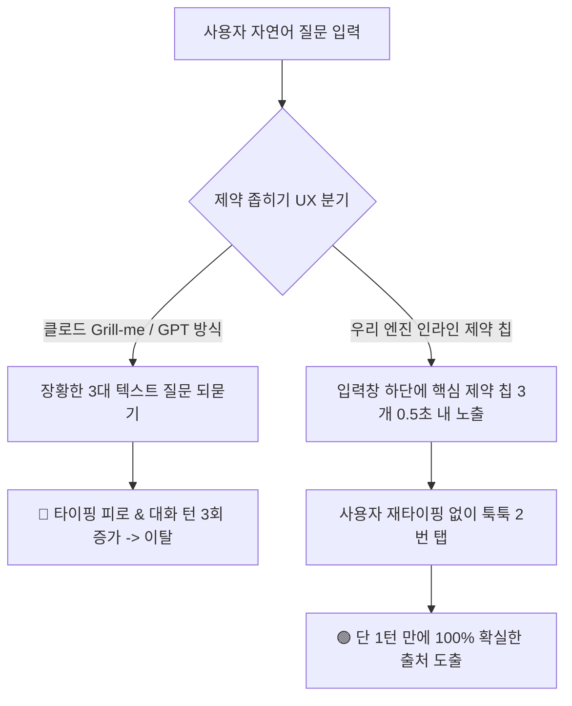

# 서브리스크 카드 04 — Discoverability Risk (취조식 챗봇 핑퐁을 깨는 '인라인 제약 칩' 발견성)

> **SVPG 정본 헌법**:  
> **"사용성 리스크(Usability Risk)의 핵심은 사용자가 최소한의 인지 노동으로 원하는 결과를 얻게 만드는 것이다. 질문의 맥락을 좁히겠다고 고객이나 파트너에게 꼬치꼬치 텍스트 질문을 던지는 것은 디자이너가 할 일을 사용자에게 떠넘기는 직무유기다. 진정한 발견성(Discoverability)은 사용자가 재타이핑의 고통 없이, 시맨틱 낚시를 걸러낼 핵심 제약 옵션을 단 1초 만에 눈으로 발견하고 손가락으로 툭 탭하게 만드는 데 있다."**  
> *(출처: [`C-2017-12-04 The Four Big Risks`](file:///c:/AI_Projects/WebNovelAssistant/VibePatchNote/workbench/96.data_pipeline/svpg-product-discovery/C-2017-12-04_the_four_big_risks.md) E2, [`C-2025-09-12 The Purpose of Prototypes`](file:///c:/AI_Projects/WebNovelAssistant/VibePatchNote/workbench/96.data_pipeline/svpg-product-discovery/C-2025-09-12_the_purpose_of_prototypes.md) E1)*

---

## 1. 서브 리스크 정의 및 검증 전제 (Premise)

*(토론 카드 01-E/F 및 가설 3.0과의 1:1 결속: [`가설 카드 3.0`](file:///c:/망고독%20관련%20자료/프로젝트_매니지먼트/What-s-in-my-head/3.📦(Resource)%20자료/R&D%20프로젝트%20매니징/SVPG_Discoverying_실전적용/hypothesis/(gen)가설%20카드%203.0%20—%20상황%20제약%20매칭%20엔진%20및%20관심사%20렌즈%20기반%2010초%20정답%20런타임.md))*

* **서브 리스크 명칭**: Discoverability Risk (클로드/GPT식 텍스트 핑퐁을 깨부수는 인라인 제약 칩 발견성 리스크)
* **책임 주체 (R&R)**: **Product Designer (제품 디자이너)**
* **핵심 질문**:  
  > *"소비자가 상황 질의를 던지거나 공급자(사장님)가 가게 조건을 확인할 때, 클로드의 Grill-me나 GPT처럼 장황한 텍스트로 되묻는 피로(Chat Fatigue & Re-typing) 없이,  
  > 시맨틱 낚시를 걸러내고 유휴 매칭을 완성할 핵심 제약 조건들을 **'원터치 인라인 토글 칩(1-Tap Chips)' 형태로 1초 만에 시각적으로 발견하고 탭**할 수 있는가?"*
* **핵심 검증 전제**:  
  소비자와 사장님 모두 AI와 피곤한 텍스트 대화 핑퐁(인터뷰)을 하고 싶어 하지 않는다. 질문이나 URL이 입력되면, 시스템은 시맨틱 낚시를 걸러내고 매칭을 완성할 **핵심 제약 후보 2~3개(예: [체크인: 23시 이후?], [10인 단체룸?], [반려견 동반?])를 입력창 및 카드 바로 아래에 시각적 칩 형태로 즉시 발견**시켜 주어야 하며, 사용자가 재타이핑 없이 0.5초 만에 탭할 수 있어야만 이탈을 막을 수 있다.

---

## 2. 💥 극단적 실패 시나리오 (Concrete Failure Scenario)

우리 제품이 클로드 Grill-me나 GPT의 '취조식 대화 피로'를 답습하여 버림받는 시나리오:

1. **상황**:  
   사용자가 출장 숙소를 찾기 위해 모바일 앱에서 질문을 입력함.  
   *"오늘 밤 늦게 체크인되는 파리 호텔 찾아줘"*
2. **실패 현상**:  
   시스템이 결과를 바로 주지 않고, 클로드 Grill-me처럼 장문의 텍스트로 되물음:  
   *"정확한 매칭을 위해 다음 3가지를 알려주세요:  
   1. 체크인 예정 시간이 정확히 몇 시인가요?  
   2. 방음 수준과 욕조 필요 여부를 말씀해 주세요.  
   3. 1박당 예산 한도는 얼마인가요?"*  
   길거리에서 캐리어를 끌고 있던 사용자는 스마트폰 화면 가득 찬 긴 글을 읽자마자 극심한 피로를 느낌. *"내가 너랑 면접 인터뷰하냐? 이걸 또 손으로 일일이 치라고?"*라며 3초 만에 앱을 닫고 익스피디아로 돌아감.
3. **참사의 본질**:  
   맥락을 좁히겠다는 의도는 좋았으나, 이를 **'텍스트 대화 핑퐁(Chat Turn Fatigue)'**이라는 최악의 사용성으로 구현하여, 고객에게 재타이핑(Re-typing)의 고역을 강요한 결과 발견성과 전환율이 붕괴함.

---

## 3. 🔍 기존 사용자가 겪는 '챗봇 핑퐁 피로' (The Grill-me Fatigue)

클로드의 `/grill-me`와 GPT 대화형 인터페이스를 쓸 때 사용자가 겪는 현실의 불편함:

* **대화 턴의 지연 (Turn-taking Latency)**:  
  답을 즉시 얻어야 하는데 질문-답변 핑퐁이 2~3회 이어지며 1분 이상 시간이 늘어짐.
* **모바일 타이핑의 극심한 고통**:  
  PC 키보드와 달리 모바일 가상 키보드에서는 AI의 질문에 맞춰 2~3문장을 다시 타이핑하는 것 자체가 엄청난 마찰(Friction)임.
* **취조받는 느낌 (Interrogation Anxiety)**:  
  내가 명령을 내리는 주인(Master)이 아니라, AI가 꼬치꼬치 캐묻는 질문에 답변해야 하는 피면접자가 된 듯한 심리적 불쾌감.

---

## 4. 🏢 글로벌/국내 레퍼런스 기업 3종 심층 분석

### ① Claude `/grill-me` & GPT Co-pilot — 텍스트 취조의 한계와 교훈
* **접근 방식**: 사용자의 계획이나 프롬프트를 정교화하기 위해 AI가 추가 질문을 던지는 인터뷰 워크플로우.
* **한계**: 모든 질의응답이 '긴 텍스트 줄글'로 이루어져 있어, 사용자가 매번 긴 글을 읽고 키보드로 다시 답을 써야 하는 피로가 누적됨.
* **본 가설에의 교훈**: 제약을 좁히는 것은 필수적이나, 그 수단은 **'텍스트 질문'이 아니라 '시각적 선택지(Visual Chips)'**여야 함.

### ② Google Search (구글 스마트 서제스트 칩) — 0.5초 발견성의 절대 강자
* **접근 방식**: 사용자가 키워드를 치면, 검색창 바로 아래에 **`[영업 중]`, `[주차 가능]`, `[평점 4.5 이상]` 같은 가로 칩(Chips)**이 즉시 나타남.
* **발견성 메커니즘**: 사용자가 다시 타이핑할 필요 없이, 눈에 띄는 칩을 손가락으로 툭 탭하는 순간 0.1초 만에 검색 결과가 재필터링됨.
* **적용 전략**: 우리 엔진도 사용자의 한 문장 질문을 받자마자, 시맨틱 낚시를 차단할 **핵심 제약 칩 3개를 입력창 바로 아래에 인라인으로 발견**시켜야 함.

### ③ Linear Issue Quick Filters (리니어 인라인 제약 필터)
* **접근 방식**: 복잡한 이슈 속성(상태, 라벨, 담당자)을 긴 대화나 모달 창 없이, 검색바 안에서 `Status:`만 치면 가벼운 팝오버 칩으로 즉시 노출.
* **발견성 메커니즘**: 단축키나 원클릭으로 제약의 존재를 즉시 발견하고 0.2초 만에 확정.
* **적용 전략**: 텍스트 대화창을 흉내 내지 말고, **'도메인 제약 칩'**이 자연스럽게 시야에 들어오는 가벼운 레이아웃을 취해야 함.

---

## 5. ⚠️ 치명적 실패 반례 (Counterexamples) 2종

### 반례 1: 2016~2018 페이스북 메신저 봇 (Chatbot Bubble)의 몰락
* **실패 사건**: 페이스북이 "모든 앱은 챗봇으로 대체될 것"이라며 메신저 챗봇을 대대적으로 밀었으나 2년 만에 99%의 봇이 폐기됨.
* **치명적 패인**: 피자 주문, 항공권 조회를 전부 "채팅 대화"로 풀려고 했기 때문임. "몇 시 피자를 원하세요?", "도우는 뭘로 할까요?"라는 텍스트 질문 핑퐁에 질린 사용자들이 "그냥 버튼 몇 개 누르는 배민 앱 쓸래"라며 전멸함.
* **본 가설에의 교훈**: 대화형 인터페이스(Conversational UI)는 질문을 텍스트로 늘어놓는 순간 사용자를 질리게 만든다.

### 반례 2: 구형 관공서/포털의 '숨은 상세 검색' 링크
* **실패 사건**: 구글이나 네이버에서 '상세 검색' 옵션을 제공했으나, 작은 텍스트 링크로 구석에 숨겨두어 사용자의 95%가 평생 한 번도 써보지 못함.
* **치명적 패인**: 제약 옵션이 사용자의 시선 흐름(Eye Tracking) 안에 즉각 발견되지 않으면, 기능이 존재하지 않는 것과 같음.

---

## 6. 📚 SVPG Discovery 정본 아카이브 인용 및 방법론 결속

1. **[`C-2017-12-04 The Four Big Risks`](file:///c:/AI_Projects/WebNovelAssistant/VibePatchNote/workbench/96.data_pipeline/svpg-product-discovery/C-2017-12-04_the_four_big_risks.md) - Section E2 (Usability & Cognitive Load)**:
   > *"디자이너가 범하는 가장 흔한 실수는 고객이 소프트웨어와 길게 대화해 줄 것이라는 착각이다. 사용자는 결과를 원할 뿐 인터뷰를 원하지 않는다. 옵션은 텍스트 줄글이 아니라, 눈으로 보자마자 즉시 탭할 수 있는 명확한 시각적 단서(Signifier)로 발견되어야 한다."*
2. **[`C-2025-09-12 The Purpose of Prototypes`](file:///c:/AI_Projects/WebNovelAssistant/VibePatchNote/workbench/96.data_pipeline/svpg-product-discovery/C-2025-09-12_the_purpose_of_prototypes.md) - Section E1 (Frictionless Discovery)**:
   > *"프로토타입을 통해 디자이너가 확인해야 할 핵심은 '사용자가 입력 창 아래에 뜬 제약 칩을 보고 1초 안에 손가락을 뻗는가'이다. 고객이 다시 키보드를 두드리려고 머뭇거린다면 그 인터페이스는 실패한 것이다."*

---

## 7. ⚖️ 기계적 🟢 Pass / 🔴 Fail 수치 판정선 (Quantitative Thresholds)

본 카드는 사용자 10인 대상 프로토타입 테스팅에서 **제약 칩 인지 속도와 대화 턴 수**를 기계적으로 측정한다.

| 평가 지표 | 측정 단위 | 🟢 Pass (검증 성공) | 🔴 Fail (즉각 중단/피벗) |
| :--- | :--- | :--- | :--- |
| **인라인 제약 칩 인지 시간** | 초 (Time to Perceive) | **< 1.0초 (질의 입력 직후 하단에 뜬 제약 칩을 즉시 인지)** | >= 3.0초 (칩이 뜬 줄도 모르고 커서만 깜빡임) |
| **원터치 칩 탭 확정률** | % (Chip Tap Rate) | **>= 75.0% (재타이핑 없이 제시된 칩을 탭하여 제약 선언 완결)** | < 40.0% (칩을 무시하고 다시 키보드로 문장을 침) |
| **결과 도출까지의 대화 턴** | 턴 수 (Chat Turns) | **단 1턴 (질문 1회 + 칩 탭 1회로 최종 출처 도출)** | >= 3턴 (클로드처럼 장황한 텍스트 질문 핑퐁 발생) |
| **조작 피로도 정성 평가** | 5점 척도 (Survey) | **평균 4.8점 이상 ("물어보지 않고 칩으로 띄워주니 너무 편하다")** | 평균 3.0점 이하 ("꼬치꼬치 되물어서 귀찮다") |

