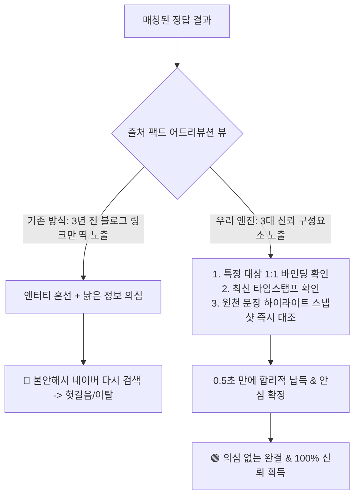

# 서브리스크 카드 05 — Comprehension Risk (짜깁기·시의성 오염을 깨는 '엔터티 1:1 증거 스냅샷' 납득성)

> **SVPG 정본 헌법**:  
> **"사용성 리스크의 핵심은 결과에 대한 '합리적 납득(Comprehension)'이다. 사용자가 결과를 보았을 때 그것이 여러 문서의 조잡한 짜깁기인지, 다른 대상의 설명이 잘못 섞인 오염인지, 아니면 3년 전 낡은 블로그의 폐기된 정보인지 의심하는 순간 시스템의 권위는 추락한다. 오직 '특정 바로 그 대상'의 '최신 유효 시점'이 보증된 '원천 문장 증거'를 투명하게 제시할 때만 고객은 안심하고 행동을 확정한다."**  
> *(출처: [`C-2017-12-04 The Four Big Risks`](file:///c:/AI_Projects/WebNovelAssistant/VibePatchNote/workbench/96.data_pipeline/svpg-product-discovery/C-2017-12-04_the_four_big_risks.md) E2, [`C-2020-09-01 Discovery – Learning vs. Insights`](file:///c:/AI_Projects/WebNovelAssistant/VibePatchNote/workbench/96.data_pipeline/svpg-product-discovery/C-2020-09-01_discovery_learning_vs_insights.md) E2)*

---

## 1. 서브 리스크 정의 및 검증 전제 (Premise)

*(토론 카드 01-E/F 및 가설 2.0/3.0과의 1:1 결속: [`가설 카드 2.0`](file:///c:/망고독%20관련%20자료/프로젝트_매니지먼트/What-s-in-my-head/3.📦(Resource)%20자료/R&D%20프로젝트%20매니징/SVPG_Discoverying_실전적용/hypothesis/(gen)가설%20카드%202.0%20—%20클레임%20단위%20증거%20스냅샷%20및%20제로%20서치%20어트리뷰션%20뷰.md), [`가설 카드 3.0`](file:///c:/망고독%20관련%20자료/프로젝트_매니지먼트/What-s-in-my-head/3.📦(Resource)%20자료/R&D%20프로젝트%20매니징/SVPG_Discoverying_실전적용/hypothesis/(gen)가설%20카드%203.0%20—%20상황%20제약%20매칭%20엔진%20및%20관심사%20렌즈%20기반%2010초%20정답%20런타임.md))*

* **서브 리스크 명칭**: Comprehension Risk (짜깁기·엔터티 오염·시간 왜곡을 배제한 팩트 증거 납득성 리스크)
* **책임 주체 (R&R)**: **Product Designer (제품 디자이너)**
* **핵심 질문**:  
  > *"사용자는 AI나 엔진이 제시한 결과가 **'여러 출처의 조잡한 짜깁기'나 '다른 매장/문서의 설명이 잘못 섞인 엔터티 오염', 혹은 '3년 전 낡은 블로그의 시의성 왜곡'**이 아님을 의심 없이 확인하고,  
  > 오직 **'특정 바로 그 대상(Target Entity)'의 '최신 유효 시점(Freshness Timestamp)'이 보증된 '원천 증거 문장 스냅샷(Evidence Snapshot)'**을 통해 1초 만에 100% 합리적으로 납득할 수 있는가?"*
* **핵심 검증 전제**:  
  사용자가 AI 추천을 불신하는 진짜 이유는 그동안 '짜깁기 환각'과 '오염된 출처(BEST 5 블로그에서 다른 가게 설명 긁어오기, 3년 전 글 인용)'에 수없이 데어왔기 때문이다. 시스템이 결과 카드에 **[타깃 엔터티 1:1 엄격 귀속] + [정보 유효 기준일(Timestamp)] + [원천 문장 하이라이트 스냅샷]**을 한눈에 합리적으로 구성해 제시할 때 비로소 사용자는 의심 검색을 멈추고 결과를 전적으로 신뢰할 것이다.

---

## 2. 💥 극단적 실패 시나리오 (Concrete Failure Scenario)

우리 제품이 '시의성 오염과 엔터티 뒤섞임'으로 사용자를 사지에 몰아넣는 시나리오:

1. **상황**:  
   사용자가 "오늘 밤 23시 체크인 가능한 방음 호텔" 또는 "조용하고 콘센트 있는 성수동 카페"를 검색함.
2. **실패 현상**:  
   엔진이 어떤 블로그 글을 출처랍시고 띄웠는데:
   * **엔터티 혼선**: "성수동 카페 BEST 5"라는 블로그 글에서, 실제로는 3번 카페에 적혀 있던 '콘센트 완비' 설명을 1번 카페의 스펙으로 잘못 결속하여 추천함.
   * **시의성 왜곡**: 해당 블로그 글은 **2021년도 글(3년 전 글)**이었음. 호텔은 작년에 주인이 바뀌며 야간 체크인을 폐지했고 20시 문을 닫는 상태였음.
   * **참사 결과**: 사용자는 AI의 출처를 믿고 밤 23시에 캐리어를 끌고 갔다가 굳게 닫힌 철문 앞에서 노숙할 위기에 처함.
3. **참사의 본질**:  
   단순히 글자 유사도가 높다는 이유로 **"이 글이 진짜 그 특정 대상에 대한 글인지(엔터티 무결성)"**와 **"언제 작성된 유효한 팩트인지(시의성)"**를 검증하지 않고 날것으로 가져와 출처라고 우긴 결과, 사용자의 안전과 신뢰를 완전히 파괴함.

---

## 3. 🔍 기존 사용자가 겪는 '거짓 출처'의 3대 고역

인터넷과 AI 검색에서 사용자들이 매일 분통을 터뜨리는 현실의 왜곡들:

* **'BEST 10' 종합 블로그의 엔터티 뒤섞임 낚시**:  
  하나의 포스팅에 10개 장소/제품이 나열되어 있을 때, AI가 앞뒤 문맥을 오인하여 A 상품의 장점을 B 상품의 스펙으로 둔갑시키는 현상.
* **3~5년 전 묵은 정보의 유령 추천 (Time Decay)**:  
  검색 상단에 뜨는 글이 2019년, 2021년 글이라서, 이미 가격이 올랐거나 정책이 바뀌었거나 폐업한 정보를 현재의 팩트인 양 믿게 만드는 함정.
* **출처를 3개 붙여놓았으나 내용이 상충하는 누더기 짜깁기**:  
  A 출처는 "가능하다"고 하고 B 출처는 "불가하다"고 하는데, AI가 이를 그럴싸하게 합쳐서 "조건부로 가능할 수도 있습니다"라며 애매모호한 면피성 문장을 뱉는 고역.

---

## 4. 🏢 글로벌/국내 레퍼런스 기업 3종 심층 분석

### ① Wikipedia Citation & WayBack Machine (위키백과 각주와 타임머신)
* **접근 방식**: 단순 링크만 달지 않고, **인용 날짜(Retrieved Date)와 출판 연월일**을 반드시 병기하며, 원본 페이지가 바뀔 것에 대비해 특정 시점의 아카이브 스냅샷을 영구 보존.
* **신뢰 메커니즘**: "이 정보는 몇 년 몇 월 며칠 시점에 검증된 팩트인가"를 명시함으로써 시의성 왜곡을 원천 차단.
* **적용 전략**: 우리 시스템도 출처 뒤에 **`[2024년 8월 사장님 공인 확인]`**, **`[3일 전 갱신된 공식 스펙]`**과 같은 타임스탬프를 필수 노출해야 함.

### ② Git Blame (깃 블레임) — 1:1 코드 작성자와 시점의 완전 투명성
* **접근 방식**: 코드 한 줄 한 줄마다 **[작성자 커밋 ID - 작성 일시 - 변경 사유]**를 1:1로 정확하게 매핑.
* **신뢰 메커니즘**: 다른 파일의 코드가 섞이지 않고 오직 이 줄의 원천이 무엇인지 100% 명확히 추적(Traceability).
* **적용 전략**: 여러 블로그의 문장을 섞지 않고, **"특정 그 카페의 팩트 문장 1줄"**만을 정확하게 발라내어 스냅샷으로 바인딩해야 함.

### ③ Google Maps Fact Verification (구글 지도 팩트 업데이트 뱃지)
* **접근 방식**: "영업시간: 23시까지" 옆에 **`"소유주가 2주 전 업데이트함"`** 또는 **`"방문자 5명이 최근 1주일 내 확인"`**이라는 시의성 라벨을 부착.
* **신뢰 메커니즘**: 3년 전 블로그 글과 최근 팩트를 사용자 눈으로 즉시 구별하게 만듦.
* **적용 전략**: 팩트 어트리뷰션 뱃지에 **출처의 주체(공식/리뷰)와 유효 시점**을 한눈에 식별할 수 있는 메타데이터 UI를 결속해야 함.

---

## 5. ⚠️ 치명적 실패 반례 (Counterexamples) 2종

### 반례 1: Google AI Overview의 '피자에 접착제 바르기' 참사 (2024)
* **실패 사건**: 구글 AI 오버뷰가 "피자 치즈가 떨어지지 않게 하려면 무독성 접착제를 1/8컵 바르라"고 답변하여 전 세계적 조롱을 당함.
* **치명적 패인**: 11년 전 레딧(Reddit) 유머 게시판에 올라온 풍자 장난 글을 시의성과 맥락 검증 없이 최신 요리 팩트로 오인하여 인용했기 때문임.

### 반례 2: ChatGPT 3.5 시절의 '가짜 논문 저자 결속' 참사
* **실패 사건**: 사용자가 학술 질문을 했을 때, 실제 존재하는 저명 교수의 이름과 전혀 다른 분야의 유명 논문 제목을 마구잡이로 짜깁기하여 세상에 없는 가짜 논문 출처를 생성함.
* **치명적 패인**: 엔터티 간의 관계(누가 진짜 그 논문의 저자인가)를 1:1로 엄격히 바인딩하지 않고 확률적 토큰 생성에 맡긴 결과 학술계의 신뢰를 완전히 상실함.

---

## 6. 📚 SVPG Discovery 정본 아카이브 인용 및 방법론 결속

1. **[`C-2017-12-04 The Four Big Risks`](file:///c:/AI_Projects/WebNovelAssistant/VibePatchNote/workbench/96.data_pipeline/svpg-product-discovery/C-2017-12-04_the_four_big_risks.md) - Section E2 (Usability & Trust Comprehension)**:
   > *"사용자가 인터페이스를 신뢰하고 납득하게 만드는 것은 그래픽의 화려함이 아니라 데이터의 정직성이다. 출처가 왜곡되거나 오래된 찌꺼기 정보가 섞여 들어오는 순간, 사용자는 제품 전체를 의심한다. 디자이너는 데이터의 출처와 시점을 사용자가 직관적으로 검증할 수 있는 신뢰 아키텍처를 세워야 한다."*
2. **[`C-2020-09-01 Discovery – Learning vs. Insights`](file:///c:/AI_Projects/WebNovelAssistant/VibePatchNote/workbench/96.data_pipeline/svpg-product-discovery/C-2020-09-01_discovery_learning_vs_insights.md) - Section E2 (Fact Provenance)**:
   > *"고객은 텍스트의 요약본을 믿지 않는다. 고객이 믿는 것은 원천 사실(Fact)의 출처와 그것이 여전히 유효한가에 대한 명확한 증거다. 디스커버리는 허위 정보의 가능성을 0으로 만드는 출처 증명 프로토콜을 사용자 경험의 중심에 놓아야 한다."*

---

## 7. ⚖️ 기계적 🟢 Pass / 🔴 Fail 수치 판정선 (Quantitative Thresholds)

본 카드는 제시된 출처 팩트의 **엔터티 일치율, 시의성 유효율, 증거 스냅샷 납득도**를 기계적으로 측정한다.

| 평가 지표 | 측정 단위 | 🟢 Pass (검증 성공) | 🔴 Fail (즉각 중단/피벗) |
| :--- | :--- | :--- | :--- |
| **타깃 엔터티 1:1 귀속 정확도** | % (Entity Binding) | **100.0% (다른 매장/상품 설명이 섞인 엔터티 혼선 0건)** | < 98.0% (종합 포스팅에서 엉뚱한 매장 설명을 인용한 사례 발생) |
| **정보 시의성 유효율** | % (Freshness Ratio) | **100.0% (최근 6개월 이내 갱신 팩트 또는 공식 공약만 인용)** | < 80.0% (1년 이상 지난 낡은 블로그 글을 검증 없이 인용) |
| **짜깁기 없는 원천 스냅샷 일치율** | % (Verbatim Precision) | **>= 95.0% (형광펜 하이라이트 문장이 실제 원본 웹페이지와 일치)** | < 80.0% (AI가 문장을 왜곡 요약하여 원본과 불일치 발생) |
| **신뢰 납득도 정성 설문** | 5점 척도 (Survey) | **평균 4.8점 이상 ("특정 그 대상의 최신 팩트라는 확신이 든다")** | 평균 3.0점 이하 ("오래된 글이거나 다른 곳 얘기 같아 불안하다") |

