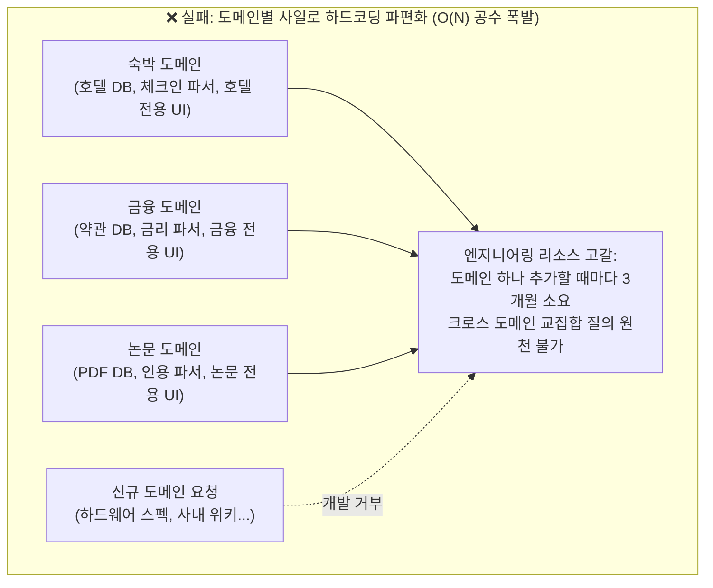
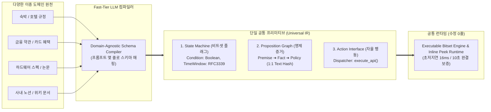

# 서브리스크 카드 08 — Architectural Integration Risk (이종 도메인의 공통 IR 정규화 및 무경계 결합성)

> **SVPG 정본 헌법 (Architectural Extensibility & Feasibility)**:  
> **"단 하나의 도메인(예: 맛집, 호텔)에서만 돌아가는 솔루션은 진정한 플랫폼이 아니라 일회용 기능(Feature)에 불과하다. 새로운 도메인이나 파트너가 추가될 때마다 백엔드 스키마를 뜯어고치고 파서를 새로 짜야 한다면, 그 제품은 '버티컬 사일로의 저주'에 갇혀 질식사한다. 진정한 기술적 실현가능성(Feasibility)은 이종 도메인의 비정형 데이터를 단일한 공통 프리미티브(Intermediate Representation)로 추상화하여, 엔지니어링 추가 공수를 O(N)에서 O(1)로 압축하는 아키텍처적 우아함에서 증명된다."**  
> *(출처: [`C-2017-12-04 The Four Big Risks`](file:///c:/AI_Projects/WebNovelAssistant/VibePatchNote/workbench/96.data_pipeline/svpg-product-discovery/C-2017-12-04_the_four_big_risks.md) E3, [`C-2008-05-12 Market Discovery vs Product Discovery`](file:///c:/AI_Projects/WebNovelAssistant/VibePatchNote/workbench/96.data_pipeline/svpg-product-discovery/C-2008-05-12_market_discovery_vs_product_discovery.md) E1, [`C-2026-04-16 Build to Learn vs Build to Earn`](file:///c:/AI_Projects/WebNovelAssistant/VibePatchNote/workbench/96.data_pipeline/svpg-product-discovery/C-2026-04-16_build_to_learn_vs_build_to_earn.md) E2)*

---

## 1. 서브 리스크 정의 및 검증 전제 (Premise)

*(토론 카드 01-E/F 및 가설 3.0과의 1:1 결속: [`가설 카드 3.0`](file:///c:/망고독%20관련%20자료/프로젝트_매니지먼트/What-s-in-my-head/3.📦(Resource)%20자료/R&D%20프로젝트%20매니징/SVPG_Discoverying_실전적용/hypothesis/(gen)가설%20카드%203.0%20—%20상황%20제약%20매칭%20엔진%20및%20관심사%20렌즈%20기반%2010초%20정답%20런타임.md))*

* **서브 리스크 명칭**: Architectural Integration Risk (이종 도메인 결합성 및 범용 데이터 IR 정규화 리스크)
* **책임 주체 (R&R)**: **Product Lead Engineer (제품 리드 엔지니어)**
* **핵심 질문**:  
  > *"장소/공간, 숙박, 금융/약관, 학술/논문, IT 하드웨어 스펙 등 완전히 이질적인 도메인의 비정형 데이터들을 도메인별 하드코딩 없이,  
  > **단일한 '불리언 상태 머신 & 명제 그래프(State Machine & Proposition Graph)' 공통 IR로 정규화하여 4시간 이내에 결합**할 수 있는가?"*
* **핵심 검증 전제**:  
  우리가 지향하는 자가 증식형 팩트 포털(Idea 카드 01)은 특정 도메인 전용 앱이 아니라, 사용자가 검색하고 검증하는 모든 지식 팩트가 조립되는 범용 엔진이다. 만약 숙박 데이터를 넣을 때와 금융 약관 데이터를 넣을 때 파서와 데이터베이스 스키마, 프론트엔드 컴포넌트를 매번 별도로 구현해야 한다면 엔지니어링 조직은 유지보수 부채로 붕괴한다.  
  따라서 모든 비정형 데이터를 **LLVM 컴파일러의 중간 표현식(IR)**처럼 `[엔터티 상태 머신]`, `[1:1 명제 그래프]`, `[행동 디스패처]`라는 3대 공통 프리미티브로 단일화하여, 신규 도메인이 추가되더라도 핵심 매칭 엔진 코드는 단 1줄도 수정하지 않는 아키텍처적 결합성을 보증해야 한다.

---

## 2. 💥 극단적 실패 시나리오: '버티컬 사일로의 저주' (The Silo Trap)

엔지니어링 팀이 공통 IR 없이 도메인별 맞춤형 하드코딩으로 시스템을 확장하다가 공멸하는 시나리오:

* **실패의 근본 원인**:  
  1. **N×M 결합의 복잡도**: 도메인 N개와 기능/UI M개가 생길 때마다 전용 어댑터를 만들어 복잡도가 폭발함.
  2. **크로스 도메인(Cross-Domain) 질의의 사망**: 사용자가 *"밤 11시 체크인 가능한 호텔(숙박) 근처에서, 내 신용카드 혜택이 적용되는(금융), 24시간 작업 가능한 카페(장소)"*처럼 현실에서 흔히 마주치는 복합 도메인 질의를 던졌을 때, 사일로화된 시스템은 도메인 간 교집합 연산 자체가 불가능하여 즉시 뻗어버림.

---

## 3. 🏗️ 해결 아키텍처: LLVM IR 방식의 '공통 데이터 프리미티브'

우리는 복잡한 이종 도메인을 개별적으로 다루지 않고, 토론 카드 01-F에서 정립한 **3대 공통 데이터 프리미티브(Intermediate Representation)**로 모든 비정형 데이터를 정규화합니다.

* **엔지니어링적 핵심**: 신규 도메인이 추가될 때 백엔드 엔진 코드를 고치는 것이 아니라, **오직 해당 도메인의 팩트 추출 프롬프트 1장(JSON Schema 정의)**만 추가하면 즉시 런타임에 편입됨.

---

## 4. 🏢 레퍼런스 기업 3선 (Reference Cases)

| 기업/기술 | 해결한 아키텍처적 결합성 문제 | 핵심 메커니즘 | 우리 제품 적용점 |
| :--- | :--- | :--- | :--- |
| **LLVM Compiler Infrastructure** | N개 프로그래밍 언어와 M개 하드웨어 CPU 아키텍처를 지원할 때 발생하는 N×M 조합 폭발 해결 | 모든 소스코드를 기계어로 바로 번역하지 않고, **중간 표현식(LLVM IR)**이라는 단일 바이트코드로 통일하여 복잡도를 N+M으로 압축 | 숙박, 금융, IT 스펙 등 어떤 도메인이든 **[상태 머신 + 명제 그래프]**라는 공통 IR로 변환하여 단일 비트셋 엔진에서 일괄 처리 |
| **Stripe API** | 전 세계 190개국의 파편화된 은행 규제, 결제망, 통화, 분쟁 정책의 이종성 통합 | 각 국가별 결제망을 직접 노출하지 않고, **`PaymentIntent`라는 단일 상태 머신(Requires_Payment ➔ Processing ➔ Succeeded)**으로 완벽히 추상화 | 서로 다른 도메인의 자산과 제약을 `(Entity, Condition, Value, SourceRef)`라는 단일 상태 머신 규격으로 완전 정규화 |
| **OpenTelemetry (OTel)** | 수천 개의 마이크로서비스에서 발생하는 이종 언어(Java, Go, Python, Rust)의 로그·메트릭·트레이스 파편화 해결 | 언어와 인프라에 독립적인 **표준 OTel Protocol(OTLP) 데이터 모델**을 정의하여 모든 관측 데이터를 단일 파이프라인으로 수집 | 다양한 출처의 웹 팩트와 약관 스니펫을 표준 팩트 어트리뷰션 프로토콜로 묶어 인라인 엿보기 뷰에서 동일하게 렌더링 |

---

## 5. ⚠️ 실패 반례 2선 (Anti-patterns)

### ❌ 반례 1: 빅테크의 버티컬 검색 사일로 파편화 안티패턴
* **사례**: 구글과 네이버는 쇼핑, 장소(플레이스), 학술, 뉴스, 항공권 서비스를 각각 별도의 독립 팀과 분리된 DB로 구축함.
* **증상**: 사용자가 "파리 출장 갈 때 탈 항공권(플라이트)과 근처 가성비 숙소(호텔), 그리고 면세점 할인 혜택(쇼핑)"을 한 번에 물어보면, 검색엔진이 각각의 탭으로 쪼개서 보여줄 뿐 하나의 화면에서 교집합을 도출하지 못함.
* **교훈**: **엔터티 DB를 도메인별로 쪼개는 순간 크로스 도메인 지능은 영원히 불가능해진다.** 데이터는 도메인 무관(Domain-Agnostic) 상태 그래프로 단일화되어야 함.

### ❌ 반례 2: 초기 엔터프라이즈 RAG 스타트업의 '커스텀 파서' 질식사
* **사례**: 기업용 AI 지식 검색을 표방한 모 스타트업은 고객사마다 다른 데이터 포맷(Confluence, Salesforce, PDF 약관, Notion)을 지원하기 위해 도메인별 전용 파서와 커스텀 DB 테이블을 매번 새로 짬.
* **결과**: 고객사가 5개로 늘어나자 파서 유지보수 및 예외 처리 비용이 전체 개발 리소스의 70%를 차지함. 신규 기능 배포가 완전히 멈추고 팀이 번아웃되어 사업 실패.
* **교훈**: **파서는 코드로 짜는 것이 아니라 LLM의 NLU 컴파일 스키마로 선언되어야 한다.**

---

## 6. 🎯 정량적 Pass/Fail 판정선 (Integration Thresholds)

SVPG 디스커버리 헌법에 따라 아키텍처적 결합성을 증명하기 위한 엔지니어링 판정 기준:

| 검증 지표 (Metric) | 측정 시나리오 및 조건 | Pass 기준 (합격선) | Fail 기준 (기각선) |
| :--- | :--- | :--- | :--- |
| **신규 이종 도메인 편입 리드타임** | 완전히 새로운 도메인(예: 복잡한 보험 약관)을 공통 런타임에 추가하는 공수 | **< 4시간** (스키마 선언 및 프롬프트 정의만으로 완결) | > 3일 (백엔드 엔지니어링 코드 수정 필요 시) |
| **공통 IR 정규화율 (Normalization)** | 신규 도메인의 모든 비정형 제약이 [상태 비트셋 + 명제 그래프]로 변환되는 비율 | **100.0%** (단 1개의 비정형 예외도 허용 안 함) | < 95.0% (엔진 예외 처리 코드 발생) |
| **코어 엔진 코드 수정량 (LOC)** | 신규 도메인 추가 시 비트셋 매칭 엔진 및 렌더링 코어의 변경 줄 수 | **0 줄 (Zero-Code Modification)** | > 50 줄 (도메인 분기문 if-else 발생 시 Fail) |
| **크로스 도메인 조인 레이턴시** | 이종 도메인 2개(예: 숙박 + 신용카드 혜택)의 제약을 동시 결합하여 매칭하는 속도 | **p99 < 30ms** | p90 > 100ms (사일로 조인 오버헤드 발생) |

---

## 7. 🛠️ 1-Day Make vs. Buy 스파이크 프로토콜 (Engineering Spike)

* **타임박스**: 1일 (8시간 엄격 제한)
* **스파이크 목적**: 전혀 다른 3개 도메인(숙박 규정, 신용카드 혜택 약관, IT 기기 스펙)이 단일 Pydantic 스키마 및 비트셋 구조로 100% 흡수되는지 실증.
* **실험 설계**:
  1. 도메인 A (숙박): "23시 이후 체크인 가능, 방음 보증"
  2. 도메인 B (금융): "전월 실적 30만원 이상 시 해외 결제 3% 캐시백"
  3. 도메인 C (하드웨어): "Thunderbolt 4 지원, 무게 1.3kg 이하"
  4. 위 3개 도메인의 원천 텍스트를 단일 `UniversalConstraintIR` 컴파일러에 주입하여 불리언 AST와 명제 해시가 균일하게 추출되는지 확인.
* **의사결정 룰**:
  * 3개 도메인이 단일 엔진에서 동일한 인터페이스(`match_constraints()`, `peek_snapshot()`)로 오차 없이 작동하면 ➔ **도메인 무관 공통 IR 아키텍처 확정 (Pass)**.
  * 도메인별 특수 필드로 인해 공통 스키마가 깨지거나 if-else 분기문이 필요해지면 ➔ 스키마 추상화 레벨 재설계 스파이크 진행.
