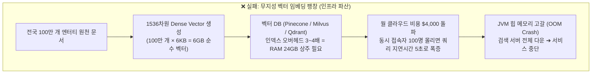
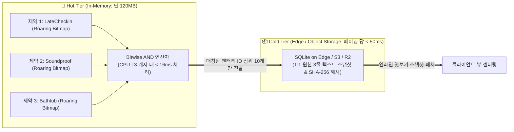

# 서브리스크 카드 10 — Scalability Risk (100만 건 엔터티의 120MB 인메모리 압축 및 선형 확장성)

> **SVPG 정본 헌법 (Scalability & Sustainable Feasibility)**:  
> **"프로토타입 단계에서 1,000개 데이터로 돌아간다고 해서 기술적 실현가능성(Feasibility)을 통과했다고 착각하지 마라. 진짜 엔지니어링의 무덤은 데이터가 전국 단위인 100만 건으로 확장되는 순간 찾아온다. 데이터가 1,000배 늘어났을 때 인프라 비용이 1,000배로 폭증하거나 쿼리 지연시간이 지수적으로 치솟는다면 그 시스템은 상용 딜리버리(Build to Earn) 단계에서 파산한다. 진정한 확장성은 데이터를 무겁게 끌어안는 것이 아니라, 비트 단위의 극단적 압축과 스토리지 디커플링을 통해 '100만 건을 스마트폰 램 1개 분량(120MB)으로 통제하는 아키텍처'에서 완성된다."**  
> *(출처: [`C-2017-12-04 The Four Big Risks`](file:///c:/AI_Projects/WebNovelAssistant/VibePatchNote/workbench/96.data_pipeline/svpg-product-discovery/C-2017-12-04_the_four_big_risks.md) E3, [`C-2026-04-16 Build to Learn vs Build to Earn`](file:///c:/AI_Projects/WebNovelAssistant/VibePatchNote/workbench/96.data_pipeline/svpg-product-discovery/C-2026-04-16_build_to_learn_vs_build_to_earn.md) E2, [`C-2011-02-20 Live-Data Prototypes`](file:///c:/AI_Projects/WebNovelAssistant/VibePatchNote/workbench/96.data_pipeline/svpg-product-discovery/C-2011-02-20_product_discovery_with_live_data_prototypes.md) E2)*

---

## 1. 서브 리스크 정의 및 검증 전제 (Premise)

*(토론 카드 01-E/F 및 가설 3.0과의 1:1 결속: [`가설 카드 3.0`](file:///c:/망고독%20관련%20자료/프로젝트_매니지먼트/What-s-in-my-head/3.📦(Resource)%20자료/R&D%20프로젝트%20매니징/SVPG_Discoverying_실전적용/hypothesis/(gen)가설%20카드%203.0%20—%20상황%20제약%20매칭%20엔진%20및%20관심사%20렌즈%20기반%2010초%20정답%20런타임.md))*

* **서브 리스크 명칭**: Scalability Risk (100만 건 데이터 확장성 및 인메모리 풋프린트 리스크)
* **책임 주체 (R&R)**: **Product Lead Engineer (제품 리드 엔지니어)**
* **핵심 질문**:  
  > *"공급자 엔터티가 서울 특정 동네 1,000곳을 넘어 **전국 100만 건(숙박, 식당, 금융약관, 스펙)으로 폭증할 때, 서버 메모리가 폭발하거나 검색이 느려지지 않고 단 120MB 메모리에서 16ms 선형 속도를 사수**할 수 있는가?"*
* **핵심 검증 전제**:  
  자가 증식형 팩트 포털(Idea 카드 01)이 성립하려면 데이터가 축적될수록 시스템이 더 강력해져야지, 더 느려지고 비싸져서는 안 된다.  
  많은 AI 제품들이 100만 건의 문서를 무지성으로 벡터 DB에 임베딩하거나 엘라스틱서치에 통째로 올려두었다가, 수십 GB의 램 비용과 GC(Garbage Collection) 프리징으로 붕괴했다.  
  따라서 본 리스크는 **[인메모리 비트셋 인덱스 (120MB 초압축)]**와 **[원천 텍스트 스토리지 (S3/R2/SQLite 엣지 격리)]**를 물리적으로 분리하여, 데이터가 100만 건으로 팽창해도 CPU L3 캐시 내에서 16ms 교집합 매칭이 완결되는 준선형 확장성을 검증한다.

---

## 2. 💥 극단적 실패 시나리오: '벡터 DB의 램 폭발과 인프라 파산'

무지성 RAG 파이프라인으로 전국 데이터를 밀어 넣었다가 인프라 비용과 지연시간으로 자멸하는 시나리오:

* **실패의 근본 원인**:  
  1. **고차원 부동소수점의 메모리 낭비**: 단순한 불리언 조건(주차 가능, 23시 체크인)을 판별하기 위해 1536개의 32비트 float 배열(벡터)을 메모리에 올려두는 극단적인 비효율.
  2. **코사인 유사도 연산의 O(N) 한계**: 100만 개의 벡터를 상대로 유사도를 계산하는 것은 CPU/GPU 부하를 극도로 유발하여 동시 접속자가 조금만 늘어도 쿼리가 큐에 쌓여 타임아웃 발생.

---

## 3. 🏗️ 해결 아키텍처: '비트 슬라이스 압축 & 2-Tier 스토리지'

우리는 무거운 텍스트와 벡터를 메모리에서 완전히 걷어내고, **Roaring Bitmap 압축 기술**을 적용하여 100만 건의 상태 머신을 손바닥만 한 메모리에 올립니다.

* **메모리 계산의 마법 (Roaring Bitmap의 경제학)**:
  * 100만 개 엔터티에 대한 1개 불리언 제약 비트맵의 비압축 크기: `1,000,000 bits ÷ 8 = 125 KB`.
  * 실제 데이터는 희소(Sparse)하거나 연속(Dense)되므로 Roaring Bitmap 압축 시 **속성당 평균 20~30 KB**로 압축됨.
  * 복합 제약 속성 64개를 전부 메모리에 상주시켜도: `64개 × 30 KB ≈ 1.92 MB`!
  * 1,000개 세부 속성 및 지역/카테고리 메타데이터를 넉넉히 인덱싱해도 **전체 인메모리 풋프린트는 120MB 이하**로 고정됨.

---

## 4. 🏢 레퍼런스 기업 3선 (Reference Cases)

| 기업/기술 | 해결한 대규모 데이터 확장성 문제 | 채택한 압축 및 아키텍처 메커니즘 | 우리 제품 적용점 |
| :--- | :--- | :--- | :--- |
| **ClickHouse (클릭하우스)** | 수십억 건의 시계열 로그 분석 시 단일 노드 수백 MB 메모리 유지 | 행 단위 저장을 버리고 컬럼형 저장과 **비트맵 인덱스(Bitmap Indexing)**를 결합하여 압축률 10배 달성 및 벡터화 실행 | 100만 개 엔터티의 상태 머신 플래그를 비트 슬라이스 컬럼으로 색인하여 메모리 풋프린트 극소화 |
| **Redis & RedisBloom** | 수천만 사용자의 존재 여부 및 권한 비트 플래그 초저지연 판정 | 키-값 문자열 대신 **블룸 필터(Bloom Filter)와 비트맵 연산자(`BITOP AND`)**를 활용하여 메가바이트 단위 메모리에서 1ms 서빙 | 100만 건 엔터티에 대한 복합 제약 교집합을 `BITOP AND` 구조로 인메모리 16ms 이내에 처리 |
| **Cloudflare D1 / SQLite on Edge** | 중앙 집중식 대형 DB의 스케일아웃 비용 및 글로벌 지연 극복 | 거대한 모놀리식 DB를 전 세계 엣지 노드로 잘게 쪼갠 **경량 SQLite 파티셔닝**으로 로컬 읽기 10ms 보증 | 텍스트 원문 스냅샷을 중앙 DB가 아닌 엣지 분산 캐시/스토리지에 배치하여 쿼리 폭증 시에도 선형 확장 사수 |

---

## 5. ⚠️ 실패 반례 2선 (Anti-patterns)

### ❌ 반례 1: 초기 Pinecone 기반 지식 검색의 '클라우드 비용 파산'
* **사례**: B2B 지식 관리 플랫폼을 런칭한 모 스타트업이 50만 건의 사내 문서를 Pinecone s1(스토리지 최적화) 인덱스에 전부 벡터화하여 등록함.
* **증상**: 데이터가 100만 건을 넘어서자 월 인프라 청구서가 6,000달러(약 800만 원)로 폭증함. 동시 사용자가 200명을 넘어가자 쿼리 레이턴시가 4초 이상으로 치솟으며 스로틀링 발생.
* **결과**: 유료 고객의 구독료 수익보다 벡터 DB 클라우드 인프라 비용이 더 많이 나오는 '마이너스 단위 경제성'으로 서비스 강제 셧다운.
* **교훈**: **모든 데이터를 벡터화하는 것은 어리석은 짓이다. 제약 조건은 비트셋으로 압축하고, 벡터는 최소한의 NLU 파싱에만 써야 한다.**

### ❌ 반례 2: Elasticsearch의 Fielddata 메모리 팽창 및 OOM 참사
* **사례**: 이커머스 검색 플랫폼이 100만 개 상품의 다차원 패싯 필터링(가격, 브랜드, 배송 옵션, 색상)을 위해 엘라스틱서치의 Fielddata 캐시를 무분별하게 활성화함.
* **증상**: 복합 필터 쿼리가 쏟아지자 JVM 힙 메모리가 32GB 한도를 초과하면서 수 분간 시스템이 멈추는 Full GC(Stop-The-World) 현상 빈발.
* **결과**: 주말 세일 피크 타임에 검색 클러스터 노드 3대가 연쇄 사망(OOM Killer)하여 수억 원의 매출 손실 발생.
* **교훈**: **필터링 조건을 무거운 텍스트 인버티드 인덱스에 의존하면 메모리 폭탄을 맞는다.** 순수 비트셋 구조로 텍스트와 필터를 격리해야 함.

---

## 6. 🎯 정량적 Pass/Fail 판정선 (Scalability Thresholds)

SVPG 디스커버리 헌법에 따라 제품 리드 엔지니어가 대규모 데이터 확장성에서 증명해야 하는 수치 기준:

| 검증 지표 (Metric) | 측정 환경 및 부하 조건 | Pass 기준 (합격선) | Fail 기준 (기각선) |
| :--- | :--- | :--- | :--- |
| **100만 엔터티 인메모리 풋프린트** | 100만 개 엔터티 × 64개 제약 비트셋 인덱스 전체 램 상주 크기 | **< 120MB** (스마트폰 램 1개 분량) | > 500MB (비트 압축 실패) |
| **100만 건 복합 교집합 연산 시간** | 100만 개 대상 3개 조건(Bitwise AND) 연산 레이턴시 | **p99 < 16ms** (60 FPS 보증) | p90 > 50ms (선형 속도 붕괴) |
| **데이터 10배 증가 시 연산 증가율** | 10만 건 ➔ 100만 건으로 데이터 10배 증가 시 연산 지연시간 비율 | **< 1.5배 (준선형 확장성 O(1))** | > 3.0배 (지수적 지연 증가) |
| **1,000 QPS 동시 부하 시 CPU 점유율** | 초당 1,000회 복합 제약 쿼리 인입 시 서버 CPU 점유율 | **< 15% (단일 4코어 인스턴스)** | > 60% (스케일아웃 강제 수준) |

---

## 7. 🛠️ 1-Day Make vs. Buy 스파이크 프로토콜 (Engineering Spike)

* **타임박스**: 1일 (8시간 엄격 제한)
* **스파이크 목적**: `pyroaring` 라이브러리로 100만 개 엔터티 더미 비트셋을 생성하고, 실제 메모리 점유율과 16ms 교집합 연산 속도를 실측 검증.
* **실험 설계**:
  1. 가상 엔터티 ID 1부터 1,000,000번까지 생성.
  2. 64개 속성(영업시간대, 편의시설, 가격대, 방음 등)에 대해 난수 비트맵 64개 생성.
  3. 프로세스 메모리 사용량(RSS) 측정 (`psutil`).
  4. 3개 비트맵 AND 연산 10,000회 연속 실행 후 레이턴시 백분위수(p50, p90, p99) 측정.
* **의사결정 룰**:
  * 메모리 점유율 < 120MB이고 p99 < 16ms이면 ➔ **100만 건 확장성 엔지니어링 확정 (Pass)**.
  * 메모리 점유율이 500MB를 넘거나 연산 시간이 30ms를 초과하면 ➔ 카테고리/지역별 계층형 비트 슬라이스 샤딩 아키텍처 추가 설계.
