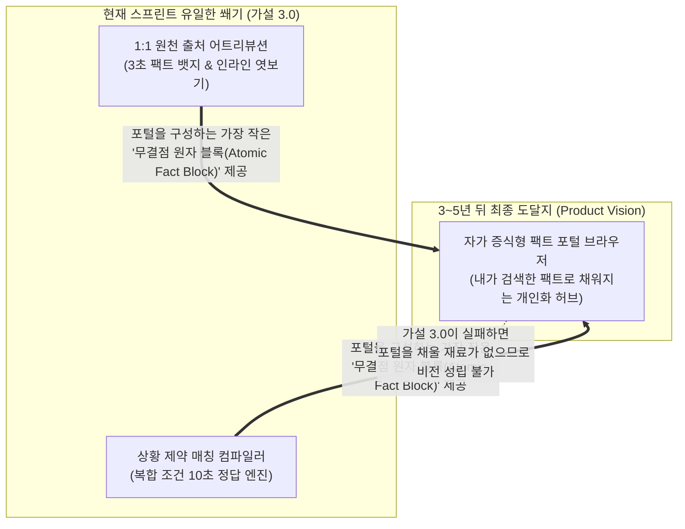

# Idea 카드 01 — 자가 증식형 팩트 포털 (Self-Assembling Fact Portal)

> **SVPG 정본 헌법 (Product Vision & Idea Pool)**:  
> **"뛰어난 리더는 늘 3~5년 뒤의 거대한 미래상을 먼저 본다. 그러나 그 아이디어를 즉시 팀의 작업 목록(Backlog)에 쏟아부으면 팀은 방향성을 잃고 난파한다. 리더의 영감은 `Idea Pool`이라는 안전한 인큐베이터에 박제되어야 하며, 현재 팀이 파고 있는 '가장 날카로운 쐐기 가설(Wedge)'을 지탱하는 궁극적 북극성으로 기능해야 한다."**  
> *(출처: [`C-2020-09-04 Problem vs Solution Teams`](file:///c:/AI_Projects/WebNovelAssistant/VibePatchNote/workbench/96.data_pipeline/svpg-product-discovery/C-2020-09-04_problem_vs_solution_teams.md) E1, Marty Cagan, *Inspired* Ch.18 Product Vision and Product Strategy)*

---

## 1. 💡 아이디어 한 줄 정의 (Elevator Pitch)

> **"네이버나 구글처럼 광고와 쓰레기 정보로 이미 꽉 채워진 광장형 포털이 아니라,  
> 사용자가 검색하고 1:1로 검증한 '진짜 확실한 팩트'들이 작업 캔버스에 실시간 블록으로 조립되어 스스로 채워져 나가는 나만의 브라우저형 팩트 포털(Self-Assembling Fact Portal)."**

---

## 2. 🌪️ 문제의식: 기존 광장형 포털의 구조적 종말

| 비교 축 | 기존 포털 (네이버·구글·다음) | 신개념 자가 증식형 팩트 포털 (Our Vision) |
| :--- | :--- | :--- |
| **공간의 성격** | **광장형 (Square)**: 불특정 다수를 위한 정적 피드와 광고, 가십으로 꽉 차 있음 | **개인 작업실 (Atelier)**: 순수한 빈 캔버스에서 출발하여 사용자의 의도에 따라 빌드업됨 |
| **정보 채움 방식** | **Push/Ad 기반**: 포털 운영자가 광고주와 언론사 알고리즘으로 밀어 넣은 콘텐츠 | **Pull/Assembly 기반**: 사용자가 검색하고 검증한 팩트 엔터티가 블록 형태로 자동 적재 |
| **정보의 순도** | **시맨틱 낚시 & 3년 전 블로그**: 광고, 제휴 링크, 바이럴 마케팅으로 오염 | **1:1 원천 출처 증거 팩트**: 맥락 조건(시점, 제약, 엔터티)이 100% 매칭된 무결점 데이터 |
| **브라우징 경험** | **탭 지옥 (20개 탭 오픈)**: 링크 누를 때마다 새 창으로 튕겨 나가 문맥 상실 | **인라인 엿보기 (Inline Peek)**: 탭 이탈 없이 한 화면에서 증거 스냅샷을 검증하고 흡수 |

---

## 3. 🧱 현재 작업([가설 3.0])과의 쐐기(Wedge) 관계 및 종속성

이 거대한 포털 비전은 결코 허황된 상상이 아니며, 현재 우리가 검증 중인 **[[(gen)가설 카드 3.0 — 상황 제약 매칭 엔진 및 관심사 렌즈 기반 10초 정답 런타임]]**과 완벽한 상하 종속 관계를 가집니다.

* **구글의 역사적 교훈**: 구글도 처음부터 방대한 포털 서비스를 만들지 않았습니다. 그들은 오직 검색창 하나와 'PageRank 알고리즘'이라는 가장 날카로운 쐐기(Wedge)로 시작하여 전 세계의 데이터를 장악한 뒤 크롬과 포털 생태계를 완성했습니다.
* **가설 3.0의 절대적 가치**: 사용자가 검색한 것으로 포털이 채워지려면, **그 채워지는 벽돌(팩트 블록)이 단 1%의 환각이나 낚시도 없는 100% 신뢰 데이터**여야 합니다. 가설 3.0은 이 포털의 기초 골조가 될 **'단 하나의 완벽한 팩트 벽돌'을 굽는 엔진**입니다.

---

## 4. 🛡️ 팀 보호용 거버넌스 가드레일 (Team Alignment)

리더의 직관이 팀의 혼란(Whiplash)으로 이어지지 않도록, 본 카드는 다음의 절대 원칙을 선언합니다.

1. **절대 피벗(Pivot)이 아님**:
   * 본 아이디어는 기존 가설 3.0을 대체하거나 수정하는 것이 아닙니다. 
   * 가설 3.0이 완벽하게 증명되었을 때 열리게 될 **'다음 단계의 미래형 인터페이스'**를 사전 정의한 것입니다.
2. **코드 구현 전면 금지 (No Early Code)**:
   * 현재 스프린트에서 브라우저 탭, 복합 포털 레이아웃, 크롬 익스텐션 등의 코드를 한 줄도 작성하지 않습니다.
   * 팀의 모든 엔지니어링 리소스는 가설 3.0의 **[상황 제약 매칭 엔진]**과 **[인라인 엿보기 팩트 런타임]**에만 100% 집중합니다.
3. **팀 브리핑용 1분 스크립트 (Leader's Communication)**:
   > *"팀원 여러분, 최근 제가 이야기했던 '자가 증식형 포털'은 우리가 지금 당장 만들어야 할 작업이 아니라, 우리 제품이 훗날 도달할 상위 비전(Idea)입니다.*  
   > *그 포털이 성립하기 위한 가장 첫 번째이자 유일한 엔진이 바로 지금 우리가 만들고 있는 **가설 3.0(10초 정답 및 팩트 어트리뷰션)**입니다. 여러분이 지금 만들고 계신 코드가 바로 이 차세대 포털의 심장이 되니, 현재 스프린트에 한 치의 흔들림 없이 집중해 주시면 됩니다."*

---

## 5. 🚀 향후 승격 조건 (Next Phase Trigger)

본 아이디어 카드는 다음 조건이 충족될 때 정식 `Product Vision` 및 차기 디스커버리 가설로 승격(Unfreeze)됩니다.

* [ ] **가설 3.0 12대 서브리스크 돌파**: 가치·사용성·실현가능성·사업성 쿼터 검증 완료.
* [ ] **팩트 블록 1초 조립 검증**: 사용자의 복합 제약 쿼리가 10초 이내에 무결점 팩트 블록으로 반환되는 엔진 성능 확보.
* [ ] **포털 뷰 프로토타입 착수 승인**: Discovery 팀의 정식 동의 하에 캔버스/포털 형태의 뷰 인터랙션 실험 설계.
