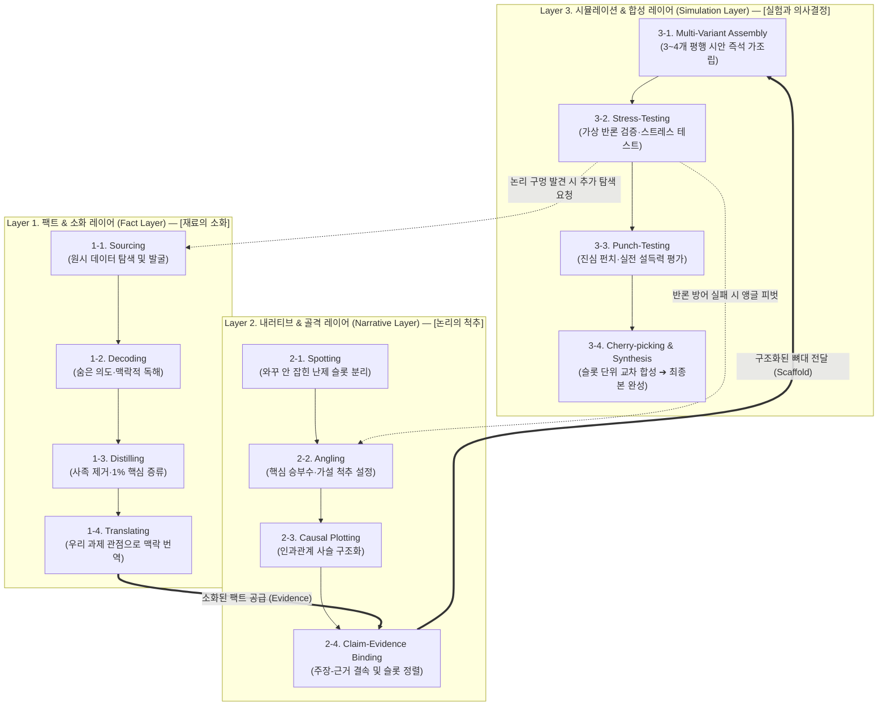

# (gen) 가치 카드 08 — [전과정] 기획 활동의 3대 인지 아키텍처 (팩트 소화 · 내러티브 척추 · 시뮬레이션 합성)

> **핵심 명제**:  
> **"기획 문서는 단번에 쓰이는 결과물이 아니라, [팩트 소화 ➔ 내러티브 척추 ➔ 시뮬레이션 합성]이라는 3대 인지 레이어의 상호작용(Dual-Loop)을 통해 직조된다."**  
> 신뢰할 수 있는 재료를 씹어 삼키는 **디깅(Digging)**과, 기승전결의 인과관계로 메시지를 꿰어내는 **스토리라이닝(Storylining)**, 그리고 여러 시안을 나란히 올려놓고 진심 펀치를 검증하는 **시뮬레이션(Simulation)**이 하나의 유기적인 사이클로 맞물릴 때 비로소 무결점의 비즈니스 문서가 완성된다.

---

## 1. 기획 활동의 3대 인지 아키텍처 조감도 (The 3-Layer Architecture)



---

## 2. Layer 1: 팩트 레이어 (Fact Layer) — 재료의 탐색과 소화
> **"어떤 신뢰할 수 있는 재료로 무장할 것인가?" (디깅 활동군)**

기획자가 외부의 날것 데이터(Raw Data)를 들여와 문서의 자산으로 내재화하는 구간입니다.

* **1-1. 탐색 및 발굴 (Sourcing)**:  
  * RFP, 관련 법령, 학술 논문, 통계청 데이터, 과거 통과 기안서를 수집.
* **1-2. 해독과 맥락 파악 (Decoding)**:  
  * 100쪽짜리 RFP에서 발주처의 숨은 니즈를 읽어내고, 논문의 기술적 전제조건을 독해.
* **1-3. 증류와 선별 (Distilling / Pruning)**:  
  * 사족을 버리고 내 논리를 뒷받침할 **단 하나의 표, 핵심 수치(1%)만 칼로 도려내듯 발췌**.
* **1-4. 내재화와 맥락 번역 (Translating)**:  
  * 원문의 표현을 그대로 복붙하지 않고, **"우리 과제의 목표와 언어"로 의미를 치환하여 가공**.

---

## 3. Layer 2: 내러티브 레이어 (Narrative Layer) — 논리의 척추 구축
> **"어떤 이야기 줄기와 뼈대로 설득할 것인가?" (스토리라이닝 활동군)**

소화된 팩트를 바탕으로, 독자가 반론할 수 없는 기승전결의 인과관계를 설계하는 구간입니다.

* **2-1. 난제 슬롯 분리 (Spotting)**:  
  * 당장 채울 수 있는 기지의 영역(Known)은 배경으로 두고, **어떻게 써야 할지 모르는 '와꾸 안 잡힌 슬롯(Unshaped Slot)'을 핀포인트로 특정**.
* **2-2. 핵심 앵글/가설 설정 (Angling)**:  
  * '드론(시장 파급력)' vs '임베디드 PCB(원천 기술)'처럼 **문서의 주인공이 될 핵심 승부수(Thesis)를 결정**.
* **2-3. 인과관계 사슬 구축 (Causal Plotting)**:  
  * 상황(Situation) ➔ 문제(Complication) ➔ 해법(Question/Answer) ➔ 파급효과의 기승전결 논리 사슬 엮기.
* **2-4. 주장-근거 결속 및 구조화 (Claim-Evidence Binding)**:  
  * 설계된 인과 척추의 각 마디(주장)에 디깅된 팩트(근거)를 물리적 와이어프레임 슬롯에 안착.

---

## 4. Layer 3: 시뮬레이션 레이어 (Simulation Layer) — 실험과 최적본 합성
> **"실제로 말이 되는가? 어느 조합이 최강의 펀치인가?" (시뮬레이터 활동군)**

뼈대와 팩트를 결합해 3~4개의 평행 시안을 눈앞에 펼치고, 최고의 결과물을 조립 확정하는 구간입니다.

* **3-1. 평행 시안 즉석 가조립 (Multi-Variant Assembly)**:  
  * 단일안 출력을 기다리는 것이 아니라, 서로 다른 가설(A안, B안)을 탄 시안들을 캔버스 위에 나란히 렌더링.
* **3-2. 잠재 반론 검증 (Stress-Testing)**:  
  * 심사위원의 날카로운 시선(Devil's Advocate)으로 각 시안의 논리적 구멍을 스스로 찔러보고 방어벽 보강.
* **3-3. 진심 펀치 평가 (Punch-Testing)**:  
  * 겉모양이나 문체가 아닌, "실제 고객이나 심사위원을 설득할 파괴력이 있는가?"를 실전 평가.
* **3-4. 슬롯별 교차 합성 (Cherry-picking & Synthesis)**:  
  * 단일 시안을 억지로 고르지 않고, **"A안의 강력한 서론 슬롯 + B안의 탄탄한 기술 슬롯"을 체리피킹하여 무결점 황금본(Golden Draft)으로 완성**.

---

## 5. 기획의 살아있는 박동: 상호 촉발형 이중 루프 (Dual-Loop Dynamics)

```text
[디깅 (팩트 소화)] ◀════ (근거 부족/반론 발생 시 재탐색) ════▶ [스토리라이닝 (인과 척추)]
        │                                                              │
        └───────────────────────▶ [시뮬레이션 (가조립)] ◀─────────────┘
                                         │
                                         ▼
                            [진심 펀치 합격 ➔ 최종 확정]
```

* **팩트가 없는 내러티브는 '공허한 소설'**이 되고,
* **내러티브가 없는 팩트는 '정리 안 된 모래알 자료'**에 불과하며,
* **시뮬레이션이 없는 기획은 '단일안의 함정에 빠진 워드 복붙 노가다'**로 전락합니다.

기획자는 [팩트 소화 ➔ 척추 설계 ➔ 즉석 가조립 ➔ 반론 발견 ➔ 재탐색]의 루프를 빠르게 돌리며 점진적으로 문서의 완성도를 끌어올립니다.

---

## 6. 시뮬레이터 제품과의 정렬 맵 (System Alignment)

| 기획 인지 레이어 | 기획자의 실제 행동 | 망고독 시뮬레이터 시스템 대응 모듈 |
| :--- | :--- | :--- |
| **Layer 1. 팩트 레이어** | 외부 자료를 찾고, 해독하고, 1%만 증류하여 내재화 | **리소스 매니저**, **Reference Distiller**, Segment Extractor |
| **Layer 2. 내러티브 레이어** | 와꾸 안 잡힌 슬롯을 특정하고, 가설 척추를 세워 팩트 배선 | **Tiptap Scaffold Editor**, **Recipe Smart Chips**, Binder Engine |
| **Layer 3. 시뮬레이션 레이어** | 3~4개 평행 시안을 비교하고, 반론을 방어하며 슬롯 단위 합성 | **2D Infinite Canvas**, **Multi-Variant Runner**, Slot Synthesizer |
