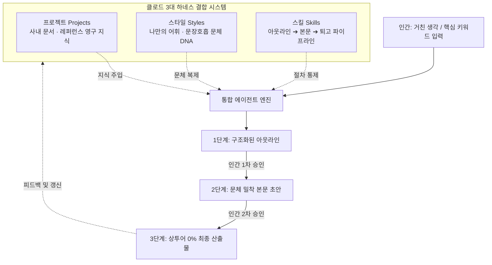

# (gen)Step 04 — 3대 하네스 결합 실전 콘텐츠 양산 및 피드백 루프 (System Co-working)

> **핵심 원칙**: *"프로젝트(지식), 스타일(문체), 스킬(절차)은 각각 따로 쓸 때보다 **셋이 결합된 하나의 시스템으로 맞물려 돌아갈 때** 폭발적인 생산성을 냅니다. 인간은 긴 프롬프트를 치는 노동자에서 벗어나, 거친 아이디어를 던지고 각 단계별 산출물을 검토·승인하는 **'총괄 디렉터(Director)'**로 전환해야 합니다."*

---

## 1. 3대 하네스 결합 시스템 작동 메커니즘

| 구분 | 하네스 구성요소 | 실제 역할 | 인간의 역할 |
| :--- | :--- | :--- | :--- |
| **지식 베이스** | **Projects** | 배경 지식, 사내 규칙, 레퍼런스 영구 보존 | 원본 자료 업로드 및 업데이트 |
| **문체 DNA** | **Styles** | AI 특유의 번역투 제거, 고유의 호흡과 어휘 유지 | 내 최고 글 샘플 제공 및 문체 교정 |
| **실행 절차** | **Skills** | 기획 ➔ 초안 ➔ 퇴고 모듈형 파이프라인 | 키워드 호출 (`/outline`, `/draft`, `/polish`) |

---

## 2. 10분 만에 고품질 문서 완성하는 4단계 실전 세션

### 1단계: 세션 세팅 (10초)
1. 클로드에서 생성해 둔 해당 **[프로젝트(Project)]** 접속.
2. 우측 하단 또는 입력창의 스타일 드롭다운에서 등록한 **[나만의 스타일(Custom Style)]** 선택.
3. *결과*: 지식과 문체가 이미 100% 장착된 상태로 대화가 시작되므로 사전 설명 프롬프트가 완전히 0이 됨.

### 2단계: 거친 생각 투척 & 아웃라인 생성 (2분)
* **인간 입력**:
  > *"/outline 오늘 회의에서 나온 '에이전트 온보딩 2단계 하네스 도입의 필요성'에 대해 사내 공유용 문서를 쓸 거야. 핵심은 프롬프트 노가다를 없애고 시스템으로 일하게 만드는 거야."*
* **에이전트 출력**:
  * 사내 프로젝트 지식을 바탕으로 [오프닝 문제의식 ➔ 3대 하네스 솔루션 ➔ 실행 액션플랜] 3단 아웃라인 출력.
* **인간 디렉팅**: 구조 확인 후 *"2번 항목에 지난주 세인튜 유튜브 사례도 한 줄 추가해줘. 승인, 진행해."* 피드백.

### 3단계: 문체 결합 본문 드래프팅 (5분)
* **인간 입력**:
  > *"/draft 승인된 개요대로 본문 작성해줘."*
* **에이전트 출력**:
  * 내 스타일(단문 위주, 실용적 어휘, 명확한 두괄식)이 완벽히 적용된 3개 단락 본문 산출.
* **인간 디렉팅**: 전문 용어 표기나 사내 고유 명사 1~2개 가볍게 확인.

### 4단계: 상투어 박멸 및 최종 퇴고 (2분)
* **인간 입력**:
  > *"/polish AI 티 나는 상투어 빼고 문장 리듬감 다듬어줘."*
* **에이전트 출력**:
  * 접속사 중복 제거, AI 특유의 미사여구(도모하다, 혁신을 이끌다 등) 삭제, 강렬한 결론으로 마무리된 완성본 도출.
* **결과**: 총 소요 시간 **9분 30초**. 인간이 직접 쓸 때 걸리던 2~3시간이 1/10 이하로 단축.

---

## 3. 복리(Compounding)로 진화하는 피드백 루프

이 시스템의 진정한 강점은 **'쓸수록 똑똑해진다'**는 점입니다:

1. **지식 베이스(Projects)의 누적**:
   * 오늘 완성한 문서를 프로젝트의 Files에 다시 업로드 (`사내_문서_04.md`).
   * 다음 문서 작성 시 에이전트는 오늘 작성된 문서까지 참고하여 더욱 정교하고 일관된 문맥을 형성.
2. **문체(Styles)의 정밀 교정**:
   * 에이전트가 쓴 문장 중 마음에 들지 않아 인간이 직접 고친 문장이 있다면, 그 '교정 전/후' 예시를 스타일에 추가 반영.
   * 에이전트는 해당 교정 패턴을 학습하여 동일한 실수를 영구히 반복하지 않음.
3. **스킬(Skills)의 특화**:
   * 블로그용, 제안서용, 슬랙 공지용 등 목적별 스킬 템플릿을 서브 모듈로 확장 등록.

---

## 4. 온보딩 2단계(망고독 Usability) 최종 정리

### 하네스 도입 전 vs 도입 후 비교

| 비교 항목 | 1단계: 날것의 대화 (Raw Chat) | 2단계: 3대 하네스 결합 (Harness Co-working) |
| :--- | :--- | :--- |
| **배경 지식** | 대화창 열 때마다 복사+붙여넣기 (누락 잦음) | **Projects** 지식 베이스가 영구 기억 (일관성 100%) |
| **문체 및 어조** | 밋밋한 AI 번역투, *"말투 고쳐줘"* 10번 반복 | **Styles**로 내 문체 DNA 100% 복제 (수정 불필요) |
| **작업 절차** | 장문의 프롬프트 매번 작성 (피로도 극대화) | **Skills** 파이프라인으로 단축 명령어 호출 (`/outline` 등) |
| **문서 1건 소요시간** | 60~120분 (프롬프트 실랑이 + 대량 재수정) | **10분 이내** (검토 및 승인 중심) |
| **인간의 정체성** | AI에게 명령하느라 지친 '프롬프트 타이피스트' | 시스템 위에서 품질을 지휘하는 **'총괄 디렉터'** |

> **결론**: 온보딩 2단계를 통과한 작업자는 더 이상 *"어떤 프롬프트를 넣어야 잘 나오지?"*를 고민하지 않습니다. 이미 잘 작동하는 하네스를 어떻게 조립하고 진화시킬 것인가를 고민하는 진정한 에이전트 협업자로 거듭납니다.
