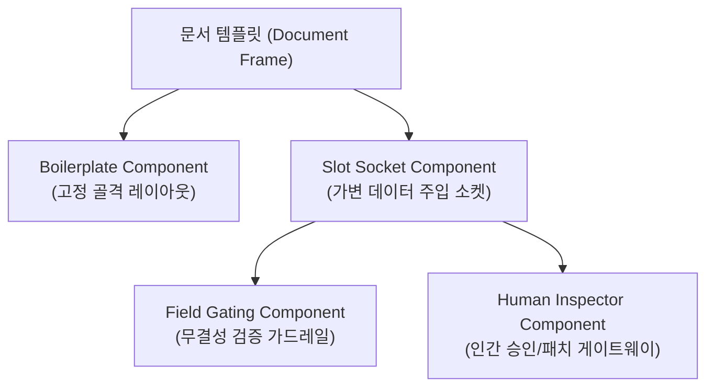

# 05. 스캐폴드 최소 Component 상세 사양서

> **문서 성격**: 단일 아웃라이너 트리([[04. (gen)Scaffold_Manager_프로토타입_구현_아웃라이너_이관]])에서 파생된 **완결형 롱폼 상세 기술 규격서**입니다. 불릿 위계를 넘어 정형화된 테이블, 데이터 스키마, 아키텍처 다이어그램을 포함합니다.

---

## 1. 개요 및 설계 목적

스캐폴드 매니저(Scaffold Manager)는 문서의 전체 뼈대(Structure)를 안정적으로 유지하면서, 외부 팩트 데이터와 AI Agent가 주입하는 가변 콘텐츠를 특정 슬롯(Slot)에 정밀하게 배선하는 엔진입니다.

본 문서는 실전 CLI 및 워크스페이스 환경에서 즉시 구현 가능한 **4대 최소 컴포넌트 사양**을 정의합니다.



---

## 2. 4대 핵심 컴포넌트 사양 명세

### ① `SlotSocket` 컴포넌트 (가변 데이터 주입 소켓)
* **역할**: 고정 뼈대 사이사이에 위치하여 외부 데이터 또는 에이전트 생성 결과가 주입되는 동적 슬롯.
* **벤치마킹 레퍼런스**: CopilotKit (`useCopilotReadable`, `useCopilotAction`)
* **데이터 인터페이스**:
  ```typescript
  interface SlotSocketConfig {
    slotId: string;               // 고유 슬롯 식별자 (e.g. "sec-01-summary")
    title: string;                // 슬롯 표시 라벨
    contentType: 'text' | 'markdown' | 'table' | 'json';
    isRequired: boolean;          // 필수 입력 여부
    fallbackContent?: string;     // 데이터 부재 시 기본 렌더링 텍스트
    lockStatus: 'unlocked' | 'agent-editing' | 'human-approved';
  }
  ```

---

### ② `BoilerplateFrame` 컴포넌트 (불변 골격 컨테이너)
* **역할**: 내용이 변경되거나 외부 데이터가 주입되어도 문서 전체 레이아웃과 서식이 절대 깨지지 않도록 보호하는 컨테이너.
* **벤치마킹 레퍼런스**: PandaDoc (Boilerplate-Token 격리), Overleaf (A4 실측 조판 프레임)
* **동작 규칙**:
  1. 슬롯 외부의 레이아웃 마진, 헤더/푸터, 챕터 번호 매김은 사용자와 에이전트 모두 임의 수정 불가.
  2. 슬롯 내부 콘텐츠 길이가 늘어날 경우, 페이지 브레이크(Page Break) 및 자동 줄바꿈 규칙 강제 적용.

---

### ③ `FieldGating` 컴포넌트 (필수 슬롯 무결성 가드레일)
* **역할**: 필수 슬롯(`isRequired: true`)이 비어 있거나 규격을 위반한 상태에서 다음 파이프라인(빌드/내보내기)으로 진행되는 것을 차단.
* **벤치마킹 레퍼런스**: DSPy (`Assert` / `Suggest` 자가 치유 루프)
* **검증 매트릭스**:

| 검증 단계 | 검사 조건 | 위반 시 조치 (Action) |
| :--- | :--- | :--- |
| **G1. Null Check** | `isRequired == true && content.isEmpty()` | 빌드 차단 및 경고 칩 점등 |
| **G2. Type Match** | 선언된 `contentType`과 주입 데이터 형식 불일치 | 에이전트에 자가 치유(Self-refinement) 재시도 요청 |
| **G3. Length Boundary** | 최소/최대 글자수 임계치 이탈 | 인간 검토자에게 승인 요청 플래그 전달 |

---

### ④ `HumanInspector` 컴포넌트 (인간 승인 및 인터럽트 게이트웨이)
* **역할**: 에이전트가 슬롯에 초안을 채웠을 때 자동으로 확정하지 않고, 인간 작업자가 diff를 확인하고 승인/수정할 수 있는 인터랙션 창구.
* **벤치마킹 레퍼런스**: LangGraph Studio (`interrupt()` 및 `graph.update_state()`)
* **주요 상태 전이**:
  * `IDLE` → `AGENT_GENERATING` → `PAUSED_FOR_REVIEW` → `APPROVED` (또는 `HUMAN_PATCHED`)

---

## 3. 타임라인 아웃라이너와의 연동 구조

본 사양서는 아웃라이너 베이스 문서([[04. (gen)Scaffold_Manager_프로토타입_구현_아웃라이너_이관]])의 다음 노드와 1:1로 결합되어 관리됩니다:
* 상위 트랙: `🚀 향후 예정 > [ ] 1. 스캐폴드 최소 Component 상세 사양서 작성`
* 하위 구현 태스크: 본 사양서의 4대 컴포넌트를 CLI 코드로 변환하는 프로토타입 작업으로 이어집니다.
