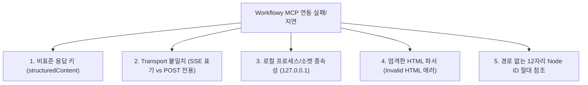

# 03. Workflowy MCP 초기 통신 가이드 및 에이전트 연동 지침

Workflowy 데스크톱 내장 MCP(Model Context Protocol) 서버는 강력한 단일 무한 트리 조작 능력을 제공하지만, 일반적인 클라우드 기반 REST API나 표준 MCP 도구들과 다른 **독자적인 프로토콜 규격과 로컬 프로세스 특성**을 지니고 있어 매번 초기 연동 시 심각한 병목과 혼선을 유발합니다.

본 문서는 코딩 에이전트(Agent)가 Workflowy MCP 서버와 최초 통신을 수립할 때 **반드시 염두에 두어야 할 5대 구조적 원인**과 **실전 5단계 연동 절차 및 트러블슈팅 수칙**을 체계적으로 정리합니다.

---

## 1. 초기 연동 시 헤매는 5대 구조적 원인 (Root Causes)



### ① 응답 필드의 비표준 설계 (`content` vs `structuredContent`)
* **표준 규격과의 충돌**: 공식 MCP 스펙의 도구 응답은 `result.content: [{type: "text", text: "..."}]` 배열에 결과 본문을 담습니다.
* **Workflowy의 동작**: Workflowy MCP 서버는 `content: []`를 비워두고, **`result.structuredContent.results`**라는 독자적인 키에 탐색 결과 텍스트를 담아 반환합니다.
* **에이전트 착시 현상**: Antigravity IDE나 일반 MCP 하네스는 `result.content`만 읽어 사용자/모델에 전달하므로, `tree_seek` 호출 시 화면에 단순 **`tool call completed` (빈 본문)**만 노출됩니다. 에이전트는 이를 "노드가 존재하지 않거나 조회가 실패했다"고 오인하여 끝없는 무한 탐색 루프에 빠지게 됩니다.

### ② Transport의 명칭과 실제 동작 불일치 (SSE 표기 vs POST 단일 엔드포인트)
* **설정 파일의 오해**: `mcp_config.json` 설정에는 `"type": "sse"`로 명시되어 있습니다.
* **실제 엔드포인트 거동**: 해당 URL(`http://127.0.0.1:<포트>/mcp/<토큰>`)로 표준 SSE `GET` 요청을 보내면 즉시 **`HTTP 405 Method Not Allowed (Allow: POST)`** 에러가 발생합니다.
* **핸드셰이크 강제**: 실질적으로 **HTTP POST 기반의 단일 JSON-RPC 2.0 엔드포인트**로 동작하며, `initialize` (`protocolVersion: "2025-06-18"`) 및 `notifications/initialized` 핸드셰이크가 선행되지 않은 모든 요청은 **`HTTP 400 Bad Request`**로 원천 차단됩니다.

### ③ 로컬 데스크톱 프로세스 및 소켓 종속성
* **클라우드 서버 부재**: Workflowy MCP 서버는 외부 원격 서버가 아니라, 사용자 PC에서 **`WorkFlowy.exe` 프로세스가 구동 중일 때만 로컬 루프백(`127.0.0.1`)에 임시 소켓을 바인딩**합니다.
* **세션 휘발성**: 데스크톱 앱이 종료되어 있거나 절전 모드로 진입하면 연결이 끊기며, 앱 자동 업데이트나 재실행 시 포트 번호(`42973` 등)나 토큰이 동적으로 바뀔 수 있습니다.

### ④ 엄격한 인라인 HTML 파서와 태그 충돌 (`Invalid HTML`)
* **서식 지원의 역효과**: Workflowy는 노드 본문 내 인라인 서식(`<b>`, `<i>`, `<a>`, `<time>`)을 지원합니다.
* **파싱 크래시**: 개발/설계 문서에서 흔히 쓰는 부등호 괄호 표현(예: `<domain>`, `<T>`, `<root>`)을 일반 텍스트로 주입하면, 내부 파서(`any_os_mcp.ts`)가 이를 **"닫히지 않았거나 허용되지 않은 비정상 HTML 태그"**로 판정합니다.
* **트랜잭션 롤백**: 이 경우 아무런 경고 없이 전체 변경 요청이 **`Invalid HTML` 에러와 함께 롤백**되어 노드가 전혀 생성되지 않습니다.

### ⑤ 사람이 읽을 수 있는 경로(Path) 부재 및 12자리 ID 참조 체계
* **계층 경로 탐색 불가**: 일반 파일 시스템처럼 `/Calendar/2026/10/09` 경로 문자열로 직행하여 쓸 수 없습니다.
* **고유 해시 강제**: 모든 노드는 12자리 16진수 랜덤 해시(예: `1e36d47c05e7`)로만 식별되므로, 반드시 **[상위 탐색(Seek) ➔ 목표 ID 파싱 ➔ 원자적 패치(Patch)]**의 2~3단계 왕복 사이클이 강제됩니다.

---

## 2. 코딩 에이전트 실전 5단계 연동 프로토콜 (Step-by-Step)

코딩 에이전트는 Workflowy MCP 작업을 수행할 때 반드시 다음 5단계를 순차적으로 집행해야 합니다.

### [1단계] 프로세스 및 로컬 포트 생존 진단
무작정 도구를 호출하기 전에 로컬 환경에 프로세스와 엔드포인트가 열려 있는지 먼저 확인합니다.
```powershell
# 1. WorkFlowy 데스크톱 프로세스 생존 확인
Get-Process WorkFlowy -ErrorAction SilentlyContinue

# 2. 전역 설정에서 포트 및 토큰 확인
Get-Content "$env:USERPROFILE\.gemini\config\mcp_config.json" -Raw
```

### [2단계] 타깃형 노드 탐색 (`tree_seek` 필터링)
전체 트리를 무지성으로 긁어오면 토큰 초과나 Truncate가 발생하므로, 알려진 앵커 ID(예: `Oct` 노드 `a4098f604c83`)를 기준으로 **직속 자식 필터(`child_of_any`)**를 걸어 오늘 날짜 노드를 신속하게 식별합니다.

* **오늘 날짜 노드 식별 앵커**:
  * `Calendar` ID: `d8799899ce79`
  * `2026` ID: `a0f2f55dcebe`
  * `Oct` ID: `a4098f604c83`
  * *`tree_seek` 인자 예시*: `start_from: "a4098f604c83"`, `filter: { child_of_any: ["a4098f604c83"] }`

### [3단계] 주입 텍스트의 HTML 태그 사전 정제 (Sanitization)
노드 텍스트에 들어가는 모든 부등호 괄호(`< >`)는 사전 치환합니다:
* `<domain>` ➔ `[domain]` 또는 `&lt;domain&gt;`
* `<T>` ➔ `[T]`
* 단, 날짜 태그(`<time startYear="2026" ...>`)나 링크(`<a href="...">`) 등 공식 지원 태그는 그대로 유지합니다.

### [4단계] 원자적 트리 패치 (`tree_patch`)
목표 노드 ID를 확보했다면 `insert_after`와 `inside: true / false` 옵션을 명확히 구분하여 일괄 주입합니다:
* **기존 메모 보존**: 오늘 날짜 노드 아래에 사용자가 이미 적어둔 메모가 있다면 덮어쓰지 않고, 그 메모 노드의 다음 형제(`inside: false`, `insert_after: "<메모노드ID>"`)로 배치합니다.
* **대규모 계층 주입**: 부모 노드 아래에 `items: [{ name: "대제목", children: [...] }]` 트리 구조로 한 번의 요청에 묶어서 주입합니다.

### [5단계] 클라이언트 시점 이동 및 시각적 피드백
작업이 끝난 후 사용자가 Workflowy 화면에서 방금 쓴 내용을 즉시 확인할 수 있도록 후속 조치를 취합니다:
1. `tree_zoom`: 생성된 최상위 노드 ID로 사용자 화면 줌인 이동
2. `message_success`: 데스크톱 화면 하단에 완료 토스트 메시지 발송

---

## 3. 실전 트러블슈팅 매트릭스 (Quick Reference)

| 현상 / 에러 메시지 | 근본 원인 | 즉각 조치 방법 |
| :--- | :--- | :--- |
| **`tool call completed` (빈 본문 반환)** | Workflowy는 `content` 대신 `result.structuredContent.results`에 결과를 넣음 | 에이전트 하네스 출력이 비어 있어도 정상 응답이 온 것이므로, 직접 JSON 응답 파싱 또는 스크립트 보조 조회 활용 |
| **`HTTP 405 Method Not Allowed`** | 설정상 `sse` 표기만 보고 `GET` 요청을 시도함 | 엔드포인트 호출을 `POST` 메서드로 변경 |
| **`HTTP 400 Bad Request`** | JSON-RPC `initialize` 핸드셰이크 누락 | 도구 호출 전 `initialize` 및 `notifications/initialized` 먼저 전송 |
| **`Invalid HTML` 에러** | 텍스트 내 `<domain>`, `<T>` 등 비공식 태그 포함 | 부등호 괄호를 `[domain]` 또는 `&lt;domain&gt;`으로 치환 후 재시도 |
| **`TypeError: Cannot read properties of undefined`** | JSON-RPC 호출 헤더나 페이로드 포맷 불일치 | `Content-Type: application/json` 지정 및 JSON-RPC 2.0 스펙 준수 |
| **노드가 엉뚱한 위치에 삽입됨** | `inside: true`와 `inside: false` 혼동 | 자식으로 넣을 때는 `inside: true`, 다음 줄(형제)로 넣을 때는 `inside: false` 명시 |

---

## 4. 직접 JSON-RPC 통신 페이로드 레퍼런스 (Python)

하네스를 우회하여 직접 엔드포인트를 호출할 필요가 있을 때 사용하는 표준 파이썬 연동 스크립트 템플릿입니다:

```python
import json
import urllib.request

URL = "http://127.0.0.1:42973/mcp/<시크릿토큰>"

def rpc_call(payload):
    req = urllib.request.Request(
        URL,
        data=json.dumps(payload).encode("utf-8"),
        headers={"Content-Type": "application/json"}
    )
    with urllib.request.urlopen(req, timeout=10) as resp:
        content = resp.read().decode("utf-8")
        return json.loads(content) if content.strip() else None

# 1. 필수 초기화 핸드셰이크
rpc_call({
    "jsonrpc": "2.0",
    "id": 1,
    "method": "initialize",
    "params": {
        "protocolVersion": "2025-06-18",
        "capabilities": {},
        "clientInfo": {"name": "antigravity-agent", "version": "1.0.0"}
    }
})
rpc_call({"jsonrpc": "2.0", "method": "notifications/initialized"})

# 2. 타깃형 tree_seek 호출 (결과는 structuredContent 에서 추출)
seek_res = rpc_call({
    "jsonrpc": "2.0",
    "id": 2,
    "method": "tools/call",
    "params": {
        "name": "tree_seek",
        "arguments": {
            "seek_requests": [{
                "start_from": "a4098f604c83",  # Oct 앵커
                "direction": "downward-deep",
                "limit": 50,
                "filter": {"child_of_any": ["a4098f604c83"]}
            }],
            "wait_any_match": False
        }
    }
})
raw_tree_output = seek_res["result"]["structuredContent"]["results"][0]
```
