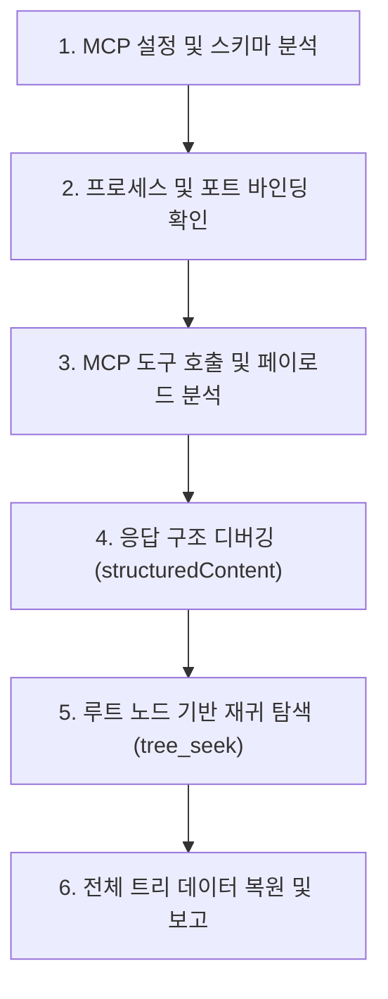

# 2026-10-07 #01 초기 연동 및 트리 전수 탐색

Workflowy 데스크톱 내장 MCP 서버와 Antigravity Agent 간의 초기 연동 검증 및 워크스페이스 트리 전체 탐색 작업을 진행한 실행 기록입니다.

---

## 1. 작업 개요 (Why & Target)

* **실행 일시**: 2026-10-07 10:22 (KST)
* **사용자 원본 프롬프트**:
  > *"현재 mcp 를 활용해서 workflowy 랑 작업을 진행할거야. 어떤 것들이 보이는지 확인해봐"*
* **작업 목표**:
  1. 로컬 환경에 구성된 Workflowy MCP 서버와의 실시간 연결 상태를 진단할 것.
  2. 현재 사용자의 Workflowy 데스크톱 클라이언트에 로드되어 있는 실제 데이터(노드 트리, 불릿 내용, 계층 구조)를 전수 탐색하여 구조화된 형태로 보고할 것.

---

## 2. 사용된 MCP 도구 (Tools)

* `tree_seek`: 트리 탐색 및 노드 검색 (하향 재귀 탐색)
* `tree_zoom`: 클라이언트 화면 줌인 상태 확인
* `message_success`: 데스크톱 화면 토스트 팝업 전송

---

## 3. 작업 수행 상세 (How)



### 단계 1: 환경 설정 및 MCP 도구 스키마 점검
* 로컬 MCP 스키마 디렉터리(`~/.gemini/antigravity-ide/mcp/workflowy`)를 확인하여 `tree_seek`, `tree_zoom`, `tree_patch` 등 13종의 도구 파라미터 규격을 파악했습니다.
* 전역 MCP 설정(`~/.gemini/config/mcp_config.json`)을 조회하여 데스크톱 프로세스가 생성한 로컬 SSE 엔드포인트(`http://127.0.0.1:42973/mcp/...`)를 확인했습니다.

### 단계 2: 프로세스 및 포트 활성화 진단
* 윈도우 프로세스 목록에서 `WorkFlowy.exe`가 정상 구동 중임을 확인했습니다.
* TCP 네트워크 연결 상태(`Get-NetTCPConnection`)를 조회하여 포트 `42973`이 `LISTEN` 상태이며, 클라이언트-에이전트 간 로컬 소켓 통신이 정상 준비되어 있음을 검증했습니다.

### 단계 3: MCP 도구 호출 및 응답 프로토콜 디버깅
* `call_mcp_tool` 도구로 `tree_seek`를 호출했을 때 완료 메시지만 반환되는 현상을 분석했습니다.
* **원인 규명**:
  * 일반적인 MCP 도구는 텍스트 결과를 `result.content`에 담아 반환하지만, Workflowy MCP 서버는 탐색 결과를 JSON-RPC 2.0 규격의 `result.structuredContent.results` 배열 안에 포맷팅하여 반환하도록 설계되어 있었습니다.
  * `message_success` 도구를 호출하여 사용자 데스크톱 화면에 "MCP 연동 확인" 토스트 메시지를 성공적으로 띄우고, `tree_zoom` 호출을 통해 현재 뷰 상태를 검증함으로써 실시간 양방향 제어가 정상 작동함을 확인했습니다.

### 단계 4: 트리 데이터 전수 추출 및 계층 복원
* 최상위 `root`를 시작점으로 설정하고, 하향 깊이 우선 탐색(`direction: "downward-deep"`, `limit: 200`)을 실행하여 워크스페이스에 존재하는 32개 노드의 고유 ID, 들여쓰기 깊이, 텍스트 본문, 링크, 블록 포맷을 완벽하게 추출했습니다.

---

## 4. 트리 변경 및 탐색 결과 (Result / Snapshot)

### ① 복원된 전체 워크스페이스 트리 구조

사용자의 Workflowy 워크스페이스는 최상위(Home) 아래에 **Inbox**, **📆 Calendar**, **Test Node1** 3개 영역으로 구성되어 있음을 확인했습니다.

```text
📁 Home (Root)
│
├── 📥 Inbox (ID: e60edb433f45)
│   └── (빈 노드)
│
├── 📆 Calendar (ID: d8799899ce79)
│   ├── Headers (ID: fbacc7e1ceea)
│   └── 2026 (ID: a0f2f55dcebe)
│       └── Oct (ID: a4098f604c83)
│           └── 📅 Wed, Oct 7, 2026 (ID: 113247151ada)
│               ├── 👋 Welcome to WorkFlowy! (ID: 05abcb9d75f9)
│               │   ├── This is your daily note. Capture anything here.
│               │   └── 💡 How it works (press the arrow)
│               │       ├── Type anything to start: tasks, thoughts, notes
│               │       ├── Hit Enter to create a new bullet
│               │       ├── Hit Tab to indent, Shift + Tab to outdent
│               │       ├── Click any bullet to zoom in and focus
│               │       ├── Use #tags to organise across days. Click to search.
│               │       ├── Drag any bullet to reorganise
│               │       └── Learn more: workflowy.com/help
│               │
│               ├── 🔗 WorkFlowy - MCP 연동 (ID: 369293435670)
│               │   ├── https://workflowy.com/help/ko/mcp-server
│               │   └── "이거 데스크탑 밖에 안되는건가? -> 이건 다른 앱을 WorkFlowy로 통합하는 방법이잖아"
│               │
│               ├── ✍️ WorkFlowy 기반 블로그 작성 (ID: 09ec5a154974)
│               │   ├── 블로그 글감 후보1 (ID: 48dc7cd5e7d6)
│               │   └── 블로그 글감 후보2 (ID: 854546171f66)
│               │
│               └── 🔍 Logseq 도입 가능성 타진해보기 (ID: a6553bc8a15b)
│                   └── "Logseq 는 그러면 아예 다 접근이 가능하나?" (ID: 51ec7e458106)
│
└── 🧪 Test Node1 (ID: 227149bfcfb6)
    └── 여기서 첫번째 노드를 사용해본다? 이것이 노드인가? (ID: 1993759460ae)
        ├── 여기서는 inner node 1개를 생성해본다 (ID: 88652f21ad11)
        ├── 이것도 노드인가 (ID: df766103454e)
        │   ├── 이건 어떤 식으로 처리가 되는건가? (ID: 518d35ffa6c5)
        │   └── 이렇게 되나? (ID: dc899e4d4019)
        └── (빈 노드) (ID: 71a8c241962b)
```

### ② 도출된 핵심 관찰 사항
* 데스크톱 앱 내장 MCP 서버와의 실시간 연결 및 읽기 기능이 100% 정상 작동함.
* 사용자의 관심사가 'MCP 연동 고찰', '블로그 글감 작성', 'Logseq 비교 검토'로 명확히 분기되어 있음을 파악함.
