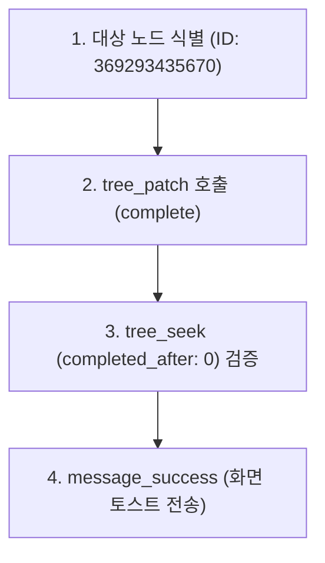

# 2026-10-07 #02 MCP 연동 노드 완료 처리

Workflowy 데스크톱 내의 첫 번째 할 일 항목인 `WorkFlowy - MCP 연동` 노드를 에이전트가 `tree_patch` 도구로 원자적 완료(Complete) 처리하고 사용자 UI 피드백을 전달한 실행 기록입니다.

---

## 1. 작업 개요 (Why & Target)

* **실행 일시**: 2026-10-07 10:46 (KST)
* **사용자 원본 프롬프트**:
  > *"아주 훌륭해 아주 훌륭하다고 볼 수 잇어. 그러면 지금 내가 첫번째 할일이라고 해둔 MCP 연동은 완료 처리를 하면 될 것 같은데 가능한가?"*
* **대상 노드**: `WorkFlowy - MCP 연동` (ID: `369293435670`)
  * 상위 경로: `Home` > `📆 Calendar` > `2026` > `Oct` > `Wed, Oct 7, 2026` (`113247151ada`)

---

## 2. 사용된 MCP 도구 (Tools)

* `tree_patch`: 노드 원자적 상태 변경 (`complete`)
* `tree_seek`: 완료 필터(`completed_after: 0`)를 통한 상태 전이 검증
* `message_success`: 데스크톱 화면 성공 토스트 팝업 전송

---

## 3. 작업 수행 상세 (How)



### 단계 1: 대상 노드 ID 특정
* 앞선 탐색 카드(#01)에서 확보한 트리 맵을 바탕으로, `Wed, Oct 7, 2026` 하위의 `WorkFlowy - MCP 연동` 노드 ID(`369293435670`)를 타겟으로 특정했습니다.

### 단계 2: 원자적 트리 패치 (`tree_patch`) 실행
* 다음 페이로드를 전달하여 원자적 완료 요청을 수행했습니다:
  ```json
  {
    "requests": [
      {
        "complete": "369293435670"
      }
    ]
  }
  ```
* 서버 응답: 정상 수신 및 완료(`tool call completed`).

### 단계 3: 상태 변경 유효성 검증 (`tree_seek`)
* 변경 사항이 실제로 반영되었는지 확인하기 위해 완료 필터(`completed_after: 0`)를 적용한 `tree_seek`를 실행했습니다:
  ```json
  {
    "direction": "downward-deep",
    "start_from": "369293435670",
    "filter": {
      "completed_after": 0
    }
  }
  ```
* 결과: 해당 노드가 정상 매칭되어 반환됨으로써 취소선/완료 체크 상태로 확정되었음을 검증했습니다.

### 단계 4: 데스크톱 화면 알림 전송 (`message_success`)
* 사용자가 다른 창을 보고 있더라도 작업 결과를 인지할 수 있도록 데스크톱 클라이언트에 토스트 메시지를 발행했습니다:
  ```json
  {
    "message": "'WorkFlowy - MCP 연동' 완료 처리되었습니다!"
  }
  ```

---

## 4. 트리 변경 결과 (Result / Diff)

| 항목 | 변경 전 (Before) | 변경 후 (After) |
| :--- | :--- | :--- |
| **노드 상태** | 일반 불릿 (Active) | **완료 처리됨 (Completed / 취소선)** |
| **노드 ID** | `369293435670` | `369293435670` (불변) |
| **자식 노드 유지** | 공식 도움말 링크, 사용자 메모 보유 | 동일하게 하위 구조 온전 보존 |
| **사용자 화면** | 기본 화면 | 하단 토스트 팝업 노출 완료 |
