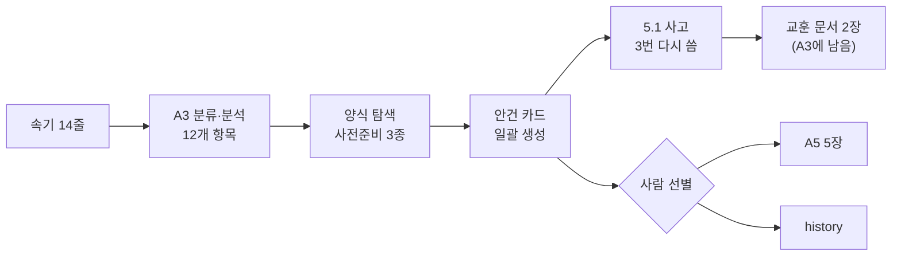
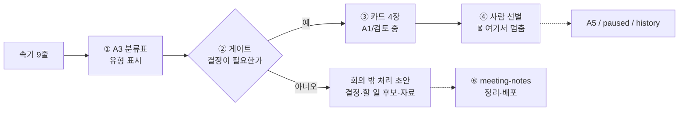

# ⚖️ 두 회의 폴더 비교 — `회의 안건` vs `주간회의`

| | 🅰️ 지난번 | 🅱️ 이번 |
| --- | --- | --- |
| 폴더 | `99.🥸(Agent) 작업 공간/2026.09.22 회의 안건` | `99.🥸(Agent) 작업 공간/2026.09.22 주간회의` |
| 원본 | [[2026.09.22 회의 안건]] (인박스) | [[2026.09.22 주간 회의록]] (보관/회의록) |
| 스킬 | `pre_meeting_agenda_preparer` | `meeting-agenda-prep` |

> [!info] 2026-09-23 이후 바뀐 것 — 이 비교는 그 전 🅱️ 기준입니다
> 🅱️ 를 **4대 축(Pre → Live → Post → Action)** 으로 다시 짰습니다. 자세한 것은 [[2026-09-22_주간회의_작업_기억]] 과 스킬을 보세요.
> - **A5 의 뜻을 바로잡음** — "회의에서 다룰 것" ✗ → **사람이 인박스나 할일로 보낼 만하다고 빼 둔 것**. 아래 표의 A5 설명은 옛 뜻입니다.
> - `속기 분류표` → **`작업 기억`** (네 축으로 된 한 장). 분류표는 그 안의 2절이 됐습니다.
> - 게이트에 **결정 후보**(속기 안에 답이 있지만 확인이 필요한 것)를 더함 — 1.1 – 1.4 가 여기에 해당합니다.
> - **Pre** 단계와 `!(Template) 사전 준비` 양식을 더함 (지난 폴더 `[견본]` 에서 지어낸 부분을 뺀 것).

> [!warning] 먼저 알아 둘 것
> 두 폴더는 **속기가 다릅니다** (🅰️ 14줄 · 🅱️ 9줄). 카드 수나 내용의 좋고 나쁨이 아니라 **일하는 방식**을 비교합니다.
> 🅱️ 는 ③(카드 만들기)까지만 했고, 회의를 거치지 않았습니다.

---

## 1. 한눈에 — 가장 큰 차이 세 가지

> [!summary] 핵심
> 1. **거르는 시점** — 🅰️ 는 카드를 **다 만든 뒤** 사람이 골랐고, 🅱️ 는 카드를 **만들기 전에** 유형으로 걸렀습니다.
> 2. **working memory 의 뜻** — 🅰️ 의 A3 에는 진행 기록 · 매뉴얼 · 교훈 · 양식이 섞여 있고, 🅱️ 의 A3 에는 **이 회의의 진행 기록만** 있습니다.
> 3. **교훈이 meta 로 가는 길** — 🅰️ 는 교훈이 A3 문서로 남고 스킬은 그대로였고, 🅱️ 는 교훈을 **스킬에 반영**하고 반영 여부를 분류표에 적었습니다.

---

## 2. 흐름

### 🅰️ 지난번 (내용으로 추정한 순서)

### 🅱️ 이번

| 단계 | 🅰️ | 🅱️ |
| --- | --- | --- |
| 속기 → 항목 | 14줄 → 12개 항목 | 9줄 → 9개 (빈 줄 하나도 "빈 줄" 로 적음) |
| 빠진 줄 | 1.3(폴더 네이밍)은 카드가 없음. 1.2 는 취소선 | 없음 — 줄마다 가는 곳이 있음 |
| 카드로 만든 것 | 사실상 전부 (지금 남은 안건 카드 10장) | **결정이 필요한 것만** 4장 |
| 카드가 아닌 것 | 따로 가는 곳 없음 — 5.1 을 할일 티켓 · 벤치마크 스펙으로 다시 쓰다가 history 로 | 분류표 안의 **결정 1 · 다음 안건 1 · 할 일 후보 4 · 자료 3** |
| 사람의 자리 | 카드를 다 본 뒤 A5 / history 로 | 똑같이 ④ — 대신 **볼 카드가 적음** |
| 멈춘 곳 | A5 이후. 회의록의 `결정` · `할 일 후보` 는 비어 있음 | ③ 에서 **일부러** 멈춤. 진행 상태 표에 ⏳ 로 표시 |

---

## 3. 폴더별

| 폴더 | 🅰️ 지난번 | 🅱️ 이번 |
| --- | --- | --- |
| **A1 / 검토 중** | 비어 있음 | 카드 4장 — 스킬 기본 출력 위치를 그대로 씀 |
| **A1 / paused** | 비어 있음 | 비어 있음 (④ 에서 사람이) |
| **A1 / history** | 11장 — 안 뽑힌 카드 5 + **옛 버전** 6 (5.1 × 3, 사전준비 × 3) | 비어 있음 (④ 에서 사람이) |
| **A2 scratch** | 비어 있음 | 비어 있음 |
| **A3 working memory** | 5장이 섞여 있음 ↓ | 2장 — 분류표(진행 기록) + 이 비교 노트 |
| **A4 meta** | 스킬 + 양식 + 예시 | 스킬 + 양식 2개 (분류표 · 안건 카드) |
| **A5 outputs** | 5장 | 비어 있음 — 사람이 채울 자리 |

### A3 안에 무엇이 있나 — 🅰️ 의 5장은 성격이 넷

| 🅰️ 파일 | 성격 | 🅱️ 에서는 |
| --- | --- | --- |
| `2026-09-22_회의_안건_속기_분류_및_분석` | 진행 기록 | 같은 자리 — [[2026-09-22_주간회의_작업_기억]] (이름을 바꿨습니다) |
| `회의_속기_발언_유형학_및_의사결정_분리_기준` | 교훈 → 계속 쓸 지식 | **스킬 2절 게이트 표**로 들어감 |
| `인수인계_발화_유형별_전용_템플릿_산출_가이드` | 교훈 → 계속 쓸 지식 | 게이트 표에 흡수 (4유형 · 6유형이 달랐던 것을 6유형 + "결정됨" 하나로) |
| `(메뉴얼)회의 필수 항목 구조화 및 템플릿 설계 스펙` | 참고 지식 | 안 씀 — 회의록 양식 쪽 이야기라 이번 흐름엔 필요 없었음 |
| `!(Template) 회의 안건 분석` | 양식 | **스킬 폴더 안** `templates/` 로 |

> [!tip] 🅱️ 에서 정한 기준
> **working memory = 이 회의가 어디까지 왔나** (회의가 끝나면 history).
> **meta = 다음 회의에도 쓸 것** (스킬 · 양식 · 판별 규칙).

---

## 4. 스킬 (A4 meta)

| | 🅰️ `pre_meeting_agenda_preparer` | 🅱️ `meeting-agenda-prep` |
| --- | --- | --- |
| 하는 일 | 속기를 안건 단위로 나눠 **모두** 카드로 | 속기를 유형으로 나누고 **결정 필요한 것만** 카드로 |
| 게이트 | 없음 — 5.1 사고의 원인 | 유형 표 (6유형 + 결정됨) |
| 어디서 멈추나 | 정해져 있지 않음 | ③ 뒤에 멈추고 보고. ④ 는 사람 |
| 카드 아닌 항목 | 다루지 않음 | 분류표 "회의 밖 처리" → 회의 뒤 `skills/meeting-notes` 로 넘김 |
| 기본 출력 | `A1.collection/검토 중` (실제로는 A5 에 있음) | `A1.collection/검토 중` (실제로도 여기) |
| 속성 규칙 | 따옴표 규칙 하나 | 속성마다 **왜 그렇게 쓰는지** 표 (4절) |
| 출처 표시 | 없음 | 맨 위 표 — 어느 부분을 어디서 가져왔는지 |
| 알려진 흠 | "6단계" / "7단계" 가 섞임 · 참조 링크가 하위 폴더를 빠뜨려 깨짐 | — |

> [!note] 🅱️ 가 새로 만든 것은 거의 없습니다
> 카드 7단 구조는 🅰️ 스킬, 6유형과 Gate 1 은 🅰️ 의 A3 유형학, 분류표 형식은 🅰️ 의 A3 분석 문서, A1 상태 뜻은 99 README, 회의 뒤는 `skills/meeting-notes`.
> 🅱️ 는 이것들을 **한 순서로 엮고, 멈출 곳을 정한 것**입니다.

---

## 5. 안건 카드

본문 7단 구조(속기 원문 → 🎯 → 기존 이유 → 분석 → 참조 → 쟁점 → 💡)는 **같습니다.** 채우는 방식이 다릅니다.

| | 🅰️ | 🅱️ |
| --- | --- | --- |
| 🌐 참조 | 외부 프레임워크·도구 위주 (GTD · Copilot/Autopilot · Dev/Staging 분리 · Google Docs 코멘트 …) | **볼트 안 근거 먼저** — `CLAUDE.md` · `docs/` · `skills/` 를 문서 이름과 함께 |
| 🎯 선택지 | 한쪽에 "(권장)" | 권장 없음 — 고르는 건 ④ 의 사람 |
| 한 줄에 여러 질문 | 카드를 따로 | 같은 결정을 묻는 줄은 **한 카드로 합침** (🅱️ 1.3 = 1.3 + 2.4) |
| 💡 해결 방향 | 비움 | 비움 |

---

## 6. 속성

| 속성 | 🅰️ | 🅱️ | 왜 바꿨나 |
| --- | --- | --- | --- |
| `구역` | 비움 | `4.archive` | 비우면 홈 `🧠 주간 리뷰` 의 "유형·구역 빈 것" 에 걸림. `CLAUDE.md` 도 필수로 둠 |
| `분류` | `회의록` | 비움 | `📝 회의록` 보드는 폴더와 상관없이 `분류: 회의록` 을 모음 → 카드가 회의록 목록에 섞임 |
| `상태` | `검토 중` 또는 비움 | 비움 | 메모는 상태를 안 쓰는 유형. `검토 중` 은 `🧠 주간 리뷰` 의 검토 중 뷰에 걸림 |
| `작성자` | 비움 | `Claude` | 본문을 쓴 에이전트는 이름을 밝히는 게 볼트 규칙 |
| `PARA정리` | `끔` | `끔` | 같음 — 플러그인이 99 밖으로 옮기지 않게 |
| `요약` | 큰따옴표 | 큰따옴표 | 같음 — 따옴표로 시작하면 YAML 이 깨짐 |

> [!warning] 확인 범위
> 🅰️ 카드가 보드에 걸린다는 것은 **보드 필터를 읽고 판단**한 것입니다. 옵시디언 화면에서 보지는 않았습니다.

---

## 7. 교훈이 meta 로 가는 길

| | 🅰️ | 🅱️ |
| --- | --- | --- |
| 교훈이 적힌 곳 | A3 의 독립 문서 2장 | 분류표 맨 아래 **⑦ 교훈 메모** |
| 스킬 반영 | 따옴표 규칙 1개만. 핵심 교훈(게이트)은 빠짐 → 같은 스킬을 다시 쓰면 5.1 이 또 생김 | 3개 반영(보드 섞임 · 한 줄 두 유형 · "결정됨"), 1개는 후보로 남김(원본 회의록이 인박스일 때) |
| 반영했는지 보이나 | 안 보임 | 줄마다 **이미 반영 / 올릴 후보** 로 표시 |

---

## 8. 🅱️ 가 아직 못 한 것 · 🅰️ 가 더 나았던 것

- **🅱️ 는 회의를 거치지 않았습니다.** ④ 이후가 실제로 돌아가는지는 모릅니다.
- **🅰️ 의 참조가 더 넓습니다.** 외부 사례를 여러 개 대 준 것은 🅰️ 쪽이 풍부합니다. 🅱️ 는 볼트 안 근거에 기대서 좁습니다.
- **🅱️ 스킬은 🅰️ 폴더를 출처로 적었습니다.** 🅰️ 폴더를 비우면 출처 링크가 끊깁니다. 카드 1.2 · 1.3 에서 정할 일입니다.
- **🅰️ 의 매뉴얼(회의 필수 항목)** 은 🅱️ 에서 쓰지 않았습니다. 회의록 양식을 고칠 때 다시 필요할 수 있습니다.
